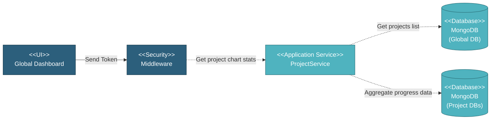

# 5.1.1 Dashboard

This component provides a global dashboard displaying all projects with their progress S-curves. Users can view active and closed projects and navigate to individual project dashboards.

---

## Component Design Diagram

*Figure: Global Dashboard Component Design*

---

## 5.1.1.1 User Interface

### Global Dashboard

This is the entry point for viewing all projects in the system. The dashboard displays a left sidebar with counts of Active and Closed Projects, and a main content area showing project cards with progress S-curves (schedule vs actual). Upon loading, it sends a token for authentication and requests project chart statistics. Users can toggle between active and closed projects and navigate to individual project dashboards.

---

## 5.1.1.2 Security

Middleware validates the authentication token sent from the Dashboard UI. Only authenticated and authorized users with global-level access can proceed to view dashboard data.

---

## 5.1.1.3 Application Services

### 5.1.1.3.1 Initial Data Retrieval

- **ProjectService**: Retrieves project list from global database and aggregates progress data from each project's dedicated database.

### 5.1.1.3.2 Dashboard Data Generation

Handles the project chart statistics request. This includes:
- Querying all projects from global database
- Iterating through each project to aggregate progress data from SOW, Work Order, and Transfer
- Calculating schedule vs actual progress for S-curve charts
- Returning array of projects with chart data

---

## 5.1.1.4 Database

### MongoDB (Global DB)

**projects** collection:
- `project_name`: Project name
- `project_company`: Company name
- `status`: Project status (active/closed)
- `db_name`: Name of project's dedicated database
- `created_at`: Creation timestamp

### MongoDB (Project DBs)

Each project has its own dedicated database containing SOW, Work Order, and Inspection collections used for progress aggregation.

---

## Code References

**Backend:**
- Controller: `app/Http/Controllers/Api/Globals/ProjectController.php`
- Service: `app/Services/Globals/ProjectService.php`
- Repository: `app/Repositories/Globals/Project/ProjectRepository.php`

**Frontend:**
- Component: `resources/js/components/global/dashboard/DashboardComponent.vue`
- Vuex: `resources/js/store/modules/globals/project/actions.js`
- Route: `/global/dashboard`

---

**Status**: ✅ Dashboard component documentation
