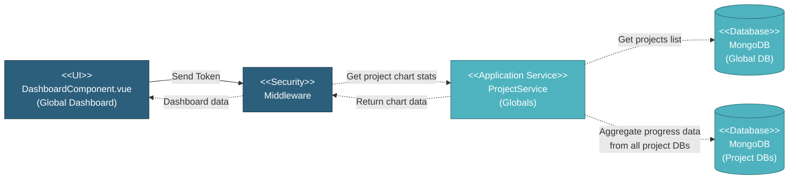

# 5.1.1.1 Global Dashboard Overview

This component provides a simple global dashboard displaying the list of all projects with their progress S-curves. Users can view active and closed projects and navigate to individual project dashboards.

---

## Component Design Diagram

*Figure: Global Dashboard Overview & Analytics Component Design*

**API Endpoint**: `GET /api/global/projects/chart/stats`  
**Vuex Action**: `global_project/setOverallCharts`

---

## 5.1.1.1.1 User Interface

### DashboardComponent.vue (Global Dashboard)

This is the entry point for viewing all projects in the system. When the page loads, it displays:
- **Left Sidebar**: Two clickable cards showing counts of Active Projects and Closed Projects
- **Main Content**: Grid of project cards, each displaying project name, company, and a progress S-curve chart (schedule vs actual)

Upon loading, the component sends an authentication token to the security middleware and requests project chart statistics. Users can toggle between active and closed projects by clicking the sidebar cards. Clicking a project card navigates to that project's detailed dashboard.

---

## 5.1.1.1.2 Security

### Middleware

The security middleware validates the authentication token sent from the Dashboard UI. It checks:
1. **Authentication**: Verifies the user is logged in with a valid JWT token
2. **Authorization**: Checks `global.dashboard` privilege (read access required)
3. **Project Access**: Filters projects based on user's project assignments

Only users with global-level access (Super Admin, MI Team, Global Viewer) can proceed. After validation, the middleware forwards the request to ProjectService to retrieve project chart data.

---

## 5.1.1.1.3 Application Services

### ProjectService (Globals)

This service handles the "Get project chart stats" request from the middleware. The method `genOverallChartStatsEachProgress()` performs the following operations:

1. **Query Global Database**: Retrieves all projects from the `projects` collection in `mongodb_global`, filtering by user's access permissions
2. **Iterate Through Projects**: For each project:
   - Connects to the project's dedicated database (`mongodb_project_*`)
   - Aggregates progress data from SOW, Work Order, and Inspection collections
   - Calculates schedule vs actual progress for S-curve chart
3. **Return Chart Data**: Sends array of projects with their progress chart data back to the middleware, which forwards it to the Dashboard UI

**Note**: There is no separate DashboardService - all logic is contained within ProjectService.

---

## 5.1.1.1.4 Database

### MongoDB (Global DB)

The **projects** collection stores project metadata including:
- `project_name`: Project name
- `project_company`: Company name
- `status`: Project status (active/closed)
- `db_name`: Name of the project's dedicated database
- `created_at`: Creation timestamp

### MongoDB (Project DBs)

Each project has its own dedicated database (`mongodb_project_*`) containing:
- **SOW collections**: Scope of work data with quantities and schedules
- **Work Order collections**: Manufacturing progress data
- **Inspection collections**: Quality inspection results

ProjectService aggregates data from these collections to calculate the progress S-curve (schedule vs actual) displayed on the dashboard.

**Note**: There is no `dashboard_widgets` collection - widget customization is not supported.

---

## Code References

**Backend:**
- Controller: `app/Http/Controllers/Api/Globals/ProjectController.php::genOverallChartStatsEachProgress()`
- Service: `app/Services/Globals/ProjectService.php::genOverallChartStatsEachProgress()`
- Repository: `app/Repositories/Globals/Project/ProjectRepository.php`

**Frontend:**
- Component: `resources/js/components/global/dashboard/DashboardComponent.vue`
- Vuex Store: `resources/js/store/modules/globals/project/actions.js::setOverallCharts`
- Route: `/global/dashboard`

**API:**
- Endpoint: `GET /api/global/projects/chart/stats`
- Returns: Array of projects with progress chart data

---

**Status**: ✅ Re-verified against codebase (BE + FE)

**Note**: Previous version incorrectly documented widget management, cross-project analytics, system health monitoring, and user statistics that don't exist. This has been corrected to reflect the simple project list dashboard.

---

