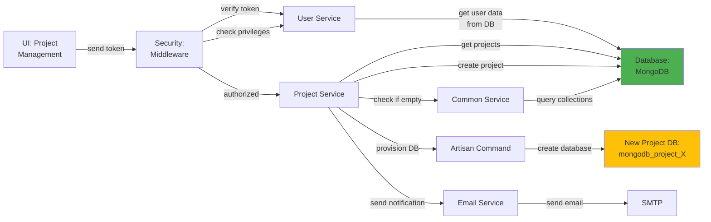

# 5.1.1 Project Management

## 5.1.1.1 User Interface

When a user navigates to the Project Management page (routes: `/global/project/:status/:id?`, `/global/project/create`, `/global/project/edit/:id/:id_project_manager`), the Vue.js UI sends a JWT token to the backend via the `Authorization: Bearer {token}` header. This token represents the user's identity and is used for authentication. The UI displays a list of projects with filtering options (active, archived, all), project cards showing key information, and forms for creating/editing projects. No business logic happens here; it simply initiates the API request and presents the result to the user.

## 5.1.1.2 Security

The middleware acts as a security layer, handling both authentication and authorization. After receiving the token from the UI, it verifies the token's validity through Laravel Passport's `auth:api` middleware, which validates the OAuth 2.0 access token against the `oauth_access_tokens` collection. Once the user is verified, the `user.privileges` middleware checks if the user has the required privilege:
- `global.project:R` for read access (view projects)
- `global.project.create:W` for write access (create projects)
- `global.project.edit:W` for write access (edit projects)

The system also enforces role-based filtering where Project Managers only see projects they manage or are assigned to, while Super Admins see all projects.

## 5.1.1.3 Application Services

### 5.1.1.3.1 Project Service

The Project Service (`App\Services\Globals\ProjectService`) is the core service that handles all project-related operations. It integrates several other services to provide complete project management functionality:

**Key Methods:**
- `index()` - Retrieves project list with filtering (by status, company, project manager) and sorting. Applies role-based access control to filter projects based on user permissions.
- `create()` - Creates a new project record in the global database and provisions a new MongoDB database (`mongodb_project_{project_code}`) for the project using Artisan commands. Sends invitation emails to the assigned project manager.
- `edit()` - Retrieves project details for editing, including project manager information.
- `update()` - Updates project metadata (name, description, company, color, project manager assignment).
- `delete()` - Soft deletes or permanently deletes a project and its associated database after confirmation.
- `closeOpenProject()` - Toggles project status between active and closed.
- `checkDuplicateProject()` - Validates project name uniqueness before creation/update.
- `countProjects()` - Counts active and closed projects for dashboard statistics.
- `genOverallChartStatsEachProgress()` - Generates overall progress chart data for all projects by querying each project's database.

### 5.1.1.3.2 User Service (Global)

Returns user data for project manager assignments. This service is used to:
- Retrieve project manager options for the project creation/edit forms (`getProjectManagerOptions()`)
- Get detailed user information for display in project cards (`getUser()`)
- Validate user roles and permissions for project access

### 5.1.1.3.3 Common Service

Provides utility functions used during project operations:
- `checkDB()` - Verifies if a project database contains data (used to determine if a project can be safely deleted)
- Database connection management for multi-tenancy operations

### 5.1.1.3.4 Email Service

Sends email notifications for project-related events:
- Project manager assignment notifications
- Project creation confirmations
- Project status change alerts

## 5.1.1.4 Database

MongoDB serves as the central data store for the Global Module. The Project Management feature interacts with the following collections:

**Global Database (`mongodb_global`):**
- `projects` - Stores project master data including project ID, name, description, company, project_manager_id, color (for UI theming), db_name (project database name), status (active/closed/incomplete), show_type (display preferences), created_at, updated_at, and version.
- `users` - Referenced for project manager assignments and user access control.
- `oauth_access_tokens` - Used by Laravel Passport for token validation.

**Project Databases (`mongodb_project_{project_code}`):**
- Each project has its own dedicated MongoDB database provisioned dynamically during project creation.
- The database name follows the pattern: `mongodb_project_{project_code}`
- Contains 85+ collections specific to that project's data (SOW, Work Orders, MDR, Inspections, etc.)
- The global `projects` collection stores the database name in the `db_name` field for multi-tenancy routing.

*Figure: Project Management Component Design*
