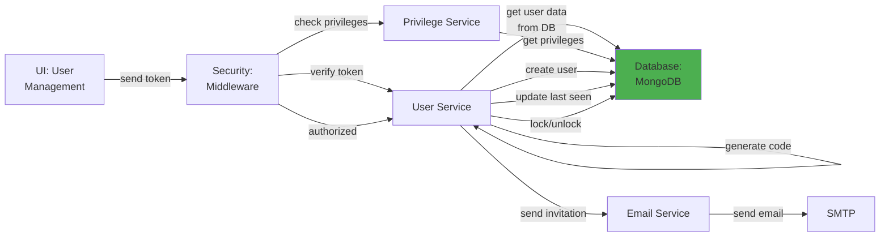

# 5.1.2 Global User Management

## 5.1.2.1 User Interface

When a user opens the Global User Management page (routes: `/global/user`, `/global/user/create`, `/global/user/:id`, `/global/user/edit/:id`, `/global/user_profile/:id`), the UI sends a JWT token to the backend. The interface displays a data table of all system users with columns for name, email, role, status, and last seen timestamp. Users can create new users with an invitation system, view detailed user profiles, edit user information and roles, and manage user project assignments. The UI also provides user activity tracking showing last seen timestamps and login history. No business logic happens here; it simply initiates the request and presents the result to the user.

## 5.1.2.2 Security

The middleware acts as a security layer, handling both authentication and authorization. After receiving the token from the UI, it verifies the token's validity through Laravel Passport's `auth:api` middleware. Once the user is verified, the `user.privileges` middleware checks for:
- `global.user:R` for read access (view user list, view user details)
- `global.user:W` for write access (create, edit, delete users)

Additionally, the `user.specific-data` middleware restricts non-admin users to only access their own profile data, preventing unauthorized access to other users' sensitive information. This middleware validates that the requested user ID matches the authenticated user's ID for profile-related operations.

## 5.1.2.3 Application Services

### 5.1.2.3.1 User Service (Global)

The Global User Service (`App\Services\Globals\UserService`) is the core service that manages all global user operations. It handles user lifecycle management, authentication, and role-based access control.

**Key Methods:**
- `index()` / `dataTables()` - Retrieves user list with pagination, search, and filtering capabilities for the DataTables component.
- `create()` / `register()` - Creates a new user account, generates a 4-digit activation code, sets expiration timestamp, and sends an invitation email with the activation code.
- `read()` / `getUser()` - Retrieves user details by ID or email, including role information and project assignments.
- `update()` - Updates user profile information (name, email, role, photo, additional privileges, allowed projects).
- `delete()` - Soft deletes a user by setting `deleted = 1` and `deleted_at` timestamp.
- `checkEmail()` - Validates email uniqueness before user creation.
- `checkDuplicateUser()` - Checks for duplicate user accounts across name and email.
- `roleOptions()` - Returns available user roles for dropdown selection (super_admin, project_manager, mi_team, non_mi_team, global_viewer, vendor_approver, customer, project_team variants).
- `getProjectManagerOptions()` - Filters users with project_manager role for project assignment dropdowns.
- `getLastSeen()` / `updateLastSeen()` - Tracks user activity by updating `last_seen_at` timestamp on each request.
- `lockUnlockAccount()` - Manages account locking for security (locks after multiple failed login attempts).
- `verifyActivationCode()` - Validates 4-digit activation codes during user account activation.
- `resendActivationCode()` - Generates a new activation code and resends invitation email.

### 5.1.2.3.2 Privilege Service

Returns privilege definitions for role-based access control. This service:
- Retrieves all available privilege definitions from the `privileges` collection
- Maps privileges to user roles for authorization checks
- Validates user permissions before allowing access to specific features
- Handles additional privilege assignments (custom permissions beyond default role privileges)

### 5.1.2.3.3 Email Service

Sends user-related email notifications:
- User invitation emails with activation codes and login instructions
- Password reset emails with secure reset links
- Account activation confirmation emails
- Role change notifications to users and administrators
- Account locked/unlocked notifications for security events

## 5.1.2.4 Database

MongoDB serves as the central data store for user management. The following collections are used:

**Global Database (`mongodb_global`):**
- `users` - Stores complete user records including _id, first_name, last_name, name (full name), email (unique), role, role_name, additional_privileges (array), photo, active (y/n), invite_by (email), invite_date (Unix timestamp), activation_code (4-digit), activation_code_exp (Unix timestamp), is_locked (boolean), last_attempt (Unix timestamp), attempt_number (failed login count), token (session token hash), token_exp, session_exp, manufacturer (for vendor users), db_access (last accessed project DB), allowed_projects (comma-separated project IDs or "all"), app_token (mobile), app_token_exp, last_seen_at (DD/MM/YYYY), created_at, created_by, updated_at, updated_by, deleted (0/1), deleted_at, deleted_by.
- `user_sessions` - Tracks active user sessions with user_id, session_token, ip_address, user_agent, last_activity, and expiration timestamps.
- `oauth_access_tokens` - Laravel Passport token storage with user_id, client_id, token (hashed), scopes, revoked flag, created_at, updated_at, and expires_at.
- `oauth_refresh_tokens` - Refresh tokens for OAuth 2.0 token renewal.
- `privileges` - Privilege definitions with privilege keys, names, descriptions, and default role assignments.

*Figure: Global User Management Component Design*
