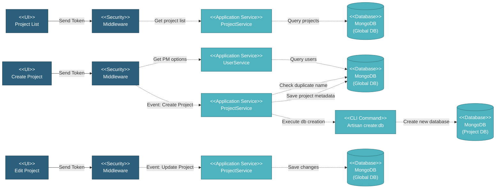

# 5.1.2 Project Management

This component handles multi-tenant project operations including project list display with role-based filtering, project creation with automatic database provisioning, project settings updates, and project status management.

---

## Component Design Diagram

*Figure: Project Management Component Design*

---

## 5.1.2.1 User Interface

### 5.1.2.1.1 Project List

This displays all projects as cards with role-based filtering. Super Admin sees all projects, Project Managers see only assigned projects, and Global Viewers see projects in their allowed list. Each card shows project name, company, status, and quick actions. When clicking a project card, the encrypted database name is stored and added to subsequent API requests for multi-tenant routing.

### 5.1.2.1.2 Create Project Form

This form creates new projects with automatic database provisioning. Users enter project name, company, description, project manager selection, business unit, color, UOM, and currency. Upon submission, it sends a token for authentication, creates project metadata, and triggers database provisioning via Artisan command.

### 5.1.2.1.3 Edit Project Form

This form uses the same structure as create but pre-populates with existing data. Field editing is role-based: Super Admin can edit all fields, MI Team has limited access, and Project Managers have read-only access. Special rules apply for business unit, project manager, and UOM fields based on project data status.

---

## 5.1.2.2 Security

Middleware validates the authentication token sent from all Project Management UIs. Only authenticated and authorized users can proceed to perform or view project actions. Multi-tenant database routing is handled by DatabaseAccessMiddleware which validates the Database-Access header and switches MongoDB connection to the appropriate project database.

---

## 5.1.2.3 Application Services

### 5.1.2.3.1 Initial Data Retrieval

- **ProjectService**: Provides project list with role-based filtering and encrypted database names.
- **UserService**: Fetches user options for project manager selection.

### 5.1.2.3.2 Project Created

Handles project creation and database provisioning. This includes validating project name uniqueness, generating unique database name, saving project metadata, executing Artisan command to create dedicated MongoDB database with all collections, and updating project manager's allowed projects list.

---

## 5.1.2.4 Database

### MongoDB (Global DB)

**projects** collection:
- `name`: Project name (unique)
- `company`: Company name
- `desc`: Project description
- `project_manager_id`: Project manager ID
- `business_unit`: Business unit
- `color`: Project card color
- `uom`: Unit of measurement
- `currency`: Project currency
- `status`: Project status (active/closed)
- `db_name`: Dedicated database name
- `created_at`, `updated_at`, `deleted_at`: Timestamps

### MongoDB (Project DBs)

Each project has its own dedicated database created via Artisan command containing all project-specific collections (SOW, Work Orders, Inspections, etc.).

---

## Code References

**Backend:**
- Controller: `app/Http/Controllers/Api/Globals/ProjectController.php`
- Service: `app/Services/Globals/ProjectService.php`
- Repository: `app/Repositories/Globals/Project/ProjectRepository.php`
- Middleware: `app/Http/Middleware/DatabaseAccessMiddleware.php`
- Command: `app/Console/Commands/CreateDatabase.php`

**Frontend:**
- Component: `resources/js/components/global/project/ProjectComponent.vue` (list)
- Component: `resources/js/components/global/project/ProjectFormComponent.vue` (create/edit)
- Vuex: `resources/js/store/modules/globals/project/actions.js`
- Routes:
  - `/global/project` - Project list
  - `/global/project/create` - Create project
  - `/global/project/edit/{id}` - Edit project

---

**Status**: ✅ Project Management component documentation
