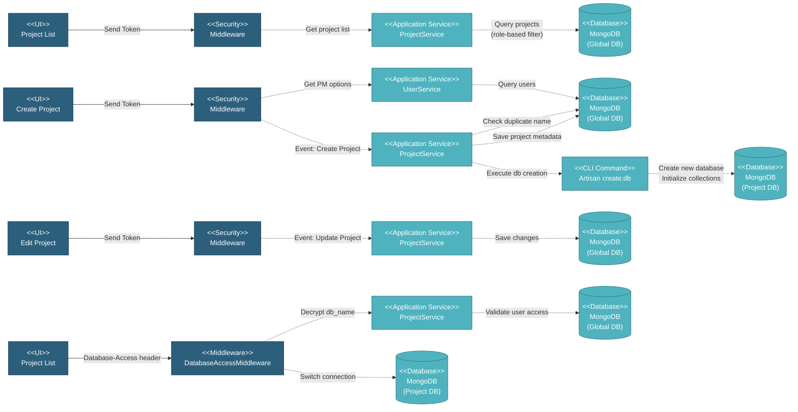

# 5.1.2 Project Management

This component handles all project-related operations including project list display, project creation with database provisioning, project settings updates, multi-tenant database routing, and project deletion.

---

## Component Design Diagram

*Figure: Project Management Component Design*

**Vuex Actions**: `global_project/getProjects`, `createProject`, `updateProject`, `closeOpenProject`

**Artisan Command**: `php artisan create:db {db_name}`

---

## 5.1.2.1 User Interface

### ProjectComponent.vue (Project List)

Displays all projects as cards with role-based filtering:
- **Super Admin**: Sees all projects
- **Project Manager**: Sees only assigned projects
- **Global Viewer**: Sees projects in `allowed_projects` array

Each project card shows:
- Project name, company, description
- Color indicator
- Status badge (Active/Closed)
- Project manager name
- Quick actions (Edit, Toggle Status)

**Database-Access Header**: When clicking a project card, the encrypted `db_name` is stored in Vuex and automatically added to all subsequent API requests via Axios interceptor.

### ProjectFormComponent.vue (Create Project)

Form for creating new projects with automatic database provisioning:
- **Project Name** (required): Unique name validation
- **Company** (required): Customer name
- **Description** (required): Project description
- **Project Manager** (required): Dropdown of users with PM role
- **Business Unit** (required): Only Super Admin can set
- **Color** (required): Color picker for project card
- **UOM** (required): Units of measurement (locked after data exists)
- **Currency** (required): Project currency

Upon submit → creates project metadata → executes `php artisan create:db {db_name}` → provisions new MongoDB database with all collections.

### ProjectFormComponent.vue (Edit Project)

Same form as creation but pre-filled with existing data:
- **Role-based field editing**:
  - **Super Admin**: All fields editable
  - **MI Team**: Limited fields (description, company, color) - cannot change PM or business unit
  - **Project Manager**: Read-only
- **Special rules**:
  - Business Unit: Only Super Admin can edit
  - Project Manager: MI Team cannot change
  - UOM/Pipe Length: Locked if project has data (`!project.is_empty`)
- **Toggle Status**: Button to switch between Active/Closed

---

## 5.1.2.2 Security

### Middleware

**For Project List**:
- Requires `global.project` privilege (R access)
- Role-based filtering applied automatically

**For Create/Edit**:
- Requires `global.project` privilege (RW access)
- Role checks:
  - Create: Project Manager, Super Admin
  - Update/Toggle: Project Manager, Super Admin

### DatabaseAccessMiddleware

Handles multi-tenant database routing:
1. **Extract Header**: Reads `Database-Access` header from request
2. **Decrypt**: Uses `Crypt::decryptString()` to decrypt `db_name`
3. **Validate Access**: Checks user's `allowed_projects` array
4. **Switch Connection**: Dynamically changes MongoDB connection to project database
5. **Continue Request**: Allows request to proceed with correct database context

If header missing/invalid or user lacks access → returns 403 Forbidden.

---

## 5.1.2.3 Application Services

### ProjectService (Globals)

**1. Get Project List** (`index()` method):
- Queries `projects` collection with role-based filter
- Returns: project_name, company, color, status, user_id (PM), db_name (encrypted)
- Encrypts `db_name` before sending to client for security

**2. Create Project** (`store()` method):
- Validates project name uniqueness
- Generates unique `db_name`: `pipeline_project_{timestamp}_{random}`
- Saves project metadata to `projects` collection
- Executes Artisan command: `php artisan create:db {db_name}`
- Updates project manager's `allowed_projects` array
- Returns project ID

**3. Update Project** (`update()` method):
- Validates changes (check duplicate name if changed)
- Updates project record in `projects` collection
- If project manager changed:
  - Removes project from old manager's `allowed_projects`
  - Adds project to new manager's `allowed_projects`
- Returns success response

**4. Toggle Status** (`closeOpenProject()` method):
- Toggles `status` field between "active" and "closed"
- Updates `updated_at` timestamp
- Returns updated project data

### Artisan Command (create:db)

Creates new project database with all required collections and indexes

---

## 5.1.2.4 Database

### MongoDB (Global DB)

**projects** collection:
- `project_name`: Project name (unique)
- `project_company`: Customer name
- `project_desc`: Description
- `color`: Color code for UI
- `business_unit`: Business unit
- `user_id`: Project manager ID
- `db_name`: Database name (e.g., "pipeline_project_1697788800_abc123")
- `status`: "active" or "closed"
- `uom`, `pipe_length_unit`, `currency`: Project settings
- `is_empty`: Boolean (true if no data exists, locks UOM changes)
- `deleted_at`: Soft delete timestamp
- `created_at`, `updated_at`: Timestamps

**users** collection:
- `allowed_projects`: Array of `db_name` values (updated when PM changes)

### MongoDB (Project Databases)

Each project has its own isolated database:
- Complete data isolation between projects
- Independent backups and restores
- Scalability (can move databases to different servers)
- Security (users can only access authorized project data)

**Multi-Tenancy Benefits**:
- `Database-Access` header routes requests to correct project DB
- Dynamic connection switching via DatabaseAccessMiddleware
- Encrypted `db_name` in header for security

---

## Code References

**Backend:**
- Controller: `app/Http/Controllers/Api/Globals/ProjectController.php`
  - `index()` - Get project list
  - `store()` - Create project
  - `update()` - Update project
  - `closeOpenProject()` - Toggle status
  - `delete()` - Delete project
- Service: `app/Services/Globals/ProjectService.php`
- Repository: `app/Repositories/Globals/Project/ProjectRepository.php`
- Request: `app/Http/Requests/Globals/Project/StoreProjectRequest.php`
- Middleware: `app/Http/Middleware/DatabaseAccessMiddleware.php`
- Command: `app/Console/Commands/CreateDatabase.php`

**Frontend:**
- Components:
  - `resources/js/components/global/project/ProjectComponent.vue` (list)
  - `resources/js/components/global/project/ProjectFormComponent.vue` (create/edit)
- Vuex: `resources/js/store/modules/globals/project/actions.js`
- Routes:
  - `/global/project` - Project list
  - `/global/project/create` - Create project
  - `/global/project/edit/{id}` - Edit project

**Database:**
- Config: `config/database.php` (mongodb_project connection)
- Artisan: `php artisan create:db {db_name}`

**Multi-Tenancy:**
- Header: `Database-Access` (encrypted `db_name`)
- Axios Interceptor: `resources/js/plugins/axios.js` (adds header automatically)
- Middleware: `DatabaseAccessMiddleware` (decrypts and switches connection)

---

**Status**: ✅ Re-verified against codebase (BE + FE + CLI + Multi-tenancy)
