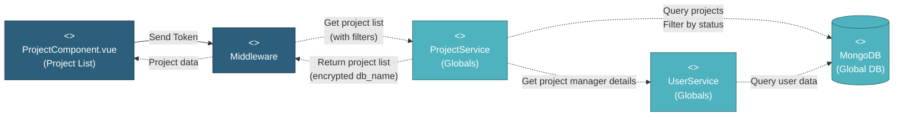

# 5.1.2.1 Project List & Management

This component provides the main interface for viewing and managing all projects in the system, with role-based filtering and access control.

---

## Component Design Diagram

*Figure: Project List & Management Component Design*

**API Endpoint**: `GET /api/global/projects?status={active|closed}`
**Vuex Action**: `global_project/setProjects`

---

## 5.1.2.1.1 User Interface

### ProjectComponent.vue (Project List)

This is the main entry point for project management. When the page loads, it displays:
- **Status Toggle**: Buttons to switch between Active and Closed projects
- **Search Bar**: Real-time search across project names and companies
- **Sort & Filter**: Dropdown menus for sorting (by name, company, date) and filtering (by company, project manager, color)
- **Project Cards**: Grid layout showing:
  - Project name and description
  - Company name
  - Color-coded indicator
  - Project manager name and photo
  - Status badge
  - Action buttons (Edit, Delete, Toggle Status)

Upon loading, the component sends an authentication token to the security middleware and requests the project list with the current status filter. Users can click a project card to navigate to that project's dashboard. The interface provides quick actions for editing project settings, toggling project status, and deleting projects (with confirmation).

---

## 5.1.2.1.2 Security

### Middleware

The security middleware validates the authentication token sent from the Project List UI. It checks:
1. **Authentication**: Verifies the user is logged in with a valid JWT token
2. **Authorization**: Checks `global.project` privilege (read access required)
3. **Role-Based Access**: Determines which projects the user can see:
   - **Super Admin**: All projects
   - **Project Manager**: Projects they manage or are assigned to
   - **Global Viewer**: Projects in their `allowed_projects` list
   - **MI Team**: All projects

After validation, the middleware forwards the request to ProjectService with the user's role and access permissions.

---

## 5.1.2.1.3 Application Services

### ProjectService (Globals)

This service handles the "Get project list" request from the middleware. The method `index()` performs the following operations:

1. **Query Projects**: Retrieves projects from the `projects` collection in `mongodb_global`, filtering by:
   - Status (active or closed)
   - User's role-based access
   - Search query (if provided)
   - Sort and filter parameters

2. **Apply Role-Based Filter**:
   - Super Admin: All projects
   - MI Team, Customer: All assigned projects
   - Global Viewer: Projects in user's `allowed_projects` array

3. **Encrypt Database Names**: Uses Laravel's `Crypt::encryptString()` to encrypt each project's `db_name` field before sending to client (security measure)

4. **Enrich with User Data**: Calls UserService to get project manager details (name, photo) for each project

5. **Return Project List**: Sends array of projects back to middleware, which forwards to the UI

### UserService (Globals)

This service provides project manager details for each project. It queries the `users` collection to retrieve:
- Manager name
- Profile photo URL
- Email

This data is merged into each project object for display on the project cards.

---

## 5.1.2.1.4 Database

### MongoDB (Global DB)

The **projects** collection stores project metadata including:
- `project_name`: Project name
- `project_company`: Company name
- `project_desc`: Project description
- `color`: Color code for visual identification
- `db_name`: Name of the project's dedicated database (encrypted before sending to client)
- `status`: Project status (active/closed/incomplete)
- `user_id`: Project manager user ID
- `team`: Array of user IDs assigned to the project
- `created_at`: Creation timestamp
- `updated_at`: Last update timestamp

The **users** collection provides project manager details:
- `name`: User full name
- `photo`: Profile photo URL
- `email`: User email

The **user_projects** collection tracks user-to-project relationships for access control.

---

## Code References

**Backend:**
- Controller: `app/Http/Controllers/Api/Globals/ProjectController.php::index()`
- Service: `app/Services/Globals/ProjectService.php::index()`
- Repository: `app/Repositories/Globals/Project/ProjectRepository.php`
- Request: `app/Http/Requests/Globals/Project/GetProjectRequest.php`

**Frontend:**
- Component: `resources/js/components/global/project/ProjectComponent.vue`
- Vuex Store: `resources/js/store/modules/globals/project/actions.js::setProjects`
- Route: `/global/project/{status}`

**API:**
- Endpoint: `GET /api/global/projects?status={active|closed}`
- Query Params: `status`, `search`, `sort_by`, `column`, `order`, `company`, `project_manager`, `color`
- Returns: Array of project objects with encrypted `db_name`

---

**Status**: ✅ Re-verified against codebase (BE + FE) through the Project Service and User Service.
