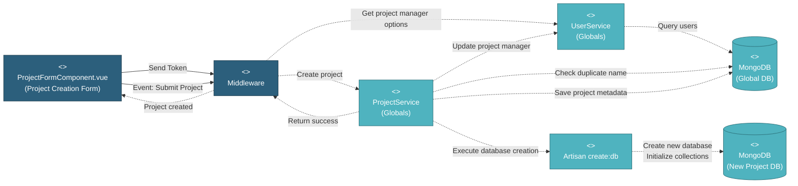

# 5.1.2.2 Project Creation & Configuration

This component handles the creation of new projects with form validation, duplicate checking, and automatic database setup.

---

## Component Design Diagram

*Figure: Project Creation & Configuration Component Design*

**API Endpoint**: `POST /api/global/project`  
**Vuex Action**: `global_project/createProject`  
**Artisan Command**: `php artisan create:db {db_name}`

---

## 5.1.2.2.1 User Interface

### ProjectFormComponent.vue (Project Creation Form)

This is the entry point for creating new projects. When the form loads, it displays:
- **Project Name** (required): Text input
- **Business Unit** (required): Dropdown (MISI/BU/Non-MI)
- **Description** (required): Textarea
- **Project Manager** (required): Searchable dropdown with "Create User" button
- **Customer Name** (required): Text input
- **Color** (required): Color picker for visual identification
- **Show Project Value**: Toggle to display project value on dashboard

Upon loading, the component sends an authentication token to retrieve project manager options from UserService. When the user clicks "Submit", it validates all required fields and sends the "Event: Submit Project" with form data to ProjectService for creation.

---

## 5.1.2.2.2 Security

### Middleware

The security middleware validates the authentication token sent from the Project Creation Form. It checks:
1. **Authentication**: Verifies the user is logged in with a valid JWT token
2. **Authorization**: Checks `global.project` privilege with write (RW) access
3. **Role Check**: Typically only Super Admins can create projects

After validation, the middleware forwards the create request to ProjectService.

---

## 5.1.2.2.3 Application Services

### ProjectService (Globals)

This service handles the "Create project" request from the middleware. The method `create()` performs the following operations:

1. **Check Duplicate Name**: Queries the `projects` collection to ensure the project name is unique

2. **Generate Database Name**: Creates a unique database name using format: `pipeline_project_{timestamp}_{random_string}`

3. **Save Project Metadata**: Inserts project record into `projects` collection in `mongodb_global` with:
   - `project_name`, `project_company`, `project_desc`
   - `color`, `business_unit`, `version`
   - `user_id` (project manager ID)
   - `db_name` (generated database name)
   - `status` = "incomplete" (until database is ready)

4. **Execute Database Creation**: Calls `Artisan::call('create:db', ['db_name' => $db_name])` to trigger the CLI command

5. **Update Project Manager**: Calls UserService to add this project to the project manager's `allowed_projects` array

6. **Return Success**: Sends project ID back to the UI

### UserService (Globals)

This service provides two functions:
1. **Get Project Manager Options**: Queries `users` collection to retrieve all users who can be assigned as project managers
2. **Update Project Manager**: Adds the new project to the selected manager's `allowed_projects` array

### Artisan create:db Command

This CLI command creates the new project database and initializes all required collections:
- Creates MongoDB database with the generated `db_name`
- Initializes collections: `sow`, `work_order`, `inspection`, `testing`, `delivery`, `transfer`, etc.
- Creates indexes for performance
- Inserts default data (e.g., default privileges, roles)

---

## 5.1.2.2.4 Database

### MongoDB (Global DB)

The **projects** collection stores the new project record:
- `_id`: Auto-generated ObjectId
- `project_name`: Unique project name
- `project_company`: Customer/company name
- `project_desc`: Project description
- `color`: Hex color code
- `business_unit`: MISI/BU/Non-MI
- `db_name`: Generated database name (e.g., `pipeline_project_1697788800_abc123`)
- `user_id`: Project manager user ID
- `status`: "incomplete" initially, "active" after database is ready
- `version`: App version (default: 2)
- `created_at`, `updated_at`: Timestamps

The **users** collection provides project manager options and is updated with the new project in `allowed_projects` array.

### MongoDB (New Project DB)

A new database is created with the generated `db_name` containing:
- **sow**: Scope of work records
- **work_order**: Manufacturing work orders
- **inspection**: Quality inspection records
- **testing**: Test results
- **delivery**: Delivery schedules
- **transfer**: Logistics and shipping
- **users**: Project-specific user roles
- **privileges**: Project-specific permissions
- And 30+ other collections

---

## Code References

**Backend:**
- Controller: `app/Http/Controllers/Api/Globals/ProjectController.php::create()`
- Service: `app/Services/Globals/ProjectService.php::create()`
- Repository: `app/Repositories/Globals/Project/ProjectRepository.php`
- Request: `app/Http/Requests/Globals/Project/StoreProjectRequest.php`
- Command: `app/Console/Commands/CreateProjectDatabase.php`

**Frontend:**
- Component: `resources/js/components/global/project/ProjectFormComponent.vue`
- Vuex Store: `resources/js/store/modules/globals/project/actions.js::createProject`
- Route: `/global/project/create`

**API:**
- Endpoint: `POST /api/global/project`
- Payload: `{ name, desc, company, project_manager, color, business_unit, show_project_value }`
- Returns: `{ status: 'success', project_id: ObjectId }`

**Artisan:**
- Command: `php artisan create:db {db_name}`
- Creates new MongoDB database with all required collections

---

**Status**: ✅ Re-verified against codebase (BE + FE + CLI)
