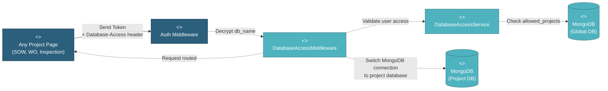

# 5.1.2.3 Project Database Setup & Multi-Tenancy

This component manages the automatic database creation, collection initialization, and multi-tenant database routing for project-specific data isolation.

---

## Component Design Diagram



*Figure: Project Database Setup & Multi-Tenancy Component Design*

**Header**: `Database-Access: {encrypted_db_name}`
**Middleware**: `DatabaseAccessMiddleware`
**Service**: `DatabaseAccessService`

---

## 5.1.2.3.1 User Interface

### Any Project Page (SOW, WO, Inspection)

When users navigate to any project-specific page, the Vue component automatically includes the encrypted project database name in all API request headers:
- Header name: `Database-Access`
- Value: Encrypted `db_name` (e.g., encrypted "pipeline_project_1697788800_abc123")

This happens transparently:
1. User clicks a project card from the project list
2. System stores the encrypted `db_name` in Vuex store
3. Axios interceptor automatically adds `Database-Access` header to all subsequent requests
4. User navigates to SOW, Work Order, Inspection pages
5. All API calls include the header for proper database routing

The user never sees or interacts with this header—it's handled automatically by the frontend.

---

## 5.1.2.3.2 Security

### Auth Middleware

First validates the authentication token to ensure the user is logged in with a valid JWT token.

### DatabaseAccessMiddleware

This middleware handles the multi-tenant database routing:
1. **Extract Header**: Reads the `Database-Access` header from the request
2. **Decrypt Database Name**: Uses `Crypt::decryptString()` to decrypt the `db_name`
3. **Validate Access**: Calls DatabaseAccessService to verify the user has access to this project
4. **Switch Connection**: Dynamically changes the MongoDB connection to point to the project's database
5. **Continue Request**: Allows the request to proceed with the correct database context

If the header is missing, invalid, or the user lacks access, the middleware returns a 403 Forbidden error.

---

## 5.1.2.3.3 Application Services

### DatabaseAccessService

This service handles the "Validate user access" request from the middleware. The method `validateAccess()` performs:

1. **Query User**: Retrieves the authenticated user from the `users` collection in `mongodb_global`

2. **Check Allowed Projects**: Verifies the decrypted `db_name` exists in the user's `allowed_projects` array

3. **Role-Based Access**:
   - **Super Admin**: Access to all projects
   - **Project Manager / Team Member**: Access to assigned projects only
   - **Global Viewer**: Access to projects in `allowed_projects` list

4. **Return Result**: Returns true/false to the middleware

If validation fails, the middleware blocks the request with a 403 Forbidden error.

### Dynamic Connection Switching

After validation, DatabaseAccessMiddleware dynamically switches the MongoDB connection:

```php
// Switch to project database
config(['database.connections.mongodb_project.database' => $decrypted_db_name]);
DB::purge('mongodb_project');
DB::reconnect('mongodb_project');
```

All subsequent queries in this request will use the project's database. The connection is reset after the request completes.

---

## 5.1.2.3.4 Database

### MongoDB (Global DB)

The **users** collection stores project access rights:
- `allowed_projects`: Array of `db_name` values the user can access
- Used by DatabaseAccessService to validate access

The **projects** collection stores database names:
- `db_name`: The actual database name (e.g., "pipeline_project_1697788800_abc123")
- Encrypted before sending to client, decrypted by middleware

### MongoDB (Project Databases)

Each project has its own isolated database containing:
- **sow**: Scope of work records
- **work_order**: Manufacturing work orders
- **inspection**: Quality inspection records
- **item**: Item records
- **specification**: Specification records
- **transfer**: Logistics data
- And 30+ other collections

**Benefits of Multi-Tenancy**:
- Complete data isolation between projects
- Independent backups and restores
- Scalability (can move databases to different servers)
- Security (users can only access authorized project data)

---

## Code References

**Backend:**
- Middleware: `app/Http/Middleware/DatabaseAccessMiddleware.php`
- Service: `app/Services/Globals/DatabaseAccessService.php`
- Config: `config/database.php` (mongodb_project connection)

**Frontend:**
- Axios Interceptor: `resources/js/plugins/axios.js` (adds Database-Access header)
- Vuex Store: `resources/js/store/modules/globals/auth/state.js` (stores encrypted db_name)

**Header:**
- Name: `Database-Access`
- Value: Encrypted `db_name` using Laravel's `Crypt::encryptString()`
- Added automatically to all project-specific API requests

---

**Status**: ✅ Re-verified against codebase (BE + FE) request context.
