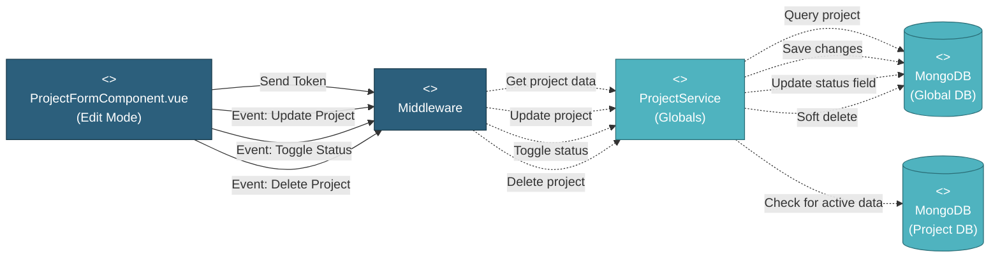

# 5.1.2.4 Project Settings & Operations

This component manages project configuration updates, status changes, and project deletion with validation checks.

---

## Component Design Diagram

*Figure: Project Settings & Operations Component Design*

**API Endpoints**:  
- `POST /api/global/project/{id}` - Update project  
- `POST /api/global/close_open_project` - Toggle status  
- `DELETE /api/global/project/{id}` - Delete project  

**Vuex Actions**: `updateProject`, `closeOpenProject`, `deleteProject`

---

## 5.1.2.4.1 User Interface

### ProjectFormComponent.vue (Edit Mode)

When editing an existing project, the form displays with three main operations:

**1. Update Project Details**:
- Pre-filled form with current project data
- Editable fields (role-based):
  - **Super Admin**: All fields (name, description, company, project manager, color, business unit, UOM, currency, etc.)
  - **MI Team**: Most fields EXCEPT project manager (disabled: `disabled_for_mi_team`)
  - **Other Roles**: All fields except business unit (disabled: `!is_super_admin`)
- Special rules:
  - **Business Unit**: Only Super Admin can edit
  - **Project Manager**: MI Team cannot change
  - **UOM/Pipe Length**: Locked if project has data (`!project.is_empty`)
- On submit: Sends "Event: Update Project" with modified data

**2. Toggle Project Status**:
- Button to switch between "Active" and "Closed"
- On click: Sends "Event: Toggle Status"
- Updates project card display immediately

**3. Delete Project**:
- Delete button with confirmation dialog
- First confirmation: "Are you sure?"
- If project has data: Second confirmation required
- On confirm: Sends "Event: Delete Project"

All operations require authentication token and `global.project` write access.

---

## 5.1.2.4.2 Security

### Middleware

The security middleware validates all project modification requests:
1. **Authentication**: Verifies valid JWT token
2. **Authorization**: Checks `global.project` privilege with write (RW) access
3. **Role Check**: 
   - Update/Toggle: Project Manager, Super Admin
   - Delete: Super Admin only

After validation, forwards the request to ProjectService.

---

## 5.1.2.4.3 Application Services

### ProjectService (Globals)

This service handles three main operations:

**1. Update Project** (`update()` method):
- Validates changes (check duplicate name if changed)
- Updates project record in `projects` collection
- If project manager changed:
  - Removes project from old manager's `allowed_projects`
  - Adds project to new manager's `allowed_projects`
- Returns success response

**2. Toggle Status** (`closeOpenProject()` method):
- Validates project exists
- Toggles `status` field between "active" and "closed"
- Updates `updated_at` timestamp
- Returns updated project data

**3. Delete Project** (`delete()` method):
- **Safety Check**: Queries project database to check for active data:
  - Checks `sow`, `work_order`, `inspection` collections
  - If any records exist, requires explicit confirmation
- **Soft Delete**: Sets `deleted_at` timestamp (doesn't actually delete)
- **Audit Trail**: Maintains project record for historical reference
- Returns success response

---

## 5.1.2.4.4 Database

### MongoDB (Global DB)

The **projects** collection stores project records:
- `project_name`, `project_company`, `project_desc`: Editable fields
- `color`, `business_unit`: Configuration
- `user_id`: Project manager ID (updated when changed)
- `status`: "active" or "closed" (toggled)
- `deleted_at`: Soft delete timestamp (null if not deleted)
- `created_at`, `updated_at`: Audit timestamps

The **users** collection:
- `allowed_projects`: Updated when project manager changes
- Used to validate project access

### MongoDB (Project DB)

Checked before deletion to ensure no active data exists:
- **sow**: Scope of work records
- **work_order**: Manufacturing work orders
- **inspection**: Quality inspection records

If any collections contain data, deletion requires explicit confirmation.

---

## Code References

**Backend:**
- Controller: `app/Http/Controllers/Api/Globals/ProjectController.php`
  - `update()` - Update project
  - `closeOpenProject()` - Toggle status
  - `delete()` - Delete project
- Service: `app/Services/Globals/ProjectService.php`
- Repository: `app/Repositories/Globals/Project/ProjectRepository.php`
- Request: `app/Http/Requests/Globals/Project/StoreProjectRequest.php`

**Frontend:**
- Component: `resources/js/components/global/project/ProjectFormComponent.vue`
- Vuex Store: `resources/js/store/modules/globals/project/actions.js`
  - `updateProject`
  - `closeOpenProject`
  - `deleteProject`
- Route: `/global/project/edit/{id}`

**API:**
- Update: `POST /api/global/project/{id}`
- Toggle: `POST /api/global/close_open_project`
- Delete: `DELETE /api/global/project/{id}` (requires confirmation if data exists)

---

**Status**: ✅ Re-verified against codebase (BE + FE) data integrity and enforces business rules before making changes to the database.
