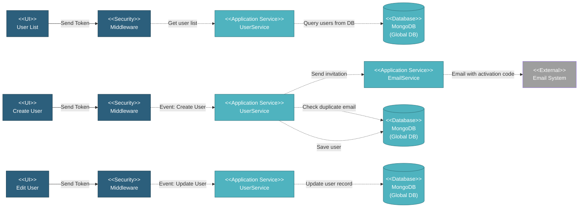

# 5.1.3 User Management

This component handles all user-related operations including user list display, creation with email invitations, editing user information, self-service profile updates, and user deletion.

---

## Component Design Diagram

*Figure: User Management Component Design*

---

## 5.1.3.1 User Interface

### 5.1.3.1.1 User List

This displays all users in a DataTable with columns for name with photo, email, role, status, last seen timestamp, and action buttons. Users can search in real-time across name, email, and role fields, and filter by role using a dropdown. Super Admin and MI Team can see all users in the system. Each row provides edit, delete, and resend invitation actions. A create button at the top opens the user creation form.

### 5.1.3.1.2 Create User Form

This form creates new users and sends email invitations. Users enter first name, last name, email, select up to two roles from primary roles like Super Admin, MI Team, and Global Viewer, with an optional additional privilege for Vendor Approver. For Global Viewer role, the form shows an allowed projects field to specify which projects the user can access. Photo upload is optional. Upon submission, it sends a token for authentication, generates a 4-digit activation code, and triggers an invitation email with the activation link.

### 5.1.3.1.3 Edit User Form

This form uses the same structure as create but pre-populates with existing data. Super Admin can edit all fields including name, email, role, allowed projects, and photo. Email uniqueness is validated excluding the current user. No email invitation is sent on update. The form enforces self-protection rules preventing users from removing their own Super Admin role.

### 5.1.3.1.4 Own Profile

This is a self-service profile editing interface where users can update their own information without special privileges. Users can edit their name and upload a new photo. Email, role, and allowed projects are read-only and displayed for reference only. This ensures users cannot escalate their own privileges or access.

---

## 5.1.3.2 Security

Middleware validates the authentication token sent from all User Management UIs. For user list viewing, it requires read access to the global user privilege, allowing Super Admin and MI Team to see all users. For create, edit, and delete operations, it requires write access to the global user privilege, restricted to Super Admin only. The profile update interface has no special privilege requirement as users can only edit their own profile with limited fields, preventing changes to email, role, or project access.

---

## 5.1.3.3 Application Services

### 5.1.3.3.1 Initial Data Retrieval

The UserService provides the user list with server-side pagination, search, and sorting capabilities. It returns user data including name, email, role name, active status, last seen timestamp, and photo using the standard DataTables format through a base helper method.

### 5.1.3.3.2 User Created

This handles user creation and invitation email delivery. The service validates email uniqueness against existing users, generates a random 4-digit activation code between 1000 and 9999, and saves the user with active status set to 'n' for pending activation. It then triggers the EmailService to send an invitation email containing the user's first name and an activation link with the code. The activation code expires in 7 days. The service returns the newly created user ID upon successful completion.

---

## 5.1.3.4 Database

### MongoDB (Global DB)

**users** collection:
- `first_name`, `last_name`, `name`: User names
- `email`: Email address
- `role`: Primary role (super_admin, mi_team, global_viewer)
- `role_name`: Role display name
- `additional_privileges`: Array of extra roles/privileges
- `allowed_projects`: Array of database names or "all"
- `active`: 'n' (pending) or 'y' (activated)
- `activation_code`: 4-digit code (1000-9999)
- `activation_code_exp`: Expiry timestamp (7 days)
- `invite_by`: Email of inviter
- `invite_date`: Invitation timestamp
- `photo`: Profile photo (blob/binary)
- `last_seen_at`: Last activity timestamp
- `created_at`, `updated_at`, `deleted_at`: Timestamps

---

## Code References

**Backend:**
- Controller: `app/Http/Controllers/Api/Globals/UserController.php`
- Service: `app/Services/Globals/UserService.php`
- Repository: `app/Repositories/Globals/User/UserRepository.php`
- Request: `app/Http/Requests/Globals/User/StoreUserRequest.php`
- Email: `app/Services/EmailService.php`

**Frontend:**
- Component: `resources/js/components/global/user/UserComponent.vue` (list)
- Component: `resources/js/components/global/user/UserCreateComponent.vue` (create)
- Component: `resources/js/components/global/user/UserEditComponent.vue` (edit)
- Component: `resources/js/components/global/user/UserProfileComponent.vue` (own profile)
- Vuex: `resources/js/store/modules/globals/user/actions.js`
- Routes: `/global/user`, `/global/user/create`, `/global/user/edit/{id}`, `/global/user_profile/{id}`

**Email:**
- Template: `resources/views/email/invitation.blade.php`
- Activation Link: `{APP_URL}/activate/{activation_code}`

---

**Status**: ✅ User Management component documentation
