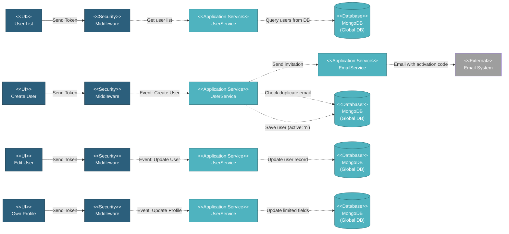

# 5.1.3 User Management

This component handles all user-related operations including user list display, creation with email invitations, editing user information, self-service profile updates, and user deletion.

---

## Component Design Diagram

*Figure: User Management Component Design*

**API Endpoints**:
- List: `POST /api/global/users/datatables`
- Create: `POST /api/global/user`
- Update: `POST /api/global/user/{id}`
- Delete: `DELETE /api/global/user/{id}`

**Vuex Actions**: `global_user/setUsers`, `createUser`, `updateUser`, `deleteUser`

---

## 5.1.3.1 User Interface

### UserComponent.vue (User List)

DataTable displaying all users with:
- **Columns**: Name (with photo), Email, Role, Status, Last seen, Actions
- **Search**: Real-time search across name, email, role
- **Filters**: Role dropdown
- **Actions**: Edit, Delete, Resend Invitation buttons
- **Create Button**: Opens user creation form

### UserCreateComponent.vue (Create User Form)

Form for creating new users with email invitation:
- **Name** (required): First name + Last name
- **Email** (required): Email validation
- **Roles** (required): Multi-select (max 2)
  - Primary Role: Super Admin, MI Team, Global Viewer
  - Additional Privilege: Vendor Approver
- **Allowed Projects** (conditional): Only for Global Viewer role
- **Photo Upload**: Optional

Upon submit → generates 4-digit activation code → sends invitation email

### UserEditComponent.vue (Edit User Form)

Same form as creation but pre-filled with existing data:
- All fields editable by admin
- Email uniqueness validated (excluding current user)
- NO email invitation sent
- Used by Super Admin to edit any user

### UserProfileComponent.vue (Own Profile)

Self-service profile editing with limited fields:
- **Name** (editable)
- **Email** (read-only)
- **Password Change** (optional, requires current password)
- **Photo Upload** (optional)
- **Role & Projects** (read-only, display only)

No special privileges required - users can only edit their own profile.

---

## 5.1.3.2 Security

### Middleware

**For User List**:
- Requires `global.user` privilege (R access)
- Super Admin and MI Team can see all users

**For Create/Edit/Delete**:
- Requires `global.user` privilege (RW access)
- Only Super Admin can create/edit/delete users
- Self-protection: Cannot remove own Super Admin role

**For Profile Update**:
- No special privilege required (`privileges: null`)
- Users can ONLY edit their own profile
- Cannot change email, role, or projects

---

## 5.1.3.3 Application Services

### UserService (Globals)

**1. Get User List** (`dataTables()` method):
- Server-side pagination with search and sorting
- Returns: name, email, role_name, active status, last_seen_at, photo
- Uses base helper `getDataTables()` for standard DataTables format

**2. Create User** (`create()` method):
- Validates email uniqueness
- Generates 4-digit activation code (1000-9999)
- Saves user with `active: 'n'` (pending activation)
- Sends invitation email via EmailService
- Returns user ID

**3. Update User** (`update()` method):
- **Admin Edit**: Can change all fields (name, email, role, projects, photo)
- **Self-Service**: Can only change name, password, photo
- Email uniqueness validated (excluding current user)
- NO email sent on update
- Returns updated user data

**4. Delete User** (`delete()` method):
- Soft delete: Sets `deleted_at` timestamp
- Validates user has no active project assignments
- Maintains audit trail
- Returns success response

### EmailService

Sends invitation email:
- Template: `resources/views/email/invitation.blade.php`
- Variables: `$first_name`, `$link_activateAccount`
- Activation link with 4-digit code
- Expires in 7 days

---

## 5.1.3.4 Database

### MongoDB (Global DB)

**users** collection:
- `first_name`, `last_name`, `name`: User names
- `email`: Email address (unique, indexed)
- `role`: Primary role (super_admin, mi_team, global_viewer, etc.)
- `role_name`: Role display name
- `additional_privileges`: Array of extra roles/privileges
- `allowed_projects`: Array of `db_name` values or "all" (for Global Viewer)
- `active`: 'n' (pending) or 'y' (activated)
- `activation_code`: 4-digit code (1000-9999)
- `activation_code_exp`: Expiry timestamp (7 days)
- `invite_by`: Email of inviter
- `invite_date`: Invitation timestamp
- `photo`: Profile photo (blob/binary)
- `password`: Hashed password
- `last_seen_at`: Last activity timestamp
- `created_at`, `updated_at`, `deleted_at`: Timestamps

---

## Code References

**Backend:**
- Controller: `app/Http/Controllers/Api/Globals/UserController.php`
  - `dataTables()` - Get user list
  - `create()` - Create user
  - `update()` - Update user
  - `delete()` - Delete user
- Service: `app/Services/Globals/UserService.php`
- Repository: `app/Repositories/Globals/User/UserRepository.php`
- Request: `app/Http/Requests/Globals/User/StoreUserRequest.php`
- Email: `app/Services/EmailService.php`

**Frontend:**
- Components:
  - `resources/js/components/global/user/UserComponent.vue` (list)
  - `resources/js/components/global/user/UserCreateComponent.vue` (create)
  - `resources/js/components/global/user/UserEditComponent.vue` (edit)
  - `resources/js/components/global/user/UserProfileComponent.vue` (own profile)
  - `resources/js/components/global/user/UserFormComponent.vue` (shared form)
- Vuex: `resources/js/store/modules/globals/user/actions.js`
- Routes:
  - `/global/user` - User list
  - `/global/user/create` - Create user
  - `/global/user/edit/{id}` - Edit user (admin)
  - `/global/user_profile/{id}` - Own profile (self-service)

**Email:**
- Template: `resources/views/email/invitation.blade.php`
- Activation Link: `{APP_URL}/activate/{activation_code}`

---

**Status**: ✅ Re-verified against codebase (BE + FE + Email)
