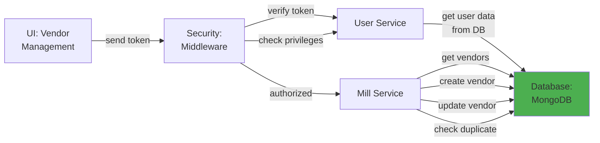

# 5.1.3 Vendor Management

## 5.1.3.1 User Interface

When a user navigates to the Vendor Management page (route: `/global/vendor`), the UI sends a JWT token to the backend. The interface displays a comprehensive list of vendors/mills/manufacturers with filtering and search capabilities. Users can view vendor details including company name, contact information, location, certifications, and quality ratings. The UI provides CRUD operations for vendor records and allows association of vendors with projects and item attributes. No business logic happens here; it simply initiates the request and presents the vendor data to the user.

## 5.1.3.2 Security

The middleware acts as a security layer, handling both authentication and authorization. After receiving the token from the UI, it verifies the token's validity through Laravel Passport's `auth:api` middleware. Once the user is verified, the `user.privileges` middleware checks for:
- `global.vendor:R` for read access (view vendor list, view vendor details)
- `global.vendor:W` for write access (create, edit, delete vendors)

Super admins and authorized users have full access to vendor management, while vendor users can only view their own vendor profile.

## 5.1.3.3 Application Services

### 5.1.3.3.1 Mill Service

The Mill Service (`App\Services\Globals\MillService`) manages all vendor/mill/manufacturer operations. It provides comprehensive vendor lifecycle management and integration with project-specific data.

**Key Methods:**
- `index()` / `dataTables()` - Retrieves vendor list with pagination, search, and filtering for the DataTables component.
- `create()` - Creates a new vendor record with company information, contact details, and certifications.
- `read()` - Retrieves vendor details including associated certifications, audit history, and quality metrics.
- `update()` - Updates vendor information including contact details, certifications, and quality ratings.
- `delete()` - Soft deletes a vendor record (sets deleted flag to 1).
- `getOptions()` - Returns vendor options for dropdown selections in SOW and work order creation.
- `checkDuplicate()` - Validates vendor name uniqueness before creation/update.
- `getAuditHistory()` - Retrieves vendor audit history from project databases.
- `getCertifications()` - Returns vendor certification documents and expiration dates.

## 5.1.3.4 Database

**Global Database (`mongodb_global`):**
- `manufacturer` - Stores vendor master data including _id, name (company name), code, address, city, state, country, postal_code, contact_person, email, phone, fax, website, certifications (array of certification objects with type, number, issued_date, expiry_date, document_url), quality_rating, audit_score, is_approved (boolean), approved_by, approved_at, notes, created_at, created_by, updated_at, updated_by, deleted, deleted_at, deleted_by.

*Figure: Vendor Management Component Design*
