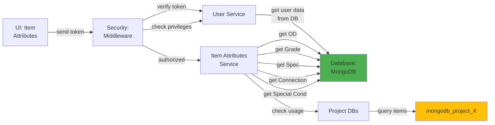

# 5.1.4 Item Attributes

## 5.1.4.1 User Interface

When a user opens the Item Attributes page (route: `/global/item_attributes`), the UI sends a JWT token to the backend. The interface displays a multi-tab view for managing different types of item attributes: OD (Outer Diameter), Grade, Specification, Connection Type, and Special Conditions. Each tab shows a data table with attribute definitions used across all projects. Users can create, edit, and delete attribute definitions to maintain standardized item configurations. No business logic happens here; it simply initiates the request and presents the attribute data to the user.

## 5.1.4.2 Security

The middleware acts as a security layer, handling both authentication and authorization. After receiving the token from the UI, it verifies the token's validity through Laravel Passport's `auth:api` middleware. Once the user is verified, the `user.privileges` middleware checks for:
- `global.item_attribute:R` for read access (view attributes)
- `global.item_attribute:W` for write access (create, edit, delete attributes)

Only super admins and authorized MI team members have write access to item attributes, ensuring data integrity and standardization across all projects.

## 5.1.4.3 Application Services

### 5.1.4.3.1 Item Attributes Service

The Item Attributes Service (`App\Services\Globals\ItemAttributesService`) manages all global item attribute definitions used across projects. It ensures standardization and consistency of item specifications throughout the system.

**Key Methods:**
- `index()` - Retrieves all item attributes grouped by type (OD, grade, specification, connection, special_condition).
- `create()` - Creates a new attribute definition with validation against existing attributes.
- `read()` - Retrieves a specific attribute definition by ID and type.
- `update()` - Updates an attribute definition (name, code, description, unit, conversion factors).
- `delete()` - Soft deletes an attribute definition after checking if it's used in any projects.
- `getOptions()` - Returns attribute options for dropdown selections in item creation forms.
- `checkUsage()` - Verifies if an attribute is used in any project before allowing deletion.
- `importFromCSV()` - Bulk imports attribute definitions from CSV files for initial setup or updates.

## 5.1.4.4 Database

**Global Database (`mongodb_global`):**
- `od` - Outer diameter specifications including _id, name (e.g., "12.75 inch", "323.9 mm"), value (numeric), unit, is_active, created_at, created_by, updated_at, updated_by, deleted, deleted_at, deleted_by.
- `grade` - Material grade definitions including _id, name (e.g., "X65", "L360"), code, specification_standard (e.g., "API 5L", "ISO 3183"), description, is_active, created_at, updated_at, deleted.
- `specification` - Detailed specification records including _id, name, code, description, standard_reference, revision, is_active, created_at, updated_at, deleted.
- `connection` - Connection type definitions including _id, name (e.g., "Buttress", "VAM TOP"), code, manufacturer, thread_type, is_active, created_at, updated_at, deleted.
- `special_condition` - Special condition codes including _id, name, code, description, is_active, created_at, updated_at, deleted.

*Figure: Item Attributes Component Design*
