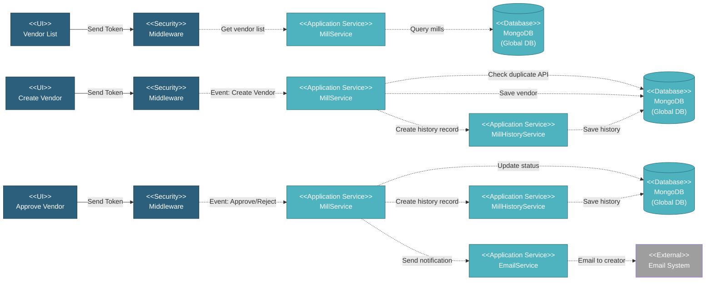

# 5.1.4 Vendor Management

This component handles vendor/manufacturer (Mills) operations including vendor list display with status filtering, creation, editing with approval workflow, status transitions (PENDING → TO_REVIEW → APPROVED/REJECTED), usage validation, and bulk operations.

---

## Component Design Diagram

*Figure: Vendor Management Component Design*

---

## 5.1.4.1 User Interface

### 5.1.4.1.1 Vendor List

This displays all vendors with status-based filtering via tabs (PENDING, APPROVED, REJECTED, TO_REVIEW). Users can search across API number, name, short name, and location. Vendor Approvers see additional bulk approve/reject actions. Upon page load, it sends a token for authentication and retrieves vendor list data.

### 5.1.4.1.2 Create/Edit Vendor Form

This form creates or edits vendors with fields for API number, name, short name, location, country, and additional information. New vendors are saved with PENDING status requiring approval. Editing approved vendors creates proposed changes with TO_REVIEW status requiring re-approval.

### 5.1.4.1.3 Approval Panel

This panel is visible only to Vendor Approvers. It provides single approve/reject buttons per vendor and bulk operations for multiple selections. For modification reviews, it shows side-by-side comparison of current vs proposed changes with agree/deny actions.

---

## 5.1.4.2 Security

Middleware validates the authentication token sent from all Vendor Management UIs. Only authenticated and authorized users can proceed to perform or view vendor actions. Vendor Approvers have special privileges to approve or reject vendors regardless of standard write access.

---

## 5.1.4.3 Application Services

### 5.1.4.3.1 Initial Data Retrieval

- **MillService**: Provides vendor list with status filtering and encrypted data.

### 5.1.4.3.2 Vendor Created

Handles vendor creation and saves it to MongoDB. This includes validating API number uniqueness, saving vendor with PENDING status, and creating history record for audit trail.

### 5.1.4.3.3 Vendor Lifecycle Events

Each of the following services handles a specific stage in the vendor flow. All of them update vendor data in MongoDB through the Mill Service:

- **Vendor Updated**: Updates existing vendor record. For approved vendors, saves proposed changes with TO_REVIEW status.
- **Vendor Approved**: Changes status to APPROVED. Creates history record and sends email notification to creator and chosen email(s).
- **Vendor Rejected**: Changes status to REJECTED. Creates history record and sends email notification to creator and chosen email(s).
- **Vendor Deleted**: Remove vendor from the system. Validates vendor is not used in any SOWs across all projects before deletion.
- **Bulk Approve/Reject**: Processes multiple vendors at once with status updates and notifications.

---

## 5.1.4.4 Database

### MongoDB (Global DB)

**mills** collection:
- `api`: API number (unique identifier)
- `name`: Full vendor name
- `short_name`: Abbreviated name
- `location`: City/region
- `country`: Country
- `status`: Vendor status (Pending for Approval, Approved, Rejected, To Review)
- `created_by`, `updated_by`: User emails
- `created_at`, `updated_at`, `deleted_at`: Timestamps

**mill_histories** collection:
- `mill_id`: Reference to mill
- `action`: Action type (created, updated, approved, rejected)
- `data`: Change tracking
- `updated_by`: User who performed action
- `created_at`: Timestamp

---

## Code References

**Backend:**
- Controller: `app/Http/Controllers/Api/Globals/MillController.php`
- Service: `app/Services/Globals/MillService.php`
- Service: `app/Services/Globals/MillHistoryService.php`
- Repository: `app/Repositories/Globals/Mill/MillRepository.php`
- Repository: `app/Repositories/Globals/Mill/MillHistoryRepository.php`

**Frontend:**
- Component: `resources/js/components/global/mill/MillComponent.vue` (list)
- Component: `resources/js/components/global/mill/MillFormComponent.vue` (create/edit)
- Vuex: `resources/js/store/modules/globals/mill/actions.js`
- Route: `/global/vendor`

---

**Status**: ✅ Vendor Management component documentation
