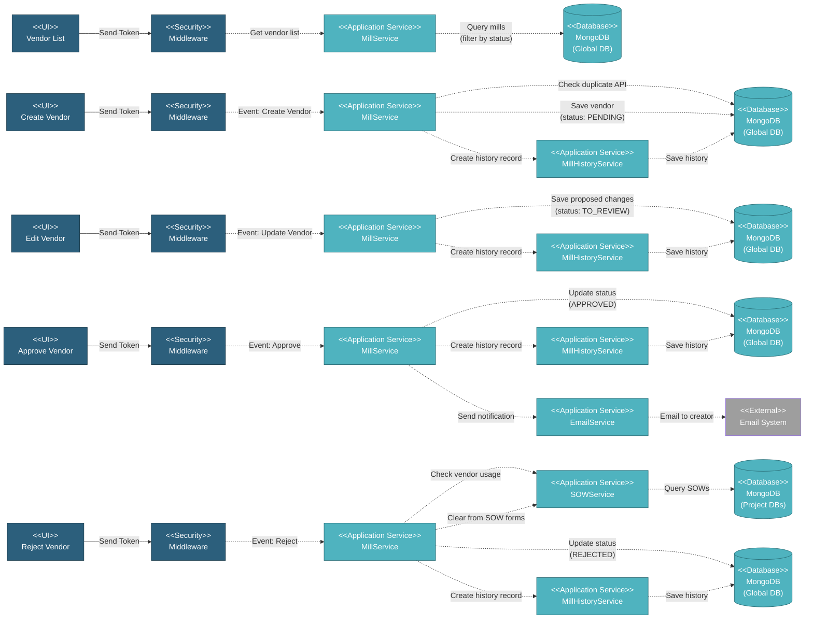

# 5.1.4 Vendor Management

This component handles all vendor/manufacturer (Mills) operations including vendor list display, creation, editing, approval workflow with status transitions (PENDING → TO_REVIEW → APPROVED/REJECTED), usage validation, and bulk operations.

---

## Component Design Diagram

*Figure: Vendor Management Component Design*

**Vuex Actions**: `global_mill/getMills`, `createMill`, `updateMill`, `deleteMill`, `vendorApproval`

---

## 5.1.4.1 User Interface

### MillComponent.vue (Vendor List)

Displays all vendors with status-based filtering:
- **Status Tabs**: PENDING, APPROVED, REJECTED, TO_REVIEW
- **Columns**: API Number, Name, Short Name, Location, Country, Status badge, Actions
- **Search**: Real-time search across API, name, short name, location
- **Actions** (role-based):
  - **All Users**: View, Edit, History
  - **Vendor Approver**: Approve, Reject, Bulk Approve/Reject

**Status Values** (from Mill model constants):
- **"Pending for Approval"**: Yellow badge - awaiting initial approval
- **"Approved"**: Green badge - active and usable
- **"Rejected"**: Red badge - denied, not usable
- **"To Review"**: Orange badge - has proposed changes awaiting approval

### MillFormComponent.vue (Create/Edit Vendor)

Form for creating or editing vendors:
- **API Number** (required): Unique identifier
- **Name** (required): Full vendor name
- **Short Name** (required): Abbreviated name
- **Location** (required): City/region
- **Country** (required): Country dropdown
- **Additional Info**: Contact details, certifications

**Behavior**:
- **Create**: Saves with `status: "Pending for Approval"` → requires approval
- **Edit Approved Vendor**: Saves proposed changes with `status: "To Review"` → requires re-approval
- **Edit Pending/Rejected**: Direct update without approval

### Approval Panel (Vendor Approver Only)

Visible only to users with `isVendorApprover` flag:
- **Single Approve/Reject**: Buttons on each vendor row
- **Bulk Operations**: Select multiple vendors → Approve All / Reject All
- **Modification Review**: Side-by-side comparison of current vs proposed changes
  - **Agree**: Applies changes, sets status to APPROVED
  - **Deny**: Restores previous data, updates status based on history

---

## 5.1.4.2 Security

### Middleware

**For Vendor List/View**:
- Requires `global.vendor` privilege (R access)
- All authenticated users can view vendors

**For Create/Edit/Delete**:
- Requires `global.vendor` privilege (RW access)
- Any user with write access can create/edit/delete

**For Approve/Reject**:
- Requires `isVendorApprover` flag (special role)
- Only Vendor Approvers can change status
- Blocks regular users even with RW access

---

## 5.1.4.3 Application Services

### MillService (Globals)

**1. Get Vendor List** (`index()` method):
- Queries `mills` collection with status filter
- Returns: api_number, name, short_name, location, country, status
- For TO_REVIEW status: Checks history to show if previously rejected

**2. Create Vendor** (`create()` method):
- Validates API number uniqueness via `checkDuplicate()`
- Saves vendor with `status: "Pending for Approval"`
- Creates history record via MillHistoryService
- Returns vendor ID

**3. Update Vendor** (`update()` method):
- **If status = "Approved"**: Saves proposed changes, sets `status: "To Review"`
- **If status = "Pending for Approval"/"Rejected"**: Direct update
- Creates history record
- Returns success response

**4. Vendor Approval** (`vendorApproval()` method):
Handles all approval operations based on request parameters:
- **Parameters**:
  - `is_reject`: Boolean (true = reject/deny, false = approve/agree)
  - `is_review`: Boolean (true = agree/deny modification, false = approve/reject new vendor)
  - `mill_ids`: Array of vendor IDs for bulk operations
  - `reason`: Rejection/denial reason (required if `is_reject = true`)

- **Approve** (`is_reject=false`, `is_review=false`):
  - Updates `status: "Approved"`
  - Creates history record
  - Sends email notification to creator

- **Reject** (`is_reject=true`, `is_review=false`):
  - Updates `status: "Rejected"`
  - Creates history record with reason
  - Returns success response
  - **Note**: Rejection is allowed even if vendor is in use (unlike deletion)

- **Agree Modification** (`is_reject=false`, `is_review=true`):
  - Applies proposed changes
  - Updates `status: "Approved"`
  - Creates history record

- **Deny Modification** (`is_reject=true`, `is_review=true`):
  - Restores previous approved data
  - Updates status based on history
  - Creates history record with reason

**5. Delete Vendor** (`delete()` method):
- **Usage Check**: Queries all project DBs for vendor usage
- If used: Prevents deletion with error
- If not used: **Hard delete** - permanently removes record
- Returns success response

### MillHistoryService (Globals)

Manages vendor audit trail:
- **Create History**: Records all status changes with user, timestamp, reason
- **Get History**: Retrieves complete timeline for a vendor
- **Format History**: Enriches with user details for display

### SOWService (Project DBs)

**Check Vendor Usage**:
- Queries all project databases for SOW records using the vendor
- Returns list of projects where vendor is referenced
- Used to prevent **deletion** of in-use vendors (rejection is allowed even if vendor is in use)

---

## 5.1.4.4 Database

### MongoDB (Global DB)

**mills** collection:
- `api_no`: Unique API identifier (string)
- `name`: Full vendor name
- `short_name`: Abbreviated name
- `location`: City/region
- `status`: "Pending for Approval", "Approved", "Rejected", "To Review"
- `type`: "Mill", "Bender", "Coater" (vendor type)
- `created_by`, `updated_by`, `deleted_by`: User email references
- `created_at`, `updated_at`, `deleted_at`: Timestamps (SoftDeletes)

**mill_histories** collection (separate table, not embedded):
- `mill_id`: Vendor reference (belongs to Mill)
- `action`: "Created", "Approved", "Modified", "Denied", "Denied Modification", "Agreed Modification"
- `data`: Object with field changes or action details
- `updated_by_id`: User ID who performed action
- `created_at`: Timestamp

**Indexes**: `api_no` (should be unique, but not enforced in model)

### MongoDB (Project DBs)

**sow** collection (in each project):
- `id_manufacturer`: Reference to vendor `_id` in global DB (main manufacturer)
- `id_manufacturer_mother_pipe`: Vendor for mother pipe (optional)
- `id_manufacturer_centre_pipe`: Vendor for centre pipe (optional)
- `id_manufacturer_pup_pipe`: Vendor for pup pipe (optional)

**sow_coating** collection (in each project):
- `id_coater`: Reference to vendor `_id` in global DB (coater type vendor)

**Note**: All these fields are checked before deletion to prevent removing in-use vendors

---

## Code References

**Backend:**
- Controller: `app/Http/Controllers/Api/Globals/MillController.php`
  - `index()` - Get vendor list
  - `dataTables()` - Get vendors with DataTables format
  - `create()` - Create vendor
  - `read()` - Get single vendor
  - `update()` - Update vendor
  - `delete()` - Delete vendor (with usage check)
  - `vendorApproval()` - Handle approve/reject/agree/deny
  - `checkDuplicate()` - Check API number uniqueness
  - `filterByApiSel()` - Filter vendors by API numbers
- Service: `app/Services/Globals/MillService.php`
- Service: `app/Services/Globals/MillHistoryService.php`
- Service: `app/Services/Projects/SOWService.php` (for usage check)
- Repository: `app/Repositories/Globals/Mill/MillRepository.php`
- Request: `app/Http/Requests/Globals/Mill/StoreMillRequest.php`
- Request: `app/Http/Requests/Globals/Mill/VendorApprovalRequest.php`
- Request: `app/Http/Requests/Globals/Mill/CheckDuplicateMillRequest.php`
- Model: `app/Models/Globals/Mill.php` (status constants)
- Model: `app/Models/Globals/MillHistory.php`

**Frontend:**
- Components:
  - `resources/js/components/global/mill/MillComponent.vue` (list)
  - `resources/js/components/global/mill/MillFormComponent.vue` (create/edit)
- Vuex: `resources/js/store/modules/globals/mill/actions.js`
- Route: `/global/vendor` (privilege: `global.vendor`)

**Email:**
- Notification sent when vendor is approved (check EmailService for template)

---

**Status**: ✅ Re-verified against codebase (BE + FE + Approval Workflow)
