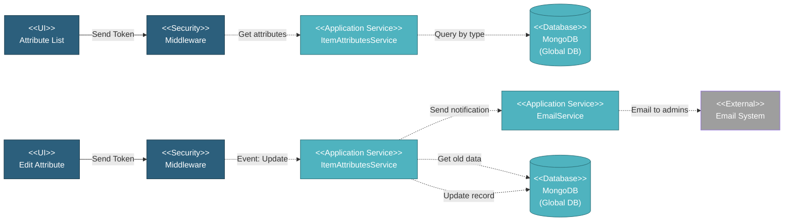

# 5.1.5 Item Attributes Management

This component manages global item attribute definitions (OD, Grade, Specification, Connection Type, Special Conditions) used to standardize material specifications across all projects.

---

## Component Design Diagram

*Figure: Item Attributes Component Design*

---

## 5.1.5.1 User Interface

### 5.1.5.1.1 Attribute List

This displays all item attributes in a single DataTable with a type filter dropdown for managing different attribute types including Single Selection, Multiple Selection, and Numeric. The table shows columns for label, description, type, and data values. Only Super Admin and MI Team can edit attributes through a modal form where the label field is disabled while description, type, and dynamic data fields can be modified. Upon page load, it sends a token for authentication.

---

## 5.1.5.2 Security

Middleware validates the authentication token sent from the Item Attributes UI. Read access requires the global item attribute privilege allowing all authenticated users to view attributes. Write access is restricted to Super Admin and MI Team only, enabling them to create or edit attribute definitions that affect all projects.

---

## 5.1.5.3 Application Services

### 5.1.5.3.1 Initial Data Retrieval

The ItemAttributesService retrieves all item attributes for display in the DataTable interface. The dataTables method returns paginated data with columns for label, description, type, and data values, supporting search and filtering capabilities for managing attribute definitions.

### 5.1.5.3.2 Attribute Updated

This handles attribute definition updates with optional email notifications. The service first retrieves old attribute data for comparison, then updates the attribute definition with new description, type, and data values while keeping the label disabled. If the global change notification flag is enabled in environment configuration, it compares old versus new data and sends an email to administrators specified in the global change email configuration. The email includes the user who made the update, the attribute label, and the old versus new values for audit purposes.

---

## 5.1.5.4 Database

### MongoDB (Global DB)

**item_attributes** collection:
- `label`: Attribute label/name
- `desc`: Description
- `type`: Attribute type (OD, Grade, Specification, Connection, Special Condition)
- `data`: Comma-separated string of attribute values
- `required`: Boolean flag
- `created_by`: User email who created
- `updated_by`: User email who last updated
- `created_at`, `updated_at`: Timestamps

All attribute types are stored in a single collection, differentiated by the type field.

---

## Code References

**Backend:**
- Controller: `app/Http/Controllers/Api/Globals/ItemAttributesController.php`
- Service: `app/Services/Globals/ItemAttributesService.php`
- Repositories: Multiple repositories for each attribute type

**Frontend:**
- Component: `resources/js/components/global/item_attributes/ItemAttributesComponent.vue`
- Vuex: `resources/js/store/modules/globals/item_attributes/actions.js`
- Route: `/global/item_attributes`

---

**Status**: ✅ Item Attributes component documentation
