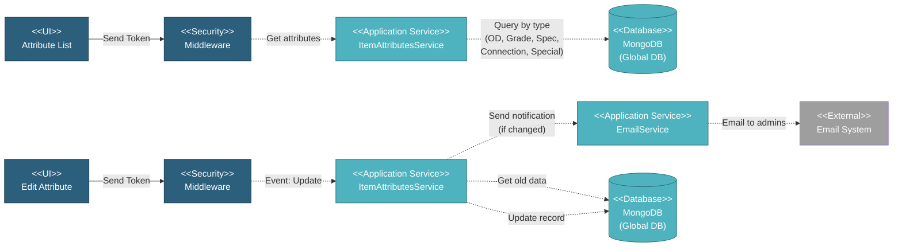

# 5.1.5 Item Attributes Management

This component manages global item attribute definitions (OD, Grade, Specification, Connection Type, Special Conditions) used to standardize material specifications across all projects.

---

## Component Design Diagram

*Figure: Item Attributes Component Design*

**API Endpoints**:
- List: `GET /api/v2/global/item_attributes`
- DataTables: `GET /api/v2/global/item_attributes/datatables`
- Read: `GET /api/v2/global/item_attributes/{id}`
- Update: `POST /api/v2/global/item_attributes/{id}`
- Check Duplicate: `POST /api/v2/global/duplicate_item_attributes`

**Route**: `/global/item_attributes`

---

## 5.1.5.1 User Interface

### ItemAttributesComponent.vue

Single DataTable with type filter for managing different attribute types:
- **Columns**: Label, Description, Type, Data
- **Filter**: Type dropdown (OD, Grade, Specification, Connection Type, Special Conditions)
- **Actions**: Edit only
- **Modal**: Edit form with label (disabled), description, type, and dynamic data fields
- **Privilege**: `global.item_attribute` (R for view, RW for edit - only Super Admin can edit)

---

## 5.1.5.2 Security

### Middleware

- **Authentication**: Verifies JWT token
- **Authorization**:
  - Read: `global.item_attribute:R`
  - Write: `global.item_attribute:W` (Super Admin, MI Team only)

---

## 5.1.5.3 Application Services

### ItemAttributesService (Globals)

Manages all global item attribute definitions:

**1. Get Attributes** (`index()` method):
- Retrieves all attributes grouped by type
- Returns: OD, grade, specification, connection, special_condition collections

**2. Update Attribute** (`update()` method):
- Gets old attribute data for comparison
- Updates attribute definition
- Fields: label (disabled), desc, type, data (array of values)
- **Email Notification**: If `GLOBAL_CHANGE_NOTIFICATION=true` in env:
  - Compares old vs new data using `checkUpdateInfo()`
  - If changed: Sends email to admins (from `GLOBAL_CHANGE_EMAIL` env)
  - Email includes: updated by user, label, old vs new values
- Returns success response

**3. DataTables** (`dataTables()` method):
- Returns paginated data for DataTable display
- Columns: label, desc, type, data

---

## 5.1.5.4 Database

### MongoDB (Global DB)

**item_attributes** collection (single collection for all attribute types):
- `label`: Attribute label/name
- `desc`: Description
- `type`: Attribute type (e.g., "OD", "Grade", "Specification", "Connection", "Special Condition")
- `data`: Comma-separated string of attribute values
- `required`: Boolean flag
- `created_by`: User email who created
- `updated_by`: User email who last updated
- `created_at`, `updated_at`: Timestamps

**Note**: All attribute types (OD, Grade, Specification, Connection, Special Condition) are stored in a single collection, differentiated by the `type` field

---

## Code References

**Backend:**
- Controller: `app/Http/Controllers/Api/Globals/ItemAttributesController.php`
- Service: `app/Services/Globals/ItemAttributesService.php`
- Repositories: Multiple repositories for each attribute type

**Frontend:**
- Component: `resources/js/components/global/item_attributes/ItemAttributesComponent.vue`
- Vuex: `resources/js/store/modules/globals/item_attributes/actions.js`
- Route: `/global/item_attributes` (privilege: `global.item_attribute`)

---

**Status**: ✅ Consolidated from separate files
