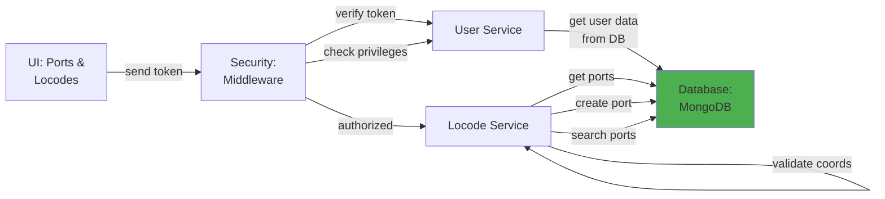

# 5.1.5 Ports & Locodes

## 5.1.5.1 User Interface

When a user opens the Ports & Locodes page (route: `/global/locodes`), the UI sends a JWT token to the backend. The interface displays a searchable data table of UN/LOCODE port reference data with columns for LOCODE, port name, country, subdivision, coordinates, and functions. Users can view, create, edit, and delete port records used for transfer and shipment tracking. The UI provides map visualization of port locations and supports bulk import from UN/LOCODE CSV files. No business logic happens here; it simply initiates the request and presents the port data to the user.

## 5.1.5.2 Security

The middleware acts as a security layer, handling both authentication and authorization. After receiving the token from the UI, it verifies the token's validity through Laravel Passport's `auth:api` middleware. Once the user is verified, the `user.privileges` middleware checks for:
- `global.locode:R` for read access (view ports/locodes)
- `global.locode:W` for write access (create, edit, delete ports)

All authenticated users have read access to port data, while only super admins and authorized users can modify port records.

## 5.1.5.3 Application Services

### 5.1.5.3.1 Locode Service

The Locode Service (`App\Services\Globals\LocodeService`) manages UN/LOCODE port reference data used throughout the system for transfer tracking and shipment management.

**Key Methods:**
- `index()` / `dataTables()` - Retrieves port list with search, filtering, and pagination.
- `create()` - Creates a new port record with LOCODE, name, country, and coordinates.
- `read()` - Retrieves port details by LOCODE or ID.
- `update()` - Updates port information (name, coordinates, functions).
- `delete()` - Soft deletes a port record.
- `search()` - Provides autocomplete search for port selection in transfer forms.
- `getByCode()` - Retrieves port information by UN/LOCODE for vessel tracking integration.
- `importUNLocode()` - Bulk imports UN/LOCODE data from official CSV files.
- `validateCoordinates()` - Validates latitude/longitude coordinates for port locations.

## 5.1.5.4 Database

**Global Database (`mongodb_global`):**
- `locode` - UN/LOCODE port data including _id, locode (UN/LOCODE code, e.g., "SGSIN", "USHOU"), name (port name), subdivision (state/province), country_code (ISO 3166-1 alpha-2), country_name, latitude (decimal degrees), longitude (decimal degrees), function (port functions code), date (last updated), iata_code, status, created_at, updated_at, deleted.

*Figure: Ports & Locodes Component Design*
