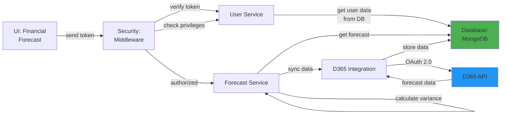

# 5.1.6 Financial Forecast (D365 Integration)

## 5.1.6.1 User Interface

When a user opens the Financial Forecast page (routes: `/global/reports/forecast_d365`, `/global/reports/detail_forecast_d365`), the UI sends a JWT token to the backend. The interface displays financial forecast data synchronized from Microsoft Dynamics 365 (D365) ERP system. Users can view revenue projections, cost forecasts, and financial summaries aggregated by project, customer, and time period. The UI provides filtering by date range, project, and forecast type, with visual charts showing trends and comparisons between forecast and actual figures. No business logic happens here; it simply initiates the request and presents the financial data to the user.

## 5.1.6.2 Security

The middleware acts as a security layer, handling both authentication and authorization. After receiving the token from the UI, it verifies the token's validity through Laravel Passport's `auth:api` middleware. Once the user is verified, the `user.privileges` middleware checks for:
- `global.report:R` for read access to financial reports

Only super admins, project managers, and authorized finance team members have access to financial forecast data, ensuring sensitive financial information is protected.

## 5.1.6.3 Application Services

### 5.1.6.3.1 Forecast Service

The Forecast Service (`App\Services\Globals\ForecastService`) manages D365 financial forecast data synchronization and reporting. It integrates with the Microsoft Dynamics 365 API to retrieve and process financial projections.

**Key Methods:**
- `index()` - Retrieves forecast summary data grouped by project and time period.
- `getDetail()` - Returns detailed forecast breakdown with line-item level data.
- `syncFromD365()` - Synchronizes forecast data from D365 API on a scheduled basis (daily/weekly).
- `calculateVariance()` - Computes variance between forecast and actual figures.
- `generateReport()` - Creates formatted financial forecast reports for export.
- `getByProject()` - Filters forecast data by specific project ID.
- `getByDateRange()` - Retrieves forecasts within a specified date range.

### 5.1.6.3.2 D365 Integration Service

Handles API communication with Microsoft Dynamics 365:
- Authenticates with D365 using OAuth 2.0
- Fetches financial forecast data via REST API
- Transforms D365 data format to MCMS data model
- Handles error cases and retry logic for API failures

## 5.1.6.4 Database

**Global Database (`mongodb_global`):**
- `forecast_d365` - Synchronized D365 forecast data including _id, project_id, project_name, customer_code, customer_name, forecast_date, forecast_period (month/quarter/year), revenue_forecast, cost_forecast, profit_forecast, currency, exchange_rate, line_items (array of forecast line items), variance_to_actual, last_sync_at, sync_status, created_at, updated_at.

*Figure: Financial Forecast Component Design*
