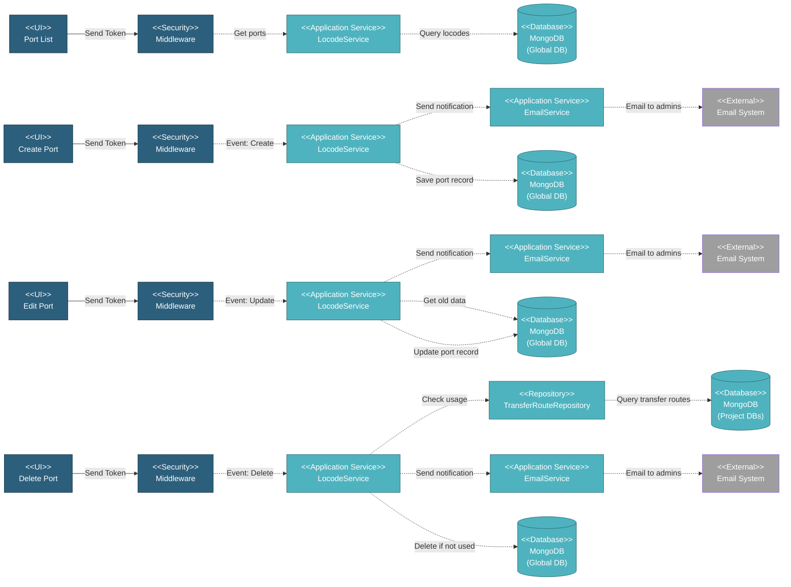

# 5.1.6 Ports & Locodes

This component manages UN/LOCODE port reference data used for transfer tracking, shipment management, and vessel location tracking across all projects.

---

## Component Design Diagram

*Figure: Ports & Locodes Component Design*

---

## 5.1.6.1 User Interface

### 5.1.6.1.1 Port List

This displays UN/LOCODE port reference data in a searchable DataTable with columns for LOCODE, port name, country, subdivision, coordinates, and functions. Users can search in real-time across LOCODE, name, and country fields. The interface includes map visualization of port locations for geographic reference. Super Admin and authorized users can create, view, edit, and delete port records. Upon page load, it sends a token for authentication and retrieves the port list with search, filtering, and pagination support.

### 5.1.6.1.2 Create Port Form

This form creates new port entries in the UN/LOCODE database. Users enter country code, port code, port name, subdivision, and coordinate information. Upon submission, it sends a token for authentication, generates the LOCODE by combining country code with uppercase port code, saves the port record, and triggers an email notification to administrators if global change notification is enabled.

### 5.1.6.1.3 Edit Port Form

This form updates existing port information with the same fields as creation. The service retrieves old port data for comparison before applying updates. If global change notification is enabled, it compares old versus new data and sends an email to administrators with the updated information including the user who made the change and the specific fields that were modified.

### 5.1.6.1.4 Delete Port

This action permanently removes a port from the system after validation. The service first checks usage across all project databases by querying transfer routes for any references to the port in loading or discharge points. If the port is currently in use, deletion is blocked and an error is returned. If not used, the record is permanently deleted and an email notification is sent to administrators if global change notification is enabled.

---

## 5.1.6.2 Security

Middleware validates the authentication token sent from all Ports & Locodes UIs. Read access requires the global locode privilege allowing all authenticated users to view port data for transfer and shipment operations. Write access is restricted to Super Admin and authorized users only, enabling them to create, edit, or delete port records that affect all projects.

---

## 5.1.6.3 Application Services

### 5.1.6.3.1 Initial Data Retrieval

The LocodeService retrieves port list data with search, filtering, and pagination capabilities. It returns port information including locode, name, country code, country name, subdivision, latitude, longitude, and function. The service also provides an autocomplete search method used in transfer forms across projects, returning port ID, description combining locode and name, and individual locode and name fields for selection.

### 5.1.6.3.2 Port Created

This handles port creation with automatic LOCODE generation and optional email notifications. The service generates the LOCODE by combining the country code with the uppercase port code, then saves the port record with complete country information. If global change notification is enabled in environment configuration, it sends an email to administrators specified in the global change email setting. The email includes the user who created the port, country, locode, and port name for audit purposes.

### 5.1.6.3.3 Port Updated

This handles port information updates with change tracking and notifications. The service first retrieves the old port data for comparison, then updates the port information including name, coordinates, country, and other fields. If global change notification is enabled, it compares old versus new data and sends an email to administrators only if changes were detected. The email includes the user who made the update, port and locode information, and the specific old versus new values that changed.

### 5.1.6.3.4 Port Deleted

This handles port deletion with usage validation across all projects. The service queries all project databases through the TransferRouteRepository to check if the port is referenced in any transfer routes as either a loading or discharge point. If the port is currently in use, the deletion is blocked and an error status is returned. If not used, the record is permanently deleted from the database. If global change notification is enabled, an email is sent to administrators with the deleted port information including the user who performed the deletion, country, locode, and port name.

---

## 5.1.6.4 Database

### MongoDB (Global DB)

**locode** collection:
- `country_code`: ISO 3166-1 alpha-2 (e.g., "SG", "US", "ID")
- `country_name`: Full country name
- `locode`: UN/LOCODE code (e.g., "SG SIN", "US HOU", "ID CGK")
- `name`: Port name
- `sub_div`: State/province code
- `created_by`, `updated_by`: User emails
- `created_at`, `updated_at`: Timestamps

---

## Code References

**Backend:**
- Controller: `app/Http/Controllers/Api/Globals/LocodeController.php`
- Service: `app/Services/Globals/LocodeService.php`
- Repository: `app/Repositories/Globals/Locode/LocodeRepository.php`
- Request: `app/Http/Requests/Globals/Locode/StoreLocodeRequest.php`

**Frontend:**
- Component: `resources/js/components/global/locode/LocodeComponent.vue`
- Vuex: `resources/js/store/modules/globals/locode/actions.js`
- Route: `/global/locodes`

---

**Status**: ✅ Ports & Locodes component documentation
