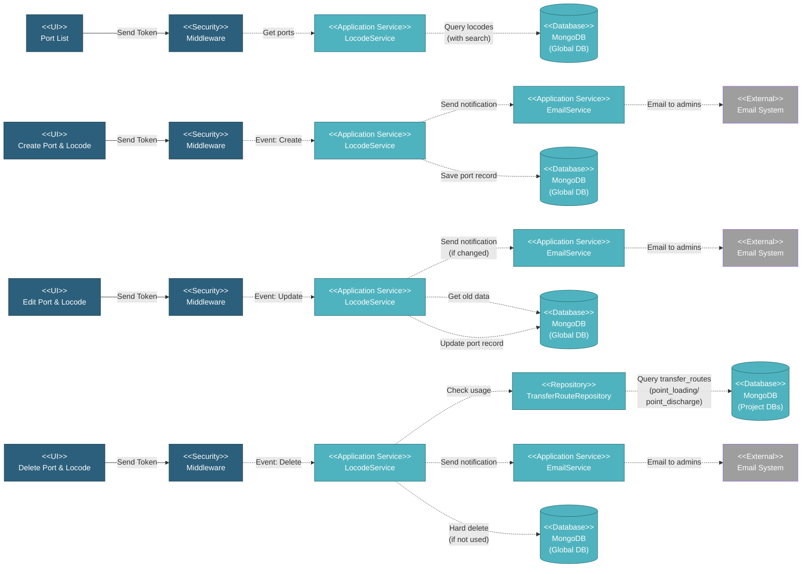

# 5.1.6 Ports & Locodes

This component manages UN/LOCODE port reference data used for transfer tracking, shipment management, and vessel location tracking across all projects.

---

## Component Design Diagram

*Figure: Ports & Locodes Component Design*

**Route**: `/global/locodes`

---

## 5.1.6.1 User Interface

### LocodeComponent.vue (Port List)

Searchable data table for UN/LOCODE port reference data:
- **Columns**: LOCODE, Port Name, Country, Subdivision, Coordinates, Functions
- **Search**: Real-time search across LOCODE, name, country
- **Actions**: Create, View, Edit, Delete (all available)
- **Features**: Map visualization of port locations
- **Privilege**: `global.locode` (R for view, RW for create/edit/delete)

---

## 5.1.6.2 Security

### Middleware

- **Authentication**: Verifies JWT token
- **Authorization**:
  - Read: `global.locode:R` (all authenticated users)
  - Write: `global.locode:W` (Super Admin, authorized users only)

---

## 5.1.6.3 Application Services

### LocodeService (Globals)

Manages UN/LOCODE port reference data:

**1. Get Ports** (`index()` / `dataTables()` method):
- Retrieves port list with search, filtering, and pagination
- Returns: locode, name, country_code, country_name, subdivision, latitude, longitude, function

**2. Search Ports** (`search()` method):
- Provides autocomplete search for port selection
- Used in transfer forms across projects
- Returns: id, desc (locode + name), locode, name

**3. Create Port** (`create()` method):
- Generates LOCODE: `country_code + " " + UPPERCASE(code)`
- Saves port record with country info
- **Email Notification**: If `GLOBAL_CHANGE_NOTIFICATION=true`:
  - Sends email to admins (from `GLOBAL_CHANGE_EMAIL` env)
  - Email includes: created by user, country, locode, port name
- Returns success response with ID

**4. Read Port** (`read()` method):
- Retrieves port details by ID
- Transforms data: extracts code from locode, renames fields
- Returns: country (object), code, port, subdivision, etc.

**5. Update Port** (`update()` method):
- Gets old port data for comparison
- Updates port information (name, coordinates, country, etc.)
- **Email Notification**: If `GLOBAL_CHANGE_NOTIFICATION=true`:
  - Compares old vs new data using `checkUpdateInfo()`
  - If changed: Sends email to admins
  - Email includes: updated by user, port & locode, old vs new values
- Returns success response

**6. Delete Port** (`delete()` method):
- **Usage Check**: Queries all project DBs for transfer routes
  - Checks `transfer_routes` collection for `point_loading` or `point_discharge` references
  - If used: Returns error status
- **Hard Delete**: Permanently removes record if not used
- **Email Notification**: If `GLOBAL_CHANGE_NOTIFICATION=true`:
  - Sends email to admins
  - Email includes: deleted by user, country, locode, port name
- Returns success response

**7. Get Port or Fallback** (`getPortOrFallback()` method):
- Helper method to get port name by ID
- Returns port name or original value if not found

### TransferRouteRepository (Project DBs)

Used for usage check:
- Queries `transfer_routes` collection across all project databases
- Checks if locode is referenced in transfer records

---

## 5.1.6.4 Database

### MongoDB (Global DB)

**locode** collection (UN/LOCODE port data):
- `country_code`: ISO 3166-1 alpha-2 (e.g., "SG", "US", "ID")
- `country_name`: Full country name
- `locode`: UN/LOCODE code (e.g., "SG SIN", "US HOU", "ID CGK")
- `name`: Port name
- `sub_div`: State/province code
- `created_by`, `updated_by`: User emails
- `created_at`, `updated_at`: Timestamps

---

## Code References

**Backend:**
- Controller: `app/Http/Controllers/Api/Globals/LocodeController.php`
  - `index()` - Get port list
  - `dataTables()` - Get ports with DataTables format
  - `read()` - Get single port
  - `update()` - Update port
  - `search()` - Autocomplete search
- Service: `app/Services/Globals/LocodeService.php`
- Repository: `app/Repositories/Globals/Locode/LocodeRepository.php`
- Request: `app/Http/Requests/Globals/Locode/StoreLocodeRequest.php`

**Frontend:**
- Component: `resources/js/components/global/locode/LocodeComponent.vue`
- Vuex: `resources/js/store/modules/globals/locode/actions.js`
- Route: `/global/locodes` (privilege: `global.locode`)

---

**Status**: ✅ Consolidated from separate files
