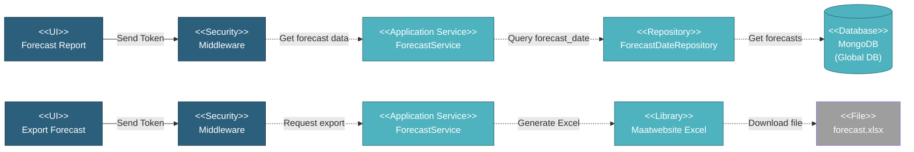

# 5.1.7 Financial Forecast

This component generates financial forecast reports from SOW (Scope of Work) data and provides Excel export functionality for financial planning and analysis.

---

## Component Design Diagram

*Figure: Financial Forecast Component Design*

---

## 5.1.7.1 User Interface

### 5.1.7.1.1 Forecast Report

This displays financial forecast data in DataTables format with two view modes. The project view shows a summary grouped by project with monthly breakdown columns and totals. The item view provides detailed forecast data by SOW items for a specific selected project. Users can filter by date range and project selection, and export the data to Excel format. Upon page load, it sends a token for authentication and retrieves forecast data from the global database. The interface supports both amount and quantity forecast types depending on the selected view.

---

## 5.1.7.2 Security

Middleware validates the authentication token sent from the Financial Forecast UI. Read access requires the global report privilege allowing authorized users to view forecast data and export to Excel. This ensures only users with appropriate financial reporting permissions can access sensitive forecast information across all projects.

---

## 5.1.7.3 Application Services

### 5.1.7.3.1 Initial Data Retrieval

The ForecastService retrieves forecast data in two formats. The project forecast method returns a summary grouped by project with monthly columns in DataTables format while the item forecast method retrieves detailed forecast by SOW items for a specific project, returning item-level breakdown with monthly data for either amount or quantity type as specified in the request.

### 5.1.7.3.2 Forecast Data Generation

This handles automatic forecast data generation when SOW data changes in any project. The service is triggered by SOW updates and calls the SOW service to calculate forecast records from SOW lot data. It generates forecast amounts and quantities with associated dates, then stores the records in the forecast date collection in the global database. Projects listed in the financial forecast exclude project environment configuration are skipped during generation to allow selective forecast management.

### 5.1.7.3.3 Excel Export

This generates an Excel file containing forecast data for download. The service retrieves forecast records grouped by customer account number and uses the ForecastExport class with Maatwebsite Excel library to format the data into a downloadable spreadsheet. The exported file is named forecast.xlsx and includes all relevant forecast information organized for financial analysis and reporting purposes.

---

## 5.1.7.4 Database

### MongoDB (Global DB)

**forecast_date** collection:
- `project_id`: Reference to project
- `project`: Embedded project data (name, customer_account_number)
- `sow_name`, `lot_name`, `item_name`: SOW hierarchy
- `sow_lot_id`: Reference to SOW lot
- `sortable_date`: Unix timestamp for month
- `amount`: Forecast amount
- `quantity`: Forecast quantity
- `created_at`, `updated_at`: Timestamps

---

## Code References

**Backend:**
- Controller: `app/Http/Controllers/Api/Globals/ForecastController.php`
- Service: `app/Services/Globals/ForecastService.php`
- Repository: `app/Repositories/Globals/Forecast/ForecastDateRepository.php`
- Export: `app/Exports/ForecastExport.php`

**Frontend:**
- Component: `resources/js/components/global/reports/ForecastComponent.vue`
- Vuex: `resources/js/store/modules/globals/forecast/actions.js`
- Route: `/global/reports/forecast_d365`

**Configuration:**
- `FINANCIAL_FORECAST_PROJECT_VERSION`: Version selector (1 or 2)
- `FINANCIAL_FORECAST_EXCLUDE_PROJECT`: Comma-separated list of excluded project db_names

---

**Status**: ✅ Financial Forecast component documentation
