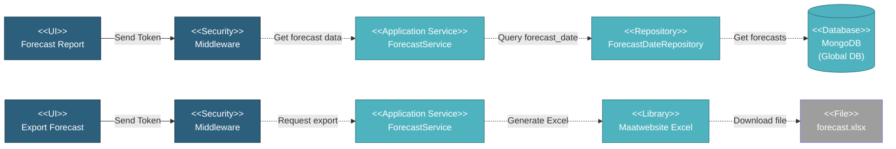

# 5.1.7 Financial Forecast

This component generates financial forecast reports from SOW (Scope of Work) data and provides Excel export functionality.

---

## Component Design Diagram

*Figure: Financial Forecast Component Design*

**Route**: `/global/reports/forecast_d365`

---

## 5.1.7.1 User Interface

### ForecastReportComponent.vue

Financial forecast report with DataTables display:
- **Project View**: Summary by project with monthly breakdown
- **Item View**: Detailed forecast by SOW items
- **Columns**: Project/Item name, monthly amounts, total
- **Filters**: Date range, project selection
- **Actions**: Export to Excel
- **Privilege**: `global.report:R`

---

## 5.1.7.2 Security

### Middleware

- **Authentication**: Verifies JWT token
- **Authorization**:
  - Read: `global.report:R` (view forecasts, export to Excel)

---

## 5.1.7.3 Application Services

### ForecastService (Globals)

Generates and manages financial forecast data from SOW records:

**1. Get Project Forecast DataTables** (`projectForecastDataTables()` method):
- Retrieves forecast summary grouped by project
- Returns DataTables format with monthly columns
- Supports version 1 or 2 based on `FINANCIAL_FORECAST_PROJECT_VERSION` env

**2. Get Item Forecast DataTables** (`itemForecastDataTables()` method):
- Retrieves detailed forecast by SOW items for a specific project
- Type: 'amount' or 'quantity'
- Returns item-level breakdown with monthly data

**3. Generate Forecast Data** (`genForecastData()` method):
- Called when SOW data changes
- Generates forecast records from SOW service
- Stores in `forecast_date` collection
- Excludes projects in `FINANCIAL_FORECAST_EXCLUDE_PROJECT` env

**4. Export to Excel** (`export()` method):
- Generates Excel file with forecast data
- Groups by customer account number
- Uses `ForecastExport` class with Maatwebsite Excel
- Returns downloadable `forecast.xlsx` file

### SOWService (Projects)

Generates forecast data:
- Called by `genForecastPerProject()` method
- Calculates forecast amounts from SOW lot data
- Returns array of forecast records with dates and amounts

---

## 5.1.7.4 Database

### MongoDB (Global DB)

**forecast_date** collection:
- `project_id`: Reference to project
- `project`: Embedded project data (name, customer_account_number)
- `sow_name`, `lot_name`, `item_name`: SOW hierarchy
- `sow_lot_id`: Reference to SOW lot
- `sortable_date`: Unix timestamp for month
- `amount`: Forecast amount
- `quantity`: Forecast quantity
- `created_at`, `updated_at`: Timestamps

**Indexes**: `sortable_date`, `project_id`, `sow_lot_id`

---

## Code References

**Backend:**
- Controller: `app/Http/Controllers/Api/Globals/ForecastController.php`
  - `projectForecastDataTables()` - Get project forecast
  - `forecastExport()` - Export to Excel
- Service: `app/Services/Globals/ForecastService.php`
- Repository: `app/Repositories/Globals/Forecast/ForecastDateRepository.php`
- Export: `app/Exports/ForecastExport.php`

**Frontend:**
- Component: `resources/js/components/global/reports/ForecastComponent.vue`
- Vuex: `resources/js/store/modules/globals/forecast/actions.js`
- Route: `/global/reports/forecast_d365` (privilege: `global.report`)

**Configuration:**
- Environment Variables:
  - `FINANCIAL_FORECAST_PROJECT_VERSION`: Version selector (1 or 2)
  - `FINANCIAL_FORECAST_EXCLUDE_PROJECT`: Comma-separated list of excluded project db_names
