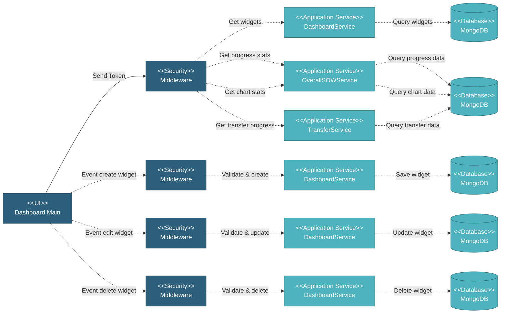

# 5.10 Dashboard Module

The Dashboard Main page is the entry point for the project, providing an overview of project progress and key metrics through customizable widgets. Users can add, edit, delete, and rearrange widgets to create a personalized dashboard view.

## 5.10.1 User Interface

This is the main dashboard page displaying customizable widgets for project overview. The interface shows widgets in a draggable grid layout with various chart types including circle progress charts (showing schedule vs actual progress), S-curve charts (showing cumulative progress over time). Each widget displays a title, last updated timestamp, and interactive chart. Users can add new widgets by clicking "Add Widget" button, edit existing widgets via dropdown menu, delete widgets via dropdown menu, enlarge/shrink chart widgets for better visibility, and drag-and-drop widgets to rearrange layout. Empty state shows a prompt to add the first widget. Upon page load, it sends a token for authentication, retrieves saved widgets configuration, fetches overall progress statistics for circle charts, retrieves chart statistics for S-curve, and gets transfer progress percentage if applicable.

## 5.10.2 Security

Middleware validates the authentication token sent from the Dashboard Main UI. Only authenticated and authorized users can proceed to view and manage dashboard widgets.

**Security Checks:**
- `auth:api` - Validates JWT token via Laravel Passport
- `project.session:api` - Validates user has access to the project database
- `user.privileges` - Checks for `project.dashboard:R` privilege to view dashboard
- `user.privileges` - Checks for `project.dashboard:W` privilege to create/edit/delete widgets

## 5.10.3 Application Services

### 5.10.3.1 Initial Data Retrieval

**DashboardService**: Retrieves saved dashboard widgets configuration including widget ID, title, graph type (circle_progress, s_curve), graph data source (project, transfer), item type filter, widget size class, enlarged state, and display order. Returns empty array if no widgets configured.

**OverallSOWService**: Retrieves overall progress statistics for circle progress charts by querying progress data per item type including schedule percentage, actual percentage, and last updated timestamp while also calculates the progress.

**OverallSOWService**: Retrieves chart statistics for S-curve charts including cumulative progress data over time, progress distribution by date ranges, and progress breakdown by item type with dates and percentage values.

**TransferService**: Retrieves transfer progress percentage by calculating total transferred quantity vs total project quantity including percentage value, transfer completed count, transfer total count, last updated timestamp, and status color indicator (red if transfer_completed < transfer_total, teal otherwise).

### 5.10.3.2 Widget Created

Creates a new dashboard widget with user-defined configuration. Validates widget parameters including title, graph type, data source, and item type filter. Creates widget record in dashboard collection with unique ID, user-defined title, selected graph type and data source, item type filter (if applicable), default widget size, display order (last position), and creation timestamp. Returns success status and new widget data.

### 5.10.3.3 Widget Updated

Updates existing dashboard widget configuration. Validates widget exists and user has permission. Updates widget fields including title, graph type, data source, item type filter, widget size, and enlarged state. Maintains original display order unless explicitly changed. Returns success status and updated widget data.

### 5.10.3.4 Widget Deleted

Deletes a dashboard widget from configuration. Validates widget exists and user has permission. Removes widget record from dashboard collection and reorders remaining widgets to fill the gap. Returns success status.

### 5.10.3.5 Widget Rearranged

Updates display order of dashboard widgets after drag-and-drop. Validates all widget IDs exist and user has permission. Updates `seq` field for all affected widgets based on new positions. Returns success status.

## 5.10.4 Database

Dashboard data is retrieved and updated in MongoDB across several collections:

**Project Database:**
• **dashboard** - Widget configuration records with titles, types, and layout
• **progress_sow_chart** - S-curve and any chart statistics data
• **transfer** - Transfer records for calculating transfer progress
• **sow** - SOW records for calculating overall project quantities
