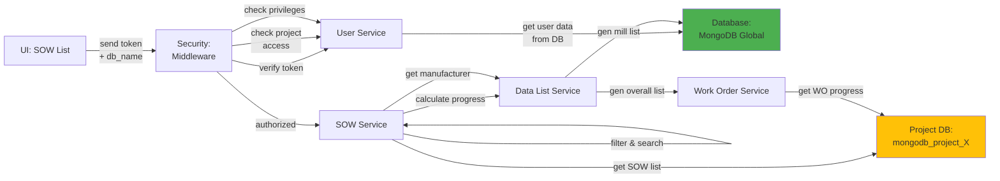

# 5.2.1 SOW List & Management

## 5.2.1.1 User Interface

When a user navigates to the SOW List page (route: `/project/:db_name/sow`), the Vue.js UI sends a JWT token to the backend via the `Authorization: Bearer {token}` header, along with the project-specific database name in the `Database-Access` header for multi-tenancy routing. The interface displays a comprehensive data table of all SOW (Scope of Work) items with columns for item description, MTO item number, customer item number, item type, manufacturer, quantity, unit, total price, status, and progress (schedule vs actual). Users can filter by item type (linepipe, elbow, flange, etc.), manufacturer, quantity range, price range, status, and progress percentage. The UI provides search functionality across multiple fields and sorting capabilities. No business logic happens here; it simply initiates the API request and presents the SOW data to the user.

## 5.2.1.2 Security

The middleware acts as a security layer, handling both authentication and authorization. After receiving the token from the UI, it verifies the token's validity through Laravel Passport's `auth:api` middleware, which validates the OAuth 2.0 access token against the `oauth_access_tokens` collection. The `project.session:api` middleware then validates the user has access to the specified project database by checking the user's `allowed_projects` field and `db_access` permission. Once the user is verified, the `user.privileges` middleware checks for:
- `project.sow:R` for read access (view SOW list, view SOW details)
- `project.sow:W` for write access (create, edit, delete SOW items)

The system ensures users can only access SOW data for projects they are authorized to view, enforcing project-level data isolation in the multi-tenant architecture.

## 5.2.1.3 Application Services

### 5.2.1.3.1 SOW Service

The SOW Service (`App\Services\Projects\SOWService`) is the core service that manages all SOW-related operations. It handles SOW lifecycle management, progress calculation, and integration with work orders, inspections, and transfers.

**Key Methods:**
- `index()` - Retrieves SOW list with filtering by item type, manufacturer, quantity, price, and sorting options. Applies role-based access control to filter SOW items based on user permissions.
- `getAll()` - Returns all SOW records for a project with optional filtering.
- `getOverallList()` - Generates comprehensive SOW progress data by aggregating work order progress, inspection results, and transfer status for each SOW item.
- `searchInSOWS()` - Performs multi-column search across SOW fields including description, item name, manufacturer short name, MTO item number, customer item number, status, quantity, and price.
- `filterType()` - Filters SOW items by type (linepipe, elbow, flange, reducer, tee, cap).
- `filterByItem()` - Filters SOW items by specific item ID.
- `getSOWOptions()` - Returns SOW options for dropdown selections in work order and inspection creation forms.
- `getAllForSelector()` - Provides simplified SOW list for selection components with minimal data for performance.
- `checkDuplicateSOW()` - Validates SOW uniqueness based on item, manufacturer, specification, and quantity to prevent duplicate entries.
- `populateSOWCoating()` - Retrieves coating information for coated pipe SOW items.

### 5.2.1.3.2 Data List Service

Provides cached reference data for SOW display. This service:
- `genMillList()` - Returns manufacturer/mill list with short names for display in SOW table
- `genItemList()` - Returns item master data for item type filtering
- `genSpecificationList()` - Returns specification reference data
- `genOverallSOWList()` - Generates comprehensive progress data by querying work orders, inspections, and transfers for all SOW items

### 5.2.1.3.3 Project Control Service

Returns project setup configuration for SOW validation. This service:
- Retrieves inspection requirements per item type from project control settings
- Validates SOW configuration against project-specific rules
- Provides default values for SOW creation based on project setup

### 5.2.1.3.4 Work Order Service

Provides work order association data for SOW items. This service:
- Retrieves work orders associated with each SOW item
- Calculates total work order count per SOW
- Groups work orders by manufacturer and coating vendors
- Returns work order progress for SOW progress calculation

## 5.2.1.4 Database

MongoDB serves as the central data store for the SOW Module. The SOW List feature interacts with the following collections:

**Project Database (`mongodb_project_{project_code}`):**
- `sow` - Stores SOW master data including _id, type (linepipe/elbow/flange/etc), type_name, desc (full description), key (base_pipe/mother_pipe/coated_pipe), id_item, id_manufacturer, id_spec, mto_item_no, customer_item_no, customer_item_code, company_line_item_no, qty, qty_unit, qty_pcs, qty_m, qty_mt, conversion (object with pcs/mt/m factors), qty_mother_pipe, qty_unit_mother_pipe, manufacturer_mother_pipe, spec_mother_pipe, qty_pup_pipe, qty_unit_pup_pipe, manufacturer_pup_pipe, spec_pup_pipe, qty_centre_pipe, qty_unit_centre_pipe, manufacturer_centre_pipe, spec_centre_pipe, price, price_unit, unit_price, total_price, delivery_tolerance (object with plus/minus values), delivery_tolerance_unit, any_coating (boolean), any_inspection_childs (object with base_pipe/mother_pipe/pup_pipe/centre_pipe inspection flags), mpqt (Mill Production Qualification Test percentage), rwpqt (Repair/Weld PQT percentage), status, form_status, created_at, created_by, updated_at, updated_by.

- `sow_progress` - Progress tracking with id_sow, schedule (array of progress snapshots with date and percentage), actual (array of actual progress with date and percentage), last_updated.

- `work_order` - Work orders associated with SOW items via id_sow reference.

- `sow_lot` - Sub-lots created from parent SOW items with id_parent reference.

**Global Database (`mongodb_global`):**
- `manufacturer` - Referenced for vendor/mill information (short names, contact details).
- `item` - Referenced for item master data (type, name, specifications).
- `specification` - Referenced for specification details.

*Figure: SOW List & Management Component Design*
