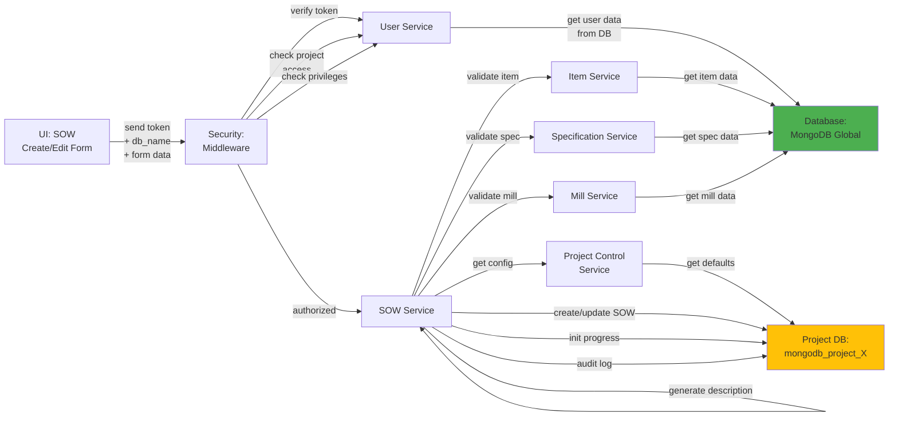

# 5.2.2 SOW Creation & Editing

## 5.2.2.1 User Interface

When a user opens the SOW Creation page (route: `/project/:db_name/sow/create`) or SOW Edit page (route: `/project/:db_name/sow/edit/:id`), the UI sends a JWT token and project database name to the backend. The interface displays a comprehensive multi-step form with the following sections:

**Step 1: Basic Information**
- Item type selection (linepipe, elbow, flange, reducer, tee, cap)
- Item selection from global item master
- MTO item number input
- Customer item number and code
- Company line item number

**Step 2: Specifications**
- Specification selection (API 5L, ISO 3183, etc.)
- Grade selection (X65, L360, etc.)
- OD (Outer Diameter) selection
- Connection type selection
- Special conditions

**Step 3: Quantities & Pricing**
- Primary quantity and unit (PCS/M/MT)
- Automatic conversion to other units based on conversion factors
- Unit price and total price calculation
- Delivery tolerance configuration (plus/minus percentages or quantities)

**Step 4: Manufacturing Setup**
- Primary manufacturer selection
- Coating requirement toggle (yes/no)
- Multi-pipe configuration for coated items:
  - Mother pipe: quantity, unit, manufacturer, specification
  - Pup pipe: quantity, unit, manufacturer, specification
  - Centre pipe: quantity, unit, manufacturer, specification
- Inspection requirement configuration per pipe type
- MPQT (Mill Production Qualification Test) percentage
- RWPQT (Repair/Weld PQT) percentage

No business logic happens here; the UI collects user input, performs client-side validation, and submits the data to the backend.

## 5.2.2.2 Security

The middleware acts as a security layer, handling both authentication and authorization. After receiving the token from the UI, it verifies the token's validity through Laravel Passport's `auth:api` middleware. The `project.session:api` middleware validates project access, and the `user.privileges` middleware checks for:
- `project.sow:W` for write access (create, edit SOW items)

Additionally, the system validates that the user has permission to modify SOW items in the current project. Super admins have full access, while project team members can only create/edit SOW items if their role includes SOW write privileges.

## 5.2.2.3 Application Services

### 5.2.2.3.1 SOW Service

The SOW Service handles all SOW creation and editing operations with comprehensive validation and data processing.

**Key Methods:**
- `create()` - Creates a new SOW record with the following steps:
  1. Validates item, specification, and manufacturer exist in global database
  2. Checks for duplicate SOW based on item + manufacturer + specification + quantity
  3. Calculates quantity conversions (PCS ↔ M ↔ MT) based on item conversion factors
  4. Generates full item description by concatenating item name, OD, grade, spec, connection, special conditions
  5. Creates SOW combination string for quick reference (format: "{item_type}-{manufacturer}-{spec}")
  6. Initializes progress tracking (schedule: 0%, actual: 0%)
  7. Sets initial status to "Submitted"
  8. Stores SOW record in project database
  9. Triggers overall progress recalculation for the project
  10. Generates audit log entry for SOW creation

- `update()` - Updates existing SOW record with validation:
  1. Retrieves existing SOW by ID
  2. Checks if SOW has associated work orders (prevents modification if work orders exist)
  3. Validates changed fields (item, manufacturer, specification)
  4. Recalculates quantity conversions if quantity or unit changed
  5. Updates full description if specifications changed
  6. Updates SOW combination string
  7. Triggers progress recalculation if manufacturer or quantity changed
  8. Generates audit log entry for SOW update

- `delete()` - Soft deletes SOW record:
  1. Validates SOW has no associated work orders, inspections, or transfers
  2. Checks if SOW has sub-lots (prevents deletion if lots exist)
  3. Sets deleted flag and deleted_at timestamp
  4. Triggers overall progress recalculation
  5. Generates audit log entry for SOW deletion

- `calculateConversions()` - Computes quantity conversions based on item attributes:
  - Retrieves conversion factors from item master (e.g., 1 PCS = 12.5 M = 0.523 MT)
  - Calculates missing quantity fields based on primary quantity and unit
  - Rounds converted values to appropriate decimal places

- `generateDescription()` - Builds full item description string from specifications:
  - Concatenates: Item Type + OD + Wall Thickness + Grade + Specification + Connection + Special Conditions
  - Example: "Linepipe 12.75\" (323.9mm) x 0.562\" (14.3mm) WT, Grade X65, API 5L PSL2, Buttress Thread, Mill Test Only"

### 5.2.2.3.2 Item Service

Provides item master data for SOW creation. This service:
- `getAll()` - Returns available items filtered by type
- `read()` - Retrieves item details including conversion factors, default specifications, and attributes
- `getConversionFactors()` - Returns PCS/M/MT conversion factors for quantity calculations

### 5.2.2.3.3 Specification Service

Returns specification reference data. This service:
- `getByItem()` - Returns specifications applicable to selected item type
- `read()` - Retrieves specification details including standard reference, revision, and description
- `validateSpecification()` - Checks if specification is valid for the selected item and grade

### 5.2.2.3.4 Mill Service (Global)

Provides manufacturer/vendor data. This service:
- `getOptions()` - Returns manufacturer dropdown options filtered by capability (linepipe mill, coating facility, etc.)
- `read()` - Retrieves manufacturer details including certifications, quality ratings, and approved item types
- `validateManufacturer()` - Verifies manufacturer is approved for the specified item type and specification

### 5.2.2.3.5 Project Control Service

Provides project-specific configuration for SOW validation. This service:
- `getInspectionChildConfig()` - Returns default inspection requirements per pipe type based on project setup
- `getMPQTDefault()` - Returns default MPQT percentage from project configuration
- `getRWPQTDefault()` - Returns default RWPQT percentage from project configuration

## 5.2.2.4 Database

**Project Database (`mongodb_project_{project_code}`):**
- `sow` - SOW master records with complete item, specification, quantity, pricing, and manufacturing configuration
- `sow_progress` - Initialized progress tracking record with empty schedule and actual arrays
- `audit_log` - Audit trail entries for SOW creation, updates, and deletions with user, timestamp, and changed fields

**Global Database (`mongodb_global`):**
- `item` - Item master data referenced during SOW creation for validation and conversion factors
- `specification` - Specification reference data for dropdown population and validation
- `manufacturer` - Manufacturer/vendor data for dropdown population and capability validation
- `od` - Outer diameter reference data
- `grade` - Material grade reference data
- `connection` - Connection type reference data
- `special_condition` - Special condition code reference data

*Figure: SOW Creation & Editing Component Design*
