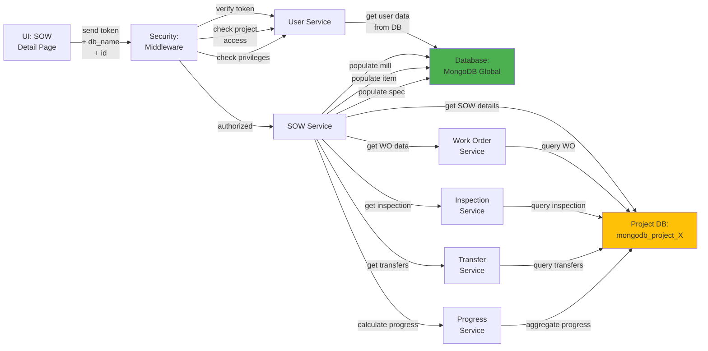

# 5.2.3 SOW Detail & Progress

## 5.2.3.1 User Interface

When a user opens the SOW Detail page (route: `/project/:db_name/sow/:id`), the UI sends a JWT token and project database name to the backend. The interface displays a comprehensive detail view organized into multiple tabs:

**Tab 1: Basic Information**
- Item type and full description
- MTO item number, customer item number, company line item number
- Specification details (grade, OD, connection, special conditions)
- Manufacturer information
- Quantities (PCS, M, MT) with unit conversions
- Pricing (unit price, total price, currency)
- Delivery tolerance configuration
- Status and form completion status

**Tab 2: Manufacturing Setup**
- Primary manufacturer details with contact information
- Coating configuration (if applicable):
  - Mother pipe: manufacturer, specification, quantity
  - Pup pipe: manufacturer, specification, quantity
  - Centre pipe: manufacturer, specification, quantity
- Inspection requirements per pipe type
- MPQT and RWPQT percentages

**Tab 3: Work Orders**
- List of associated work orders grouped by pipe type and process (manufacturing, coating)
- Work order status and progress
- Manufacturer assignment per work order
- Work order creation dates and last updated timestamps
- Quick links to work order detail pages

**Tab 4: Inspections**
- Inspection results summary per pipe type
- Inspection status (pending, in progress, completed, approved, rejected)
- Visual inspection, dimensional inspection, mechanical testing, chemical analysis results
- Inspection reports and certificates
- Links to detailed inspection pages

**Tab 5: Progress**
- Progress chart showing schedule vs actual progress over time
- Progress percentage (0-100%)
- Key milestones with dates
- Progress calculation breakdown showing contribution from:
  - Work order progress
  - Inspection completion
  - Transfer/shipment status
- Last updated timestamp

**Tab 6: Transfers**
- Transfer shipments associated with this SOW
- Transfer routes, vessels, departure/arrival dates
- Quantity shipped per transfer
- Transfer status tracking
- Links to vessel tracking and transfer detail pages

No business logic happens here; the UI displays data retrieved from the backend and provides navigation to related modules.

## 5.2.3.2 Security

The middleware acts as a security layer, handling both authentication and authorization. After receiving the token from the UI, it verifies the token's validity through Laravel Passport's `auth:api` middleware. The `project.session:api` middleware validates project access, and the `user.privileges` middleware checks for:
- `project.sow:R` for read access (view SOW details, view associated work orders, inspections, progress)

Users can only view SOW details for projects they have access to, enforcing project-level data isolation.

## 5.2.3.3 Application Services

### 5.2.3.3.1 SOW Service

The SOW Service retrieves comprehensive SOW details with all related data.

**Key Methods:**
- `read()` - Retrieves complete SOW record with the following enrichment:
  1. Fetches base SOW record from database
  2. Populates manufacturer details (name, short name, contact info) from global database
  3. Retrieves item details (name, type, specifications) from global database
  4. Fetches specification details (standard, revision, description)
  5. Populates coating configuration if SOW has coating:
     - Mother pipe manufacturer and specification
     - Pup pipe manufacturer and specification
     - Centre pipe manufacturer and specification
  6. Calculates current progress (schedule and actual percentages)
  7. Retrieves work order summary (count, manufacturers, statuses)
  8. Returns enriched SOW object with all related data

- `getInspectionResult()` - Retrieves inspection summary for the SOW:
  1. Queries all inspections associated with this SOW
  2. Groups inspections by pipe type (base pipe, mother pipe, pup pipe, centre pipe)
  3. Aggregates inspection results (pass/fail counts, pending count)
  4. Calculates inspection completion percentage
  5. Returns inspection summary object

- `getInspectionChild()` - Returns inspection requirement configuration per pipe type from project control settings

- `populateSOWCoating()` - Retrieves detailed coating information:
  1. Queries SOW coating records
  2. Fetches coating facility (coater) details
  3. Returns coating specifications and requirements

### 5.2.3.3.2 Work Order Service

Provides work order data associated with the SOW. This service:
- `getBySOW()` - Returns all work orders created from this SOW, grouped by pipe type and process
- `getWorkOrderProgress()` - Calculates aggregated work order progress for the SOW
- `getWorkOrderCount()` - Returns total work order count and breakdown by manufacturer

### 5.2.3.3.3 Inspection Service

Returns inspection data for the SOW. This service:
- `getBySOW()` - Retrieves all inspections performed on items from this SOW
- `getInspectionSummary()` - Aggregates inspection results (pass count, fail count, pending count) per pipe type
- `getInspectionProgress()` - Calculates inspection completion percentage for progress tracking

### 5.2.3.3.4 Transfer Service

Provides transfer/shipment data for the SOW. This service:
- `getBySOW()` - Returns all transfers containing cargo from this SOW
- `getTransferredQuantity()` - Calculates total quantity shipped for this SOW
- `getTransferProgress()` - Returns shipment progress percentage (shipped qty / total qty)

### 5.2.3.3.5 Progress Service

Calculates comprehensive SOW progress. This service:
- `calculateSOWProgress()` - Aggregates progress from multiple sources:
  1. Work order progress (weighted by quantity)
  2. Inspection completion (weighted by importance)
  3. Transfer shipment status (weighted by shipped quantity)
- `getScheduleProgress()` - Returns planned schedule progress based on project timeline
- `getActualProgress()` - Returns actual progress based on completed work
- `updateProgressHistory()` - Stores progress snapshots for historical tracking and chart display

## 5.2.3.4 Database

**Project Database (`mongodb_project_{project_code}`):**
- `sow` - SOW master record with all specifications, quantities, and manufacturing configuration
- `sow_progress` - Progress tracking with schedule array and actual array containing date/percentage snapshots
- `work_order` - Work orders associated with SOW via id_sow foreign key reference
- `inspection` - Inspection records associated with SOW via id_sow reference
- `transfer_cargo` - Transfer cargo records linking transfers to SOW items via id_sow reference
- `transfer_track_sow` - SOW tracking in transfers with quantity shipped per transfer
- `sow_coating` - Coating configuration for coated pipe SOW items
- `sow_schedule` - Planned schedule milestones for the SOW
- `sow_actual` - Actual completion milestones for the SOW

**Global Database (`mongodb_global`):**
- `manufacturer` - Manufacturer details for display (name, contact info, certifications)
- `item` - Item master data (type, name, specifications)
- `specification` - Specification details (standard, revision, description)

*Figure: SOW Detail & Progress Component Design*
