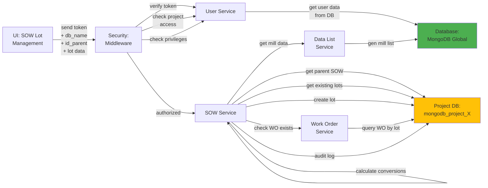

# 5.2.4 SOW Lot Management

## 5.2.4.1 User Interface

When a user opens the SOW Lot Management page (route: `/project/:db_name/sow/:id/lots`), the UI sends a JWT token and project database name to the backend. The interface displays the parent SOW details at the top, followed by a list of sub-lots created from this SOW. Users can create new lots by splitting the parent SOW into smaller batches for manufacturing purposes.

**Lot Creation Form:**
- Lot number input (auto-generated or manual)
- Quantity allocation (must not exceed remaining parent SOW quantity)
- Unit selection (PCS, M, MT)
- Automatic conversion to other units
- Manufacturer assignment (can differ from parent SOW)
- Specification selection (defaults to parent SOW spec)
- Lot description/notes

**Lot List Display:**
- Lot number
- Quantity allocated (PCS, M, MT)
- Manufacturer name
- Status (pending, in progress, completed)
- Progress percentage
- Work orders associated with this lot
- Creation date and created by user
- Actions: view details, edit, delete

No business logic happens here; the UI collects lot allocation data and displays existing lots retrieved from the backend.

## 5.2.4.2 Security

The middleware acts as a security layer, handling both authentication and authorization. After receiving the token from the UI, it verifies the token's validity through Laravel Passport's `auth:api` middleware. The `project.session:api` middleware validates project access, and the `user.privileges` middleware checks for:
- `project.sow:W` for write access (create, edit, delete lots)
- `project.sow:R` for read access (view lots)

Users can only create lots for SOW items in projects they have write access to. The system validates that lot quantities do not exceed the parent SOW remaining quantity.

## 5.2.4.3 Application Services

### 5.2.4.3.1 SOW Service

The SOW Service handles lot creation and management with quantity validation and tracking.

**Key Methods:**
- `createLot()` - Creates a new sub-lot from parent SOW:
  1. Validates parent SOW exists and is not deleted
  2. Retrieves existing lots to calculate remaining quantity
  3. Validates requested lot quantity does not exceed remaining parent quantity
  4. Calculates quantity conversions (PCS ↔ M ↔ MT) for the lot
  5. Generates lot number (auto-increment or user-provided)
  6. Creates lot record with id_parent reference to parent SOW
  7. Copies relevant attributes from parent SOW (item, specification, base configuration)
  8. Sets lot status to "Submitted"
  9. Initializes progress tracking for the lot
  10. Updates parent SOW remaining quantity
  11. Generates audit log entry for lot creation

- `lotFilterSOW()` - Retrieves all lots for a parent SOW:
  1. Queries sow_lot collection by id_parent reference
  2. Calculates remaining quantity (parent qty - sum of lot quantities)
  3. Enriches each lot with manufacturer details
  4. Calculates progress for each lot
  5. Returns lot list with remaining parent quantity

- `updateLot()` - Updates existing lot:
  1. Validates lot exists and is not deleted
  2. Checks if lot has associated work orders (prevents quantity modification if work orders exist)
  3. Validates quantity changes do not exceed parent SOW capacity
  4. Recalculates quantity conversions if quantity changed
  5. Updates lot record
  6. Triggers progress recalculation
  7. Generates audit log entry

- `deleteLot()` - Soft deletes lot:
  1. Validates lot has no associated work orders, inspections, or transfers
  2. Sets deleted flag and deleted_at timestamp
  3. Returns freed quantity to parent SOW remaining capacity
  4. Generates audit log entry for lot deletion

- `validateLotQuantity()` - Ensures lot quantity allocation is valid:
  1. Calculates total allocated quantity across all existing lots
  2. Compares against parent SOW total quantity
  3. Returns remaining available quantity
  4. Throws validation error if allocation exceeds parent capacity

### 5.2.4.3.2 Work Order Service

Checks work order associations to prevent invalid lot modifications. This service:
- `getByLot()` - Returns work orders created from a specific lot
- `validateLotModification()` - Checks if lot can be modified (no work orders exist) or deleted

### 5.2.4.3.3 Data List Service

Provides reference data for lot display. This service:
- `genMillList()` - Returns manufacturer list for lot manufacturer dropdown and display

## 5.2.4.4 Database

**Project Database (`mongodb_project_{project_code}`):**
- `sow_lot` - Lot records with fields: _id, id_parent (reference to parent SOW _id), lot_number, type (inherited from parent), type_name, desc (inherited from parent), key (inherited from parent), id_item (inherited), id_manufacturer (can differ from parent), id_spec (inherited), qty, qty_unit, qty_pcs, qty_m, qty_mt, conversion (inherited conversion factors), price (inherited unit price), unit_price, total_price (calculated as lot_qty × unit_price), status, form_status, created_at, created_by, updated_at, updated_by, deleted, deleted_at, deleted_by.

- `sow` - Parent SOW record with remaining quantity tracking (calculated field: total_qty - sum(lot_qty))

- `work_order` - Work orders can reference either parent SOW (id_sow) or specific lot (id_lot) for granular tracking

- `sow_progress` - Separate progress tracking for each lot with schedule and actual arrays

- `audit_log` - Audit trail for lot creation, updates, and deletions with user and timestamp

**Global Database (`mongodb_global`):**
- `manufacturer` - Referenced for lot manufacturer assignment and display
- `item` - Referenced for item details (inherited from parent SOW)
- `specification` - Referenced for specification details (inherited from parent SOW)

*Figure: SOW Lot Management Component Design*
