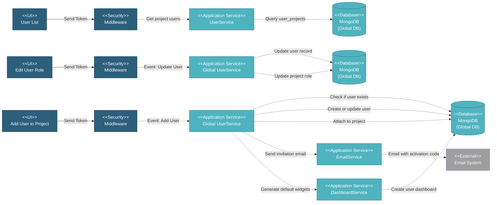

# 5.2.1 User Management

This component manages user access and roles within a specific project. It handles adding users to projects, assigning project-specific roles, and managing user privileges for project operations.

---

## Component Design Diagram

*Figure: Project User Management Component Design*

---

## 5.2.1.1 User Interface

### 5.2.1.1.1 User List

This displays all users assigned to the current project in a DataTable with columns for name with photo, email, role name, and action buttons. The list shows project-specific roles including Customer, Project Team (BU), Project Team (MISI), and Project Team (Non MI). Upon page load, it sends a token for authentication and retrieves user data filtered by the current project.

### 5.2.1.1.2 Add User to Project Form

This form adds users to the project with role assignment. Users first enter an email address which triggers a validation check. If the email exists in the global database, the system retrieves the user information and displays their name and current role. If the email is new, the form expands to collect first name, last name, and photo upload. Users then select a project role from Customer, Project Team (BU), Project Team (MISI), or Project Team (Non MI). Upon submission, it sends a token for authentication, creates or updates the user in the global database, attaches the user to the project with the selected role, sends an invitation email with a 4-digit activation code, and generates default dashboard widgets for the user.

### 5.2.1.1.3 Edit User Role Form

This form updates a user's role within the project. The form pre-populates with the user's current information including name, email, and current project role. Users can change the project role selection. Upon submission, it sends a token for authentication, updates the user record in the global database if the role affects global permissions, and updates the user project relationship with the new role.

### 5.2.1.1.4 Remove User from Project

This action detaches a user from the project. The system validates that the user is not the project manager before allowing removal. Upon confirmation, it deletes the user project relationship and removes the user's dashboard widgets for this project. The user record remains in the global database and can still access other projects they are assigned to.

---

## 5.2.1.2 Security

Middleware validates the authentication token sent from all User Management UIs. Only authenticated and authorized users can proceed to perform or view user actions. Multi-tenant database routing is handled by DatabaseAccessMiddleware which validates the Database-Access header and switches MongoDB connection to the appropriate project database. Only Project Managers and Super Admins can add, edit, or remove users from projects.

---

## 5.2.1.3 Application Services

### 5.2.1.3.1 Initial Data Retrieval

The Global UserService retrieves all users assigned to the current project through the projectUserDataTables method. It queries the user_projects collection filtered by project ID and returns paginated data with columns for name, role name, and email. The service also enriches each user record with MI Team and Super Admin flags based on their global role.

### 5.2.1.3.2 User Added to Project

This handles adding users to projects with role assignment and invitation management. The service first checks if the email exists in the global database. If the user exists and is a Super Admin or Project Manager, the operation is blocked with an appropriate error message. If the user exists as a Global Viewer, the operation is also blocked. For existing users with compatible roles, the service attaches them to the project by creating a user_projects record with the selected project role. For new users, the service creates a user record in the global database with active status set to pending, generates a 4-digit activation code between 1000 and 9999, determines the global role based on the project role selection (MI Team for BU and MISI roles, Non MI Team for others), sends an invitation email with the activation code, creates the user_projects relationship, and generates default dashboard widgets for the user in this project.

### 5.2.1.3.3 User Role Updated

This handles project role updates for existing users. The service updates the user_projects record with the new role selection. If the role change affects global permissions (switching between MI Team and Non MI Team categories), the service also updates the user's global role and role name in the users collection. The update maintains the user's access to other projects while changing their role in the current project.

### 5.2.1.3.4 User Removed from Project

This handles user removal from projects with validation. The service first checks if the user is the project manager and blocks deletion if true. For other users, it deletes all user_projects records matching the user ID and project ID, and triggers the DashboardService to delete all dashboard widgets associated with the user for this project. The user record remains in the global database unchanged.

---

## 5.2.1.4 Database

### MongoDB (Project DB)

**users** collection:
- `first_name`, `last_name`, `name`: User names
- `email`: Email address
- `role`: Project-specific role (customer, project_team_bu, project_team_misi, project_team_non_mi, project_team)
- `role_name`: Role display name (Customer, Project Team (BU), Project Team (MISI), Project Team (Non MI), Project Team)
- `active`: 'n' (pending) or 'y' (activated)
- `invite_by`: Email of inviter
- `invite_date`: Invitation timestamp
- `photo`: Profile photo filename
- `photo_name`: Photo display name
- `created_at`, `updated_at`: Timestamps

### MongoDB (Global DB)

**user_projects** collection:
- `user_id`: Reference to global user
- `project_id`: Reference to project
- `role`: Project-specific role (customer, project_team_bu, project_team_misi, project_team_non_mi)
- `created_at`, `updated_at`: Timestamps

---

## Code References

**Backend:**
- Controller: `app/Http/Controllers/Api/Projects/UserController.php`
- Service: `app/Services/Globals/UserService.php`
- Service: `app/Services/Projects/UserService.php`
- Repository: `app/Repositories/Globals/User/UserRepository.php`
- Repository: `app/Repositories/Globals/User/UserProjectRepository.php`
- Request: `app/Http/Requests/Projects/User/StoreUserRequest.php`

**Frontend:**
- Component: `resources/js/components/project/user/UserComponent.vue` (list)
- Component: `resources/js/components/project/user/UserFormComponent.vue` (add/edit)
- Vuex: `resources/js/store/modules/projects/user/actions.js`
- Route: `/v2/setup/user`

---

**Status**: ✅ Project User Management component documentation
