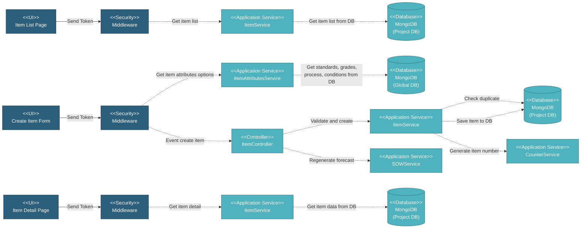

# 5.2.3 Item Management

Item Management is a critical setup component that defines the master item catalog. Items are used throughout the system in SOW, Work Orders, and Inspections. The system supports multiple item types including linepipe, bends, buckle arrestors, clad pipe, anode, elbow, reducer, tee, and flange.

---

## Component Design Diagram

*Figure: Item Management Component Design*

---

## 5.2.3.1 User Interface

### 5.2.3.1.1 Item List Page

This is the main entry point for viewing all items in the project. Users can filter by item type and search across item number, type, and description columns. Upon page load, it sends a token for authentication and retrieves item list data via DataTables endpoint. Users can create new items by selecting from available item types (linepipe, bends, buckle arrestor, clad pipe, anode, elbow, reducer, tee, flange), copy existing items, edit items, or delete items.

### 5.2.3.1.2 Item Create Form

This UI dynamically loads type-specific form components based on the selected item type. Users can select item attributes from dropdown options (standards, grades, manufacturing process, delivery conditions) loaded from the global database. The system supports single item creation and bulk item creation via manual entry or Excel upload. Upon submission, it sends a token for authentication and triggers the create item event.

### 5.2.3.1.3 Item Edit Form

This UI loads the same type-specific form components as create, but pre-populates with existing item data. The system validates if the item is used in submitted SOWs before allowing edits. Copy functionality is available to create a new item based on existing data with a new item number generated.

### 5.2.3.1.4 Item Detail Page

This UI displays the complete details of a selected item using type-specific detail components. It shows item number, description, technical specifications, usage information, and audit details. Users can navigate to edit or copy the item from this page.

---

## 5.2.3.2 Security

Middleware validates the authentication token sent from all Item Management UIs. Only authenticated and authorized users can proceed to perform or view item actions.

---

## 5.2.3.3 Application Services

### 5.2.3.3.1 Initial Data Retrieval

- **ItemService**: Provides item list and item options for dropdowns.
- **ItemAttributesService**: Fetches item attribute options (standards, grades, manufacturing process, delivery conditions) from the database.

### 5.2.3.3.2 Item Created

Handles the initial item creation and saves it to MongoDB. This includes validating input data, checking for duplicate item descriptions, generating item number, and saving to the database.

### 5.2.3.3.3 Item Lifecycle Events

Each of the following services handles a specific stage in the item flow. All of them update item data in MongoDB through the Item Service:

- **Item Updated**: Updates existing item record. Validates changes and checks for duplicate descriptions.
- **Item Deleted**: Deletes item. Validates no submitted SOWs are using the item before deletion.
- **Item Copied**: Creates a new item based on an existing item with a new item number.
- **Bulk Create**: Creates multiple items at once. Validates each item for duplicates and returns created and duplicated items.

---

## 5.2.3.4 Database

### MongoDB (Project DB)

**item** collection:
- `_id`: Item ID
- `type`: Item type (linepipe, bends, buckle_arrestor_single_piece, buckle_arrestor_combi_joint, clad_pipe, anode, elbow, reducer, tee, flange)
- `type_name`: Item type display name
- `axaptano`: Auto-generated item number (with type-specific prefix)
- `desc`: Item description (used for duplicate checking)
- Technical specification fields (varies by item type):
  - `process`: Manufacturing process
  - `standard`: Industry standard
  - `condition`: Material condition
  - `grade`: Material grade
  - `design_code`: Design code (for accessories)
  - `material`: Material specification (for accessories)
  - Type-specific dimensional and technical fields
- `created_at`, `created_by`, `updated_at`, `updated_by`: Audit fields

**Related Collections:**
- `sow` - References items via `id_item`, `id_item_mother_pipe`, `id_item_pup_pipe`, `id_item_centre_pipe`
- `specification` - Linked to items via type, process, standard, condition, grade matching

---

## Code References

**Backend:**
- Controller: `app/Http/Controllers/Api/Projects/ItemController.php`
- Service: `app/Services/Projects/ItemService.php`
- Repository: `app/Repositories/Projects/Item/ItemRepository.php`
- Model: `app/Models/Projects/Item.php`
- Request: `app/Http/Requests/Projects/Item/StoreItemRequest.php`
- Request: `app/Http/Requests/Projects/Item/StoreBulkItemRequest.php`
- Request: `app/Http/Requests/Projects/Item/GetExistingItemRequest.php`

**Frontend:**
- Component: `resources/js/components/project/setup/item/ItemComponent.vue` (List)
- Component: `resources/js/components/project/setup/item/ItemCreateComponent.vue` (Create)
- Component: `resources/js/components/project/setup/item/ItemEditComponent.vue` (Edit/Copy)
- Component: `resources/js/components/project/setup/item/ItemDetailComponent.vue` (Detail)
- Type-specific forms:
  - `resources/js/components/project/setup/item/linepipe/LinepipeFormComponent.vue`
  - `resources/js/components/project/setup/item/bends/BendsFormComponent.vue`
  - `resources/js/components/project/setup/item/bucklearrestor/BuckleArrestorSingleFormComponent.vue`
  - `resources/js/components/project/setup/item/bucklearrestor/BuckleArrestorCombiFormComponent.vue`
  - `resources/js/components/project/setup/item/clad_pipe/CladPipeFormComponent.vue`
  - `resources/js/components/project/setup/item/anode/AnodeFormComponent.vue`
  - `resources/js/components/project/setup/item/elbow/ElbowFormComponent.vue`
  - `resources/js/components/project/setup/item/reducer/ReducerFormComponent.vue`
  - `resources/js/components/project/setup/item/tee/TeeFormComponent.vue`
  - `resources/js/components/project/setup/item/flange/FlangeFormComponent.vue`
- Bulk create components:
  - `resources/js/components/project/setup/item/reusable/BulkCreateComponent.vue`
  - `resources/js/components/project/setup/item/reusable/BulkUploadComponent.vue`
  - `resources/js/components/project/setup/item/reusable/BulkCreateExistingItemsComponent.vue`
- Routes:
  - `/v2/setup/item` - Item List (privilege: `project.setup.item:R`)
  - `/v2/setup/item/create/:type` - Create Item (privilege: `project.setup.item:W`)
  - `/v2/setup/item/edit/:id` - Edit Item (privilege: `project.setup.item:W`)
  - `/v2/setup/item/edit/:id/:copy` - Copy Item (privilege: `project.setup.item:W`)
  - `/v2/setup/item/detail/:id` - Item Detail (privilege: `project.setup.item:R`)

---

**Status**: ✅ Item Management component documentation verified against FE & BE codebase
