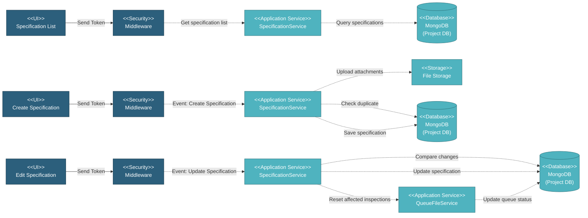

# 5.2.4 Specification Management

This component manages technical specifications for items including manufacturing specifications (API 5L, ISO 3183, DNV) and coating specifications (FBE, 3LPP, 3LPE). Specifications define quality requirements, test parameters, and acceptance criteria used in SOW and Work Orders.

---

## Component Design Diagram

*Figure: Specification Management Component Design*

---

## 5.2.4.1 User Interface

### 5.2.4.1.1 Specification List

This displays all specifications in a DataTable grouped by type and item type. Users can filter specifications by manufacturing type (linepipe, bends, accessories) or coating type (FBE, 3LPP, 3LPE). The table shows columns for specification name, type name, testing phase, and status. Each specification can be in Draft or Completed status. Upon page load, it sends a token for authentication and retrieves specification data with search and filtering capabilities.

### 5.2.4.1.2 Create Specification Form

This form creates new technical specifications with comprehensive test parameters and acceptance criteria. Users enter specification name, select item type, choose standard specification (API 5L PSL1, API 5L PSL2, DNV, ASTM A240), and define technical requirements including grade, manufacturing process, delivery condition, or other else based on the selected item type or coating type. Users also must upload PDF attachments containing the full specification document. Upon submission, it sends a token for authentication, validates data, saves the specification, and stores attachments in file storage.

### 5.2.4.1.3 Edit Specification Form

This form uses the same structure as create but pre-populates with existing specification data. Users can edit specification name, item type, standard specification, and other basic metadata based on the selected item type or coating type. Users can also update or add PDF attachments containing the full specification document. Upon submission, it sends a token for authentication, validates data, saves the specification, and stores attachments in file storage.

### 5.2.4.1.4 Specification Detail Page

This displays the complete specification details including all basic information and attached documents. Users can download specification attachments and view which SOWs and Work Orders are using this specification. The detail page includes a Configure Specification Attributes section where users can define test parameters and acceptance criteria through multiple tabs for different test types such as dimensional, chemical & heat analysis, NDI, hardness, charpy, tensile, and coating parameters. When users modify these test parameters, the service compares old versus new specification values to identify changes. If changes affect existing inspection data, the system identifies affected tests and resets their comparison status to pending, ensuring inspection results are re-evaluated against the updated specification requirements.

---

## 5.2.4.2 Security

Middleware validates the authentication token sent from all Specification Management UIs. Only authenticated and authorized users can proceed to perform or view specification actions. Multi-tenant database routing is handled by DatabaseAccessMiddleware which validates the Database-Access header and switches MongoDB connection to the appropriate project database.

---

## 5.2.4.3 Application Services

### 5.2.4.3.1 Initial Data Retrieval

The SpecificationService retrieves all specifications for display in the DataTable interface. The dataTables method returns paginated data with columns for name, testing phase, type name, and status, supporting search and filtering by specification type, testing phase, and status.

### 5.2.4.3.2 Specification Created

This handles specification creation with attachment management. The service validates specification data, checks for duplicate names, determines the specification type (manufacturing or coating) and testing phase (RWPQT, PQT, or Production), saves the specification record, and uploads PDF attachments to file storage. For accessories and anode types, the status is automatically set to Completed. The service generates a unique specification ID and stores the file paths for all attachments.

### 5.2.4.3.3 Specification Updated

This handles specification updates with inspection impact analysis. The service first retrieves the old specification data for comparison, then identifies which test parameters have changed by comparing old versus new values across all test types including dimensional, chemical & heat analysis, NDI, hardness, charpy, tensile, and coating parameters. If changes are detected, the service queries the queue file repository to find all inspection files that were compared against this specification. For affected inspections, it resets their status to pending and marks them as requiring re-comparison. The system then triggers an Artisan command to reset the inspection data, ensuring all affected inspections are re-evaluated against the updated specification requirements.

---

## 5.2.4.4 Database

### MongoDB (Project DB)

**specifications** collection:
- `name`: Specification name
- `type`: Item type (linepipe, bends, buckle_arrestor, clad_pipe, anode, elbow, reducer, tee, flange)
- `type_name`: Item type display name
- `spec_type`: Specification type (manufacturing, coating)
- `coating_type`: Coating type (FBE, 2FBE, 2LPP, 2LPE, 3LPP, 3LPE, internal, cwc, ae)
- `stage`: Specification stage (RWPQT, PQT, Production)
- `status`: Specification status (Draft, Completed)
- `standard_specification`: Standard specification code (api5l-psl1, api5l-psl2, dnv, astm-a240)
- `grade`: Material grade
- `manufacture_process`: Manufacturing process (SMLS, HFW, SAWL, SAWH)
- `condition`: Delivery condition
- `reff_no`: Reference number
- `tabs`: Object containing test parameter tabs and their applicable status
- `created_at`, `updated_at`: Timestamps

---

## Code References

**Backend:**
- Controller: `app/Http/Controllers/Api/Projects/SpecificationController.php`
- Service: `app/Services/Projects/SpecificationService.php`
- Repository: `app/Repositories/Projects/Specification/SpecificationRepository.php`
- Request: `app/Http/Requests/Projects/Specification/StoreSpecificationRequest.php`

**Frontend:**
- Component: `resources/js/components/project/specification/SpecificationComponent.vue` (list)
- Component: `resources/js/components/project/specification/SpecificationFormComponent.vue` (create/edit)
- Vuex: `resources/js/store/modules/projects/specification/actions.js`
- Route: `/v2/setup/specification/:type?`

---

**Status**: ✅ Specification Management component documentation
