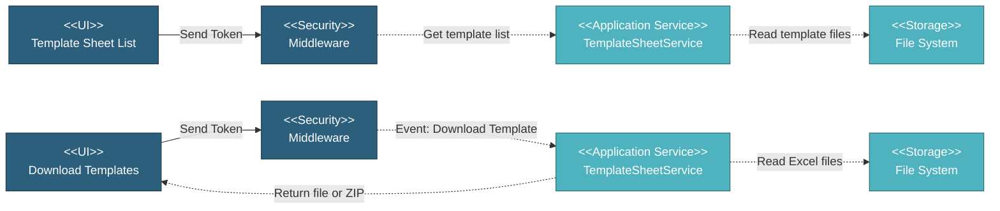

# 5.2.4 Template Sheet

This component manages downloadable Excel template files for inspection data entry. It provides pre-formatted templates for different test types across manufacturing and coating activities.

---

## Component Design Diagram

*Figure: Template Sheet Component Design*

---

## 5.2.4.1 User Interface

### 5.2.4.1.1 Template Sheet List

This displays all available Excel template files organized by activity type and test type. The interface groups templates into manufacturing activities (Linepipe, Bends, Buckle Arrestor) and coating activities (FBE, 3LPP, 3LPE). For each activity, it shows available test templates such as Heat Analysis, Product Analysis, HSD, Hydrostatic, Dimensional, HIC, and Third Party OOR for manufacturing, or Material Test templates for coating. Each template entry displays the file name, last updated date, and a checkbox for selection. Users can select multiple templates for batch download. Upon page load, it sends a token for authentication and retrieves template file information from the file system including file names and last modified timestamps.

### 5.2.4.1.2 Download Templates

Users can download templates individually or in batch. For single template download, clicking the download button returns the Excel file directly. For multiple template selection, the system creates a ZIP archive containing all selected templates organized by activity folders. The ZIP file is named template-sheets.zip and includes the activity name as the folder structure. Upon download request, it sends a token for authentication, validates the selected templates, reads the Excel files from storage, and returns either a single file or a ZIP archive.

---

## 5.2.4.2 Security

Middleware validates the authentication token sent from all Template Sheet UIs. Only authenticated and authorized users can proceed to view or download templates. Multi-tenant database routing is handled by DatabaseAccessMiddleware which validates the Database-Access header, though template files are stored globally and not project-specific.

---

## 5.2.4.3 Application Services

### 5.2.4.3.1 Initial Data Retrieval

The TemplateSheetService retrieves template file information from the TEMPLATE_SHEET constant which defines the structure of available templates. For each activity and test type, the service determines the file path based on activity type (manufacturing or coating) and checks if a specific template exists for that activity. If a specific template exists, it uses that path, otherwise it falls back to a Default template. The service reads file metadata including last modified timestamp and constructs the file name from the path. It returns a structured list of all templates with their file names, last updated dates, and selection checkboxes.

### 5.2.4.3.2 Template Download

This handles single and batch template downloads. For single template download, the service receives the activity ID and test type ID, looks up the corresponding template from TEMPLATE_SHEET constant, determines the file path, and returns the Excel file as a binary response. For batch downloads, the service creates a new ZIP archive, iterates through all selected templates, adds each Excel file to the ZIP with the activity name as the folder structure, closes the ZIP archive, and returns the ZIP file as a binary response.

---

## 5.2.4.4 File Storage

### File System (storage/template)

**Manufacturing Templates** (storage/template/manufacturing):
- Organized by item type folders: Linepipe, Bends, Buckle Arrestor, Accessories
- Default folder contains fallback templates for all item types
- Each folder contains Excel files named by test type: Heat Analysis.xlsx, Product Analysis.xlsx, HSD.xlsx, Hydrostatic.xlsx, Dimensional.xlsx, HIC.xlsx, Third Party OOR.xlsx

**Coating Templates** (storage/template/coating):
- Organized by coating type folders: FBE, 3LPP, 3LPE
- Material Test subfolder contains coating-specific material test templates
- Default folder contains fallback templates for all coating types
- Each folder contains Excel files named by test type

**Template Structure**:
- All templates are pre-formatted Excel files (.xlsx)
- Templates include column headers, data validation rules, and formatting
- Templates are designed for inspection data entry and upload

---

## Code References

**Backend:**
- Controller: `app/Http/Controllers/Api/Projects/TemplateSheetController.php`
- Service: `app/Services/Projects/TemplateSheetService.php`
- Request: `app/Http/Requests/Projects/TemplateSheet/DownloadTemplateRequest.php`
- Constants: `app/Http/specification-constants.php` (TEMPLATE_SHEET)

**Frontend:**
- Component: `resources/js/components/project/template_sheet/TemplateSheetComponent.vue`
- Vuex: `resources/js/store/modules/projects/template_sheet/actions.js`
- Route: `/v2/setup/template_sheet`

---

**Status**: ✅ Template Sheet component documentation
