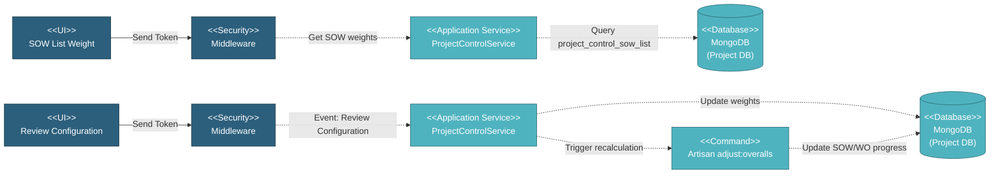

# 5.2.6 Project Control

This component manages project-level configuration for progress tracking and weighting calculations. It defines how SOW values, manufacturing-coating combinations, and production milestones contribute to overall project progress percentages.

---

## Component Design Diagram

*Figure: Project Control Component Design*

---

## 5.2.6.1 User Interface

### 5.2.6.1.1 SOW List Weight Configuration

This displays all submitted SOWs with their calculated weight percentages based on total price values. The interface shows each SOW with its total price and weight percentage, with the total always summing to 100%. Users can manually adjust individual SOW weights if needed. The configuration status can be Pending (unreviewed), Reviewed, or Submitted. Upon page load, it sends a token for authentication and retrieves SOW weight data. When weights are initially generated, the system calculates each SOW weight as its total price divided by the sum of all SOW prices multiplied by 100, then adjusts weights to ensure the total equals exactly 100%.

### 5.2.6.1.2 SOW Combination Weight Configuration

This defines weight distributions for different manufacturing and coating combinations. The interface shows available combinations based on project SOWs, such as Manufacturing-Delivery for non-coated items or Manufacturing-Coating-Delivery for coated items. Users configure weight percentages for each stage within a combination, ensuring each combination totals 100%. The configuration status can be Pending, Reviewed, or Submitted. Upon page load, it sends a token for authentication and retrieves combination weight data with available combinations determined by whether the project has coated or non-coated SOWs.

### 5.2.6.1.3 Product Milestone Weight Configuration

This defines how different production stages contribute to overall progress for each item type. The interface displays item types from submitted SOWs including linepipe, bends, buckle arrestor, coating, and accessories. For each item type, users configure weight percentages for production stages such as Pipe Receiving, Production, and Documentation. The weights determine how much each stage contributes to the item type's overall progress percentage. For example, if Production is weighted at 70% and Documentation at 30%, completing production adds 70% to progress while completing documents adds the remaining 30%. The configuration status can be Pending, Reviewed, or Submitted. Upon page load, it sends a token for authentication and retrieves product milestone data with available item types and inspection child configurations.

### 5.2.6.1.4 Inspection Child Weight Configuration

This defines weight percentages for individual inspection types within each item type. The interface displays inspection groups such as dimensional, chemical analysis, NDI, hardness, charpy, and tensile tests. Users can adjust the weight percentage for each inspection type, with the total for all inspections within an item type summing to 100%. Changes to inspection weights affect how inspection progress contributes to overall work order progress calculations.

### 5.2.6.1.5 Review and Submit Actions

Users can review configurations by clicking Review which validates weight totals and marks the configuration as reviewed. The system tracks whether values have changed from default calculations by comparing current weights against initial auto-generated weights. Users can revert configurations back to auto-calculated defaults if needed. Upon submission, the system triggers an Artisan command to recalculate all SOW and Work Order progress percentages based on the new weight configurations.

---

## 5.2.6.2 Security

Middleware validates the authentication token sent from all Project Control UIs. Only authenticated and authorized users can proceed to perform or view configuration actions. Multi-tenant database routing is handled by DatabaseAccessMiddleware which validates the Database-Access header and switches MongoDB connection to the appropriate project database. Only Project Managers and Super Admins can modify project control configurations.

---

## 5.2.6.3 Application Services

### 5.2.6.3.1 Initial Data Retrieval

The ProjectControlService retrieves configuration data for SOW list weights, SOW combinations, and product milestones. For SOW list weights, it queries the project_control_sow_list collection and returns each SOW with its weight percentage, total price, and review status. For SOW combinations, it queries project_control_sow_combination and returns weight distributions for available combinations. For product milestones, it queries project_control_product_milestone and returns module and process weights for each item type along with available inspection child configurations.

### 5.2.6.3.2 SOW List Weight Generation

This handles automatic weight calculation for SOWs based on their total prices. The service queries all submitted SOWs and calculates the total price sum. For each SOW, it calculates weight as ceiling of (SOW total price / total price sum * 100). After generating all weights, it checks if the total equals 100. If not, it sorts SOWs by weight in ascending order and adjusts weights by subtracting the excess from the lowest weighted SOW, ensuring the final total is exactly 100%. The service uses bulk insert operations for performance and only updates records that actually changed during adjustment.

### 5.2.6.3.3 SOW Combination Initialization

This handles initialization of weight distributions for manufacturing and coating combinations. The service determines available combinations by analyzing submitted SOWs to check if any have coating specifications. If coated SOWs exist, it creates Manufacturing-Coating-Delivery combination. If non-coated SOWs exist, it creates Manufacturing-Delivery combination. Each combination is initialized with default weight distributions that sum to 100%, with status set to unreviewed unless a previous reviewed configuration exists.

### 5.2.6.3.4 Product Milestone Initialization

This handles initialization of module and process weights for production milestones. The service creates configurations for each item type found in submitted SOWs. For linepipe and accessories, it sets Work Order module to 100% with processes distributed between Production and Documentation. For bends and buckle arrestor, it splits between SOW module (for mother pipe or pup/centre pipe production) and Work Order module (for pipe receiving, production, and document submission). The service calculates process weights as percentages of their parent module weight, ensuring all weights are properly normalized.

### 5.2.6.3.5 Configuration Review and Update

This handles review and update of project control configurations. The service compares submitted weights against default auto-generated weights to determine if values have changed. For SOW list reviews, it updates each SOW record with new weights, review status, and value changed flag. For SOW combination reviews, it updates weight distributions for each combination. For product milestone reviews, it recalculates module and process weights based on submitted schedule weights. After any configuration update, the service triggers the adjust:overalls Artisan command to recalculate all SOW and Work Order progress percentages based on the new weight configurations.

### 5.2.6.3.6 Configuration Revert

This handles reverting configurations back to auto-calculated defaults. For SOW list revert, it regenerates weights based on current SOW total prices. For SOW combination revert, it deletes existing combinations and reinitializes with default weight distributions. For product milestone revert, it deletes existing configurations and reinitializes with default module and process weights. After reverting, the service triggers the adjust:overalls Artisan command to recalculate progress percentages.

---

## 5.2.6.4 Database

### MongoDB (Project DB)

**project_control_sow_list** collection:
- `id_sow`: Reference to SOW
- `total_price`: SOW total price value
- `weight`: Weight percentage (0-100)
- `last_status`: Configuration status (unreviewed, reviewed, submitted)
- `is_reviewed`: Boolean review flag
- `is_value_changed`: Boolean flag indicating manual changes
- `created_at`, `updated_at`: Timestamps

**project_control_sow_combination** collection:
- `combination`: Combination type (manufacturing_delivery, manufacturing_coating_delivery)
- `data`: Object containing weight distributions for each stage
- `last_status`: Configuration status (unreviewed, reviewed, submitted)
- `is_reviewed`: Boolean review flag
- `is_value_changed`: Boolean flag indicating manual changes
- `created_at`, `updated_at`: Timestamps

**project_control_product_milestone** collection:
- `item_type`: Item type (linepipe, bends, buckle_arrestor, coating, etc.)
- `data`: Object containing module and process weight distributions
  - `sow.weight`: SOW module weight percentage
  - `sow.data`: Process weights within SOW module
  - `work_order.weight`: Work Order module weight percentage
  - `work_order.data`: Process weights within Work Order module (pipe_receiving, production, document_submission)
- `last_status`: Configuration status (unreviewed, reviewed, submitted)
- `is_reviewed`: Boolean review flag
- `is_value_changed`: Boolean flag indicating manual changes
- `created_at`, `updated_at`: Timestamps

**project_control_inspection_child** collection:
- `item_type`: Item type
- `inspection_attrs`: Inspection name
- `group_name`: Inspection group name
- `weight`: Weight percentage for this inspection
- `stage`: Production stage (production, rwpqt, pqt)
- `created_at`, `updated_at`: Timestamps

---

## Code References

**Backend:**
- Controller: `app/Http/Controllers/Api/Projects/ProjectControlController.php`
- Service: `app/Services/Projects/ProjectControlService.php`
- Repository: `app/Repositories/Projects/ProjectControl/ProjectControlSOWListRepository.php`
- Repository: `app/Repositories/Projects/ProjectControl/ProjectControlSOWCombinationRepository.php`
- Repository: `app/Repositories/Projects/ProjectControl/ProjectControlProductMilestoneRepository.php`
- Repository: `app/Repositories/Projects/ProjectControl/ProjectControlInspectionChildRepository.php`
- Request: `app/Http/Requests/Projects/ProjectControl/ReviewSOWListRequest.php`
- Request: `app/Http/Requests/Projects/ProjectControl/ReviewSOWCombinationRequest.php`
- Request: `app/Http/Requests/Projects/ProjectControl/ReviewProductMilestoneRequest.php`
- Request: `app/Http/Requests/Projects/ProjectControl/UpdateInspectionChildWeightRequest.php`

**Frontend:**
- Component: `resources/js/components/project/project_control/ProjectControlComponent.vue`
- Vuex: `resources/js/store/modules/projects/project_control/actions.js`
- Route: `/v2/setup/project_control`

---

**Status**: ✅ Project Control component documentation
