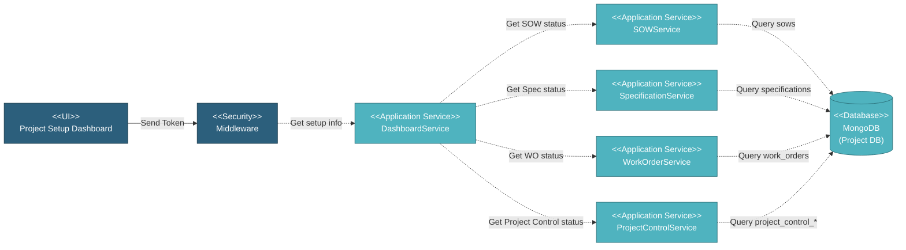

# 5.2.6 Project Setup

This component provides a centralized dashboard view of project setup progress across all setup modules. It displays completion status for SOWs, Specifications, Work Orders, and Project Control configurations.

---

## Component Design Diagram

*Figure: Project Setup Component Design*

---

## 5.2.6.1 User Interface

### 5.2.6.1.1 Project Setup Dashboard

This displays a checklist-style overview of project setup completion across four main sections: Scope of Work, Work Order, Specification, and Project Control. Each section shows a completion counter in the format "X out of Y" with a green checkmark icon when fully complete and a collapse/expand chevron button. Within each expanded section, individual items are listed as clickable underlined links in teal color with status badges on the right. Status badges show Submitted or Completed in green, Pending or Draft in grey, and Reviewed in yellow. The Scope of Work section lists all SOWs with their submission status. The Work Order section lists all vendors with their scheduling status. The Specification section lists all specifications with their completion status. The Project Control section lists SOW Listing, SOW Combination, and Product Milestone with their review status. A helper message at the top states "Project set up would assist PM to establish the missing set up for this project has context menu" and a disclaimer at the bottom states "Report maybe incorrect if project set up is incomplete". Clicking on any item navigates to its detail or edit page. Upon page load, it sends a token for authentication and retrieves setup information from all four services.

---

## 5.2.6.2 Security

Middleware validates the authentication token sent from the Project Setup Dashboard UI. Only authenticated and authorized users can proceed to view setup information. Multi-tenant database routing is handled by DatabaseAccessMiddleware which validates the Database-Access header and switches MongoDB connection to the appropriate project database.

---

## 5.2.6.3 Application Services

### 5.2.6.3.1 Initial Data Retrieval

The DashboardService orchestrates data retrieval from four different services to compile the complete project setup status. It calls getProjectSetupInfo method on SOWService, SpecificationService, WorkOrderService, and ProjectControlService in sequence. Each service queries its respective collections and returns a structured response containing the module ID, label, completed count, total count, and an array of individual records with their labels and statuses. The DashboardService aggregates all responses into a single array and returns it to the UI.

### 5.2.6.3.2 SOW Setup Information

The SOWService retrieves all SOWs from the database and counts how many have Completed status versus total count. For each SOW, it returns the description as label, status converted from Completed to Submitted or Draft, form status, item type, and SOW ID. The response includes the module ID as 'sow', label as 'Scope of Work', completion counts, and the records array.

### 5.2.6.3.3 Specification Setup Information

The SpecificationService retrieves all specifications sorted by spec_type and counts how many have Completed status versus total count. For each specification, it returns the name as label, status (Draft or Completed), specification ID, spec type (manufacturing or coating), and item type. The response includes the module ID as 'specification', label as 'Specification', completion counts, and the records array.

### 5.2.6.3.4 Work Order Setup Information

The WorkOrderService retrieves the vendor list and generates progress status for each vendor. It counts how many vendors have Scheduled status versus total count. For each vendor, it returns the vendor name as label, status (Pending or Scheduled), vendor ID, and item type as 'all'. The response includes the module ID as 'work_order', label as 'Work Order', completion counts, and the records array.

### 5.2.6.3.5 Project Control Setup Information

The ProjectControlService checks the status of three project control configurations: SOW Listing, SOW Combination, and Product Milestone. It counts how many have Reviewed or Submitted status versus total count of 3. For each configuration, it returns the configuration name as label, status converted from unreviewed/reviewed/submitted to Pending/Reviewed/Submitted, and configuration ID. The response includes the module ID as 'project_control', label as 'Project Control', completion counts, and the records array.

---

## 5.2.6.4 Database

### MongoDB (Project DB)

The Project Setup dashboard queries multiple collections:

**sows** collection:
- Queries all SOWs to check completion status
- Returns: `desc`, `status`, `form_status`, `type`, `_id`

**specifications** collection:
- Queries all specifications sorted by spec_type
- Returns: `name`, `status`, `spec_type`, `type`, `_id`

**work_orders** collection:
- Queries work orders grouped by vendor
- Returns vendor information and scheduling status

**project_control_sow_list**, **project_control_sow_combination**, **project_control_product_milestone** collections:
- Queries configuration status
- Returns: `last_status`, `is_reviewed`

---

## Code References

**Backend:**
- Controller: `app/Http/Controllers/Api/Projects/DashboardController.php`
- Service: `app/Services/Projects/DashboardService.php`
- Service: `app/Services/Projects/SOWService.php` (getProjectSetupInfo)
- Service: `app/Services/Projects/SpecificationService.php` (getProjectSetupInfo)
- Service: `app/Services/Projects/WorkOrderService.php` (getProjectSetupInfo)
- Service: `app/Services/Projects/ProjectControlService.php` (getProjectSetupInfo)

**Frontend:**
- Component: `resources/js/components/project/dashboard/ProjectSetupComponent.vue`
- Vuex: `resources/js/store/modules/projects/dashboard/actions.js`
- Route: `/v2/setup`

---

**Status**: ✅ Project Setup dashboard component documentation
