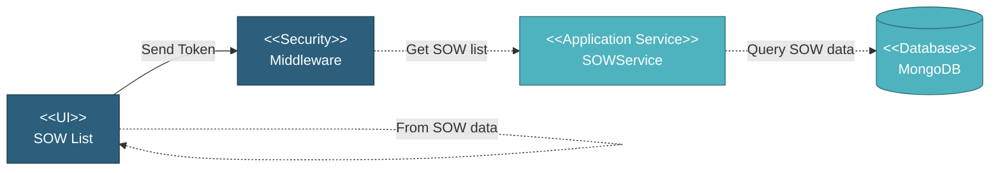

# 5.3.1 SOW List

The SOW List page is the entry point for viewing and managing all Scope of Work items in a project. Users can browse, filter, and search through SOW records to find specific items.

## 5.3.1.1 User Interface

This is the entry point for viewing all SOW items in a project. The interface displays SOW records in a DataTables grid showing SOW name, combination, item description, work order count with shortcuts, status, quantity, total product value, project SOW number, MI item number, delivery tolerance, and progress percentage. Users can filter by item type, status, manufacturer, quantity range, total product value range, and progress percentage. Multi-column search is available across SOW name, item description, combination, status, quantity, and total product value. Users can create new SOWs by selecting item type, view SOW details by clicking any row, edit SOWs (if no progress exists), or delete SOWs (if no progress and not used elsewhere). Upon page load, it sends a token for authentication and retrieves SOW list data. Filter options are then generated client-side from the retrieved SOW data.

## 5.3.1.2 Security

Middleware validates the authentication token sent from the SOW List UI. Only authenticated and authorized users can proceed to view SOW list.

**Security Checks:**
- `auth:api` - Validates JWT token via Laravel Passport
- `project.session:api` - Validates user has access to the project database
- `user.privileges` - Checks for `project.sow:R` privilege to view list

## 5.3.1.3 Application Services

### 5.3.1.3.1 Initial Data Retrieval

**SOWService**: Retrieves SOW list data by querying the `sow` collection in project database with comprehensive data including base SOW information, item details, manufacturer information, quantity data, pricing, status, progress data, work order count with shortcuts, and coating information. The service applies filters based on user selection and returns paginated results for DataTables display. Filter options are generated client-side from the retrieved SOW data by extracting unique values for item types, statuses, manufacturers, and quantity units, and calculating min/max ranges for quantity values, total prices, and progress percentages.

## 5.3.1.4 Database

SOW list data is retrieved from MongoDB:

**Project Database:**
• **sow** collection - Main SOW records with all item details, quantities, manufacturers, pricing, and status
• **work_order** collection - Referenced to get work order count per SOW & shortcut to work order manufacturer/coater tab
• **sow_coating** collection - Referenced to get coating information (coating type, coater)

**Global Database:**
• **mill** collection - Vendor/mill information with short names and type (Mill/Coater/Bender)