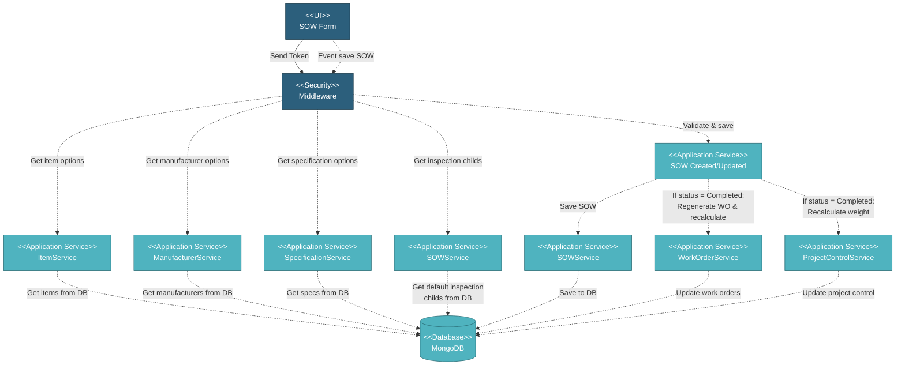

# 5.3.2 SOW Form

The SOW Form is used to create new SOW records or edit existing ones. This comprehensive form allows users to define all aspects of a Scope of Work including item details, quantities, specifications, manufacturers, coating requirements, and delivery schedules.

## 5.3.2.1 User Interface

This is the entry point for creating or editing SOW records. Users can select from item, manufacturer, and specification options. The form supports multiple item types (Linepipe, Bends, Buckle Arrestor, Clad Pipe, Anode, Elbow, Flange, Reducer, Tee) with item-specific configurations. Users define quantities with automatic unit conversions, pricing information, coating requirements (if applicable), delivery tolerances, and inspection configurations. For Bends, additional mother pipe configuration is required. For Buckle Arrestor Combi Joint, pup pipe and centre pipe configurations are required. Upon submission, it sends a token for authentication and triggers the save SOW event.

## 5.3.2.2 Security

Middleware validates the authentication token sent from the SOW Form UI. Only authenticated and authorized users can proceed to create or edit SOW.

**Security Checks:**
- `auth:api` - Validates JWT token via Laravel Passport
- `project.session:api` - Validates user has access to the project database
- `user.privileges` - Checks for `project.sow:W` privilege to create/edit SOW

## 5.3.2.3 Application Services

### 5.3.2.3.1 Initial Data Retrieval

**ItemService**: Fetches item options from the global database:
• **Get Item Options**: Retrieves item master data filtered by item type from route parameter. Returns item description, MI Item No., type, and type_name.

**ManufacturerService**: Fetches manufacturer options from the global database:
• **Get Manufacturer Options**: Retrieves manufacturer list (Mills, Coaters, Benders). Returns name, short_name, type, and approval status. Client-side filtering applied based on context (Mill for base pipe, Coater for coating, Bender for bends).

**SpecificationService**: Fetches specification options from the global database:
• **Get Specification Options**: Retrieves specification reference data filtered by selected item ID and item type. Returns specification name, type, and spec_type.

**SOWService**: Fetches default inspection configuration:
• **Get Default Inspection Childs**: Retrieves default inspection requirements based on item type. Returns inspection childs configuration for base_pipe, mother_pipe, pup_pipe, and centre_pipe.

### 5.3.2.3.2 SOW Created/Updated

Handles SOW creation and editing. Saves data to MongoDB including item details, quantities with automatic conversions (PCS, M, MT, FT), specifications, manufacturers, pricing, coating configurations, delivery tolerances, and inspection requirements. Sets status as "Draft" and calculates form_status ("Complete" or "Incomplete") based on required field completion. When editing a submitted SOW (status = "Completed"), the system regenerates all dependent data: recalculates SOW weight, regenerates work orders, updates transfer tracking, repairs queue files, regenerates forecast data, updates progress charts, adjusts overall project metrics, and recalculates total project value.

## 5.3.2.4 Database

SOW form data is saved to MongoDB:

**Project Database:**
• **sow** collection - Main SOW record with:
  - Basic info: `_id`, `desc`, `customer_item_no`, `mto_item_no`
  - Item details: `type`, `type_name`, `id_item`
  - Manufacturer: `id_manufacturer`, `id_manufacturer_mother_pipe`, etc.
  - Specification: `id_spec`, `id_spec_mother_pipe`, etc.
  - Quantities: `qty`, `qty_unit`, `qty_pcs`, `qty_m`, `qty_mt`, `qty_ft`
  - Conversion factors: `conversion` object
  - Pricing: `price`, `price_unit`, `total_price`
  - Delivery: `delivery_tolerance`, `delivery_tolerance_unit`
  - Status: `status` ("Draft"), `form_status` ("Complete" or "Incomplete")
  - Audit: `created_at`, `created_by`, `updated_at`, `updated_by`

• **sow_coating** collection - Coating records with:
  - `id_sow`: Reference to parent SOW
  - `coating_type`: Type of coating
  - `id_coater`: Reference to coating vendor
  - `id_spec_coating`: Reference to coating specification
  - `coating_thickness`, `coating_thickness_unit`
  - `density`, `density_unit`
  - `status`: "Draft"

• **item** collection - Referenced for item dropdown
• **specification** collection - Referenced for specification dropdown
• **work_order_inspection_child** collection - Referenced for default inspection configuration

**Global Database:**
• **mill** collection - Referenced for manufacturer dropdown (Mills, Coaters, Benders)