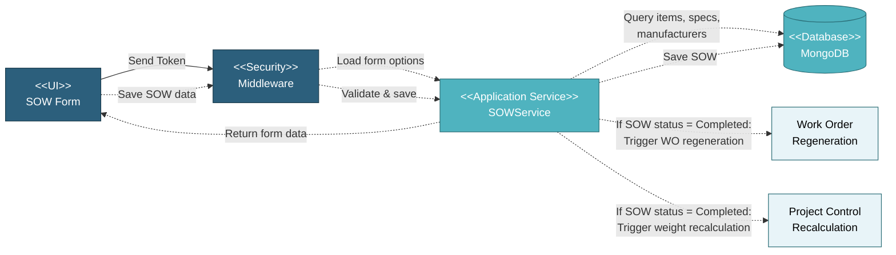

# 5.3.2 SOW Form

The SOW Form is used to create new SOW records or edit existing ones. This comprehensive form allows users to define all aspects of a Scope of Work including item details, quantities, specifications, manufacturers, coating requirements, and delivery schedules.

```mermaid
graph LR
    %% Load Form Flow
    UI_FORM["&lt;&lt;UI&gt;&gt;<br/>SOW Form"]
    SEC["&lt;&lt;Security&gt;&gt;<br/>Middleware"]
    SOW_SVC["&lt;&lt;Application Service&gt;&gt;<br/>SOWService"]
    DB[("&lt;&lt;Database&gt;&gt;<br/>MongoDB")]
    
    UI_FORM -->|Send Token| SEC
    SEC -.->|Load form options| SOW_SVC
    SOW_SVC -.->|Query items, specs,<br/>manufacturers| DB
    SOW_SVC -.->|Return form data| UI_FORM
    
    %% Save Flow
    UI_FORM -.->|Save SOW data| SEC
    SEC -.->|Validate & save| SOW_SVC
    SOW_SVC -.->|Save SOW| DB
    SOW_SVC -.->|If SOW status = Completed:<br/>Trigger WO regeneration| WO_REGEN["Work Order<br/>Regeneration"]
    SOW_SVC -.->|If SOW status = Completed:<br/>Trigger weight recalculation| PC_RECALC["Project Control<br/>Recalculation"]
    
    style UI_FORM fill:#2C5F7C,stroke:#1a3a4a,color:#fff
    style SEC fill:#2C5F7C,stroke:#1a3a4a,color:#fff
    style SOW_SVC fill:#4FB3BF,stroke:#2a6d76,color:#fff
    style DB fill:#4FB3BF,stroke:#2a6d76,color:#fff
    style WO_REGEN fill:#E8F4F8,stroke:#2a6d76,color:#000
    style PC_RECALC fill:#E8F4F8,stroke:#2a6d76,color:#000
```

## 5.3.2.1 User Interface

This is the entry point for creating or editing SOW records. Users can select from item, manufacturer, and specification options. The form supports multiple item types (Linepipe, Bends, Buckle Arrestor, Clad Pipe, Anode, Elbow, Flange, Reducer, Tee) with item-specific configurations. Users define quantities with automatic unit conversions, pricing information, coating requirements (if applicable), delivery tolerances, and inspection configurations. For Bends, additional mother pipe configuration is required. For Buckle Arrestor Combi Joint, pup pipe and centre pipe configurations are required. Upon submission, it sends a token for authentication and triggers the save SOW event.

## 5.3.2.2 Security

Middleware validates the authentication token sent from the SOW Form UI. Only authenticated and authorized users can proceed to create or edit SOW.

**Security Checks:**
- `auth:api` - Validates JWT token via Laravel Passport
- `project.session:api` - Validates user has access to the project database
- `user.privileges` - Checks for `project.sow:W` privilege to create/edit SOW

## 5.3.2.3 Application Services

### 5.3.2.3.1 Load Form Data

When the SOW Form loads, the SOWService retrieves dropdown options and default configurations:

**Item Options** (from global database):
- Retrieves item master data filtered by item type from route parameter
- Returns: item description, MI Item No., type, type_name
- Source: `item` collection

**Manufacturer Options** (from global database):
- Retrieves manufacturer list (Mills, Coaters, Benders)
- Returns: name, short_name, type, approval status
- Client-side filtering based on context (Mill for base pipe, Coater for coating, Bender for bends)
- Source: `mill` collection

**Specification Options** (from project database):
- Retrieves specification reference data filtered by selected item ID and item type
- Returns: specification name, type, spec_type
- Source: `specification` collection

**Default Inspection Configuration** (from project database):
- Retrieves default inspection requirements based on item type
- Returns: inspection childs configuration for base_pipe, mother_pipe, pup_pipe, centre_pipe
- Source: `work_order_inspection_child` collection

### 5.3.2.3.2 Save SOW

Handles SOW creation and editing. The SOWService processes the form data and saves it to MongoDB:

**Data Saved:**
- Item details (type, id_item, description)
- Quantities with automatic unit conversions (PCS, M, MT, FT)
- Specifications (id_spec, id_spec_mother_pipe, etc.)
- Manufacturers (id_manufacturer, id_manufacturer_mother_pipe, etc.)
- Pricing information (price, price_unit, total_price)
- Coating configurations (if applicable, saved to `sow_coating` collection)
- Delivery tolerances
- Inspection requirements

**Status Management:**
- New SOWs are created with `status: "Draft"`
- System calculates `form_status` ("Complete" or "Incomplete") based on required field completion
- Required fields: item, quantity, manufacturer, specification, price
- For Bends: mother pipe configuration required
- For Buckle Arrestor Combi Joint: pup pipe and centre pipe configuration required

**Unit Conversions:**
- System automatically converts between PCS, M, MT, FT based on item specifications
- Conversion factors stored in `conversion` object
- Primary quantity stored in user-selected unit (`qty`, `qty_unit`)
- All converted values calculated and stored (`qty_pcs`, `qty_m`, `qty_mt`, `qty_ft`)

### 5.3.2.3.3 Regenerate Dependencies (When SOW Submitted)

When a SOW is submitted (status changed to "Completed") or an existing submitted SOW is edited, the system triggers regeneration of all dependent data:

**Work Order Regeneration:**
- Regenerates all work orders linked to the SOW
- Updates work order quantities based on new SOW quantities
- Recalculates work order progress percentages
- Updates transfer tracking data
- Repairs queue files for inspection workflows

**Project Control Recalculation:**
- Recalculates SOW weight percentage based on total price
- Updates SOW list weights in project control
- Adjusts weight distribution across all SOWs to ensure total = 100%
- Triggers overall project metrics recalculation

**Financial Forecast Update:**
- Regenerates forecast data based on new SOW delivery schedule
- Updates projected revenue timeline
- Recalculates total project value

**Progress Chart Update:**
- Updates progress charts to reflect new SOW quantities
- Recalculates S-curve baseline
- Adjusts progress percentages across all work orders

## 5.3.2.4 Database

SOW form data is saved to MongoDB:

**Project Database:**
• **sow** collection - Main SOW record with:
  - Basic info: `_id`, `desc`, `customer_item_no`, `mto_item_no`
  - Item details: `type`, `type_name`, `id_item`
  - Manufacturer: `id_manufacturer`, `id_manufacturer_mother_pipe`, etc.
  - Specification: `id_spec`, `id_spec_mother_pipe`, etc.
  - Quantities: `qty`, `qty_unit`, `qty_pcs`, `qty_m`, `qty_mt`, `qty_ft`
  - Conversion factors: `conversion` object
  - Pricing: `price`, `price_unit`, `total_price`
  - Delivery: `delivery_tolerance`, `delivery_tolerance_unit`
  - Status: `status` ("Draft"), `form_status` ("Complete" or "Incomplete")
  - Audit: `created_at`, `created_by`, `updated_at`, `updated_by`

• **sow_coating** collection - Coating records with:
  - `id_sow`: Reference to parent SOW
  - `coating_type`: Type of coating
  - `id_coater`: Reference to coating vendor
  - `id_spec_coating`: Reference to coating specification
  - `coating_thickness`, `coating_thickness_unit`
  - `density`, `density_unit`
  - `status`: "Draft"

• **item** collection - Referenced for item dropdown
• **specification** collection - Referenced for specification dropdown
• **work_order_inspection_child** collection - Referenced for default inspection configuration

**Global Database:**
• **mill** collection - Referenced for manufacturer dropdown (Mills, Coaters, Benders)