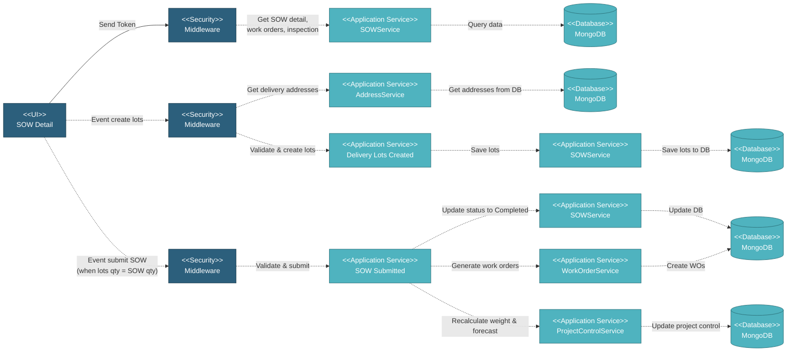

# 5.3.3 SOW Detail

The SOW Detail page is used to view and manage the full lifecycle of a SOW. Users can view comprehensive SOW information, create delivery lots, and submit the SOW to trigger work order generation.

## 5.3.3.1 User Interface

This UI displays the complete details of a selected SOW item. It shows comprehensive SOW information including item details, specifications, manufacturers, quantities, pricing, work orders, inspection results, progress tracking, and delivery lots. Users can create delivery lots by defining specific delivery addresses, quantities, and required dates. Once the total delivery lots quantity matches the SOW quantity, the Submit button becomes visible. Submitting the SOW changes its status to Completed and triggers work order generation. Each action passes through security and calls specific application services to update the SOW record.

## 5.3.3.2 Security
Middleware validates the authentication token sent from the SOW Detail UI. Only authenticated and authorized users can proceed to view or manage SOW actions.

## 5.3.3.3 Application Services

### 5.3.3.3.1 Initial Data Retrieval
• **SOWService**: Retrieves comprehensive SOW detail including item details, specifications, manufacturers, quantities, pricing, status, progress data, coating information, and delivery lots.
• **SOWService**: Retrieves work order data including total count, manufacturing work orders, and coating work orders.
• **SOWService**: Retrieves inspection results and status per SOW item and pipe type.
• **DataListService**: Fetches delivery address options from project configuration or customer data.

### 5.3.3.3.2 Delivery Lots Created
Creates multiple delivery lots from a SOW with specific delivery addresses, quantities, and required dates. Validates total lots quantity doesn't exceed SOW quantity. Creates records in sow_lot collection with reference to parent SOW, lot-specific quantities, delivery addresses, and required dates. Calculates quantity conversions for each lot and updates required_for_submit_qty flag.

### 5.3.3.3.3 SOW Submitted
Changes status from "Draft" to "Completed" and triggers work order generation. Only available when total delivery lots quantity matches SOW quantity. Validates all specifications are complete and form status is "Complete". Triggers work order generation for manufacturing and coating, project control weight calculation, forecast generation, and progress chart updates. Returns success status and total project value.

## 5.3.3.4 Database

SOW detail data is retrieved and updated in MongoDB across several collections:
• **sow** - Main SOW record with all details
• **sow_lot** - Delivery lots with delivery addresses and dates
• **sow_coating** - Coating records
• **work_order** - Work orders generated from submitted SOW
• **inspection** - Inspection results and status
• **project_control_sow_list** - SOW weight and control data
• **progress_work_order_chart** - Progress tracking data
