# 5.3.1 Work Order & Vendor Tab Generation

This component handles the automatic generation of work orders and vendor tabs when a SOW (Scope of Work) is submitted. Work orders are created for manufacturing and coating processes, while vendor tabs are automatically generated to organize work orders by manufacturer and coater for vendor-specific views.

---

## Component Design Diagram

```mermaid
graph LR
    UI_SOW["&lt;&lt;UI&gt;&gt;<br/>SOW Detail"]
    UI_WO["&lt;&lt;UI&gt;&gt;<br/>Work Order List"]
    
    SEC1["&lt;&lt;Security&gt;&gt;<br/>Middleware"]
    SEC2["&lt;&lt;Security&gt;&gt;<br/>Middleware"]
    SEC3["&lt;&lt;Security&gt;&gt;<br/>Middleware"]
    
    SOW_SVC["&lt;&lt;Application Service&gt;&gt;<br/>SOWService"]
    WO_SVC1["&lt;&lt;Application Service&gt;&gt;<br/>WorkOrderService"]
    VENDOR_SVC1["&lt;&lt;Application Service&gt;&gt;<br/>VendorService"]
    TRANSFER_SVC["&lt;&lt;Application Service&gt;&gt;<br/>TransferService"]
    WO_SVC2["&lt;&lt;Application Service&gt;&gt;<br/>WorkOrderService"]
    VENDOR_SVC2["&lt;&lt;Application Service&gt;&gt;<br/>VendorService"]
    
    DB1[("&lt;&lt;Database&gt;&gt;<br/>MongoDB")]
    DB2[("&lt;&lt;Database&gt;&gt;<br/>MongoDB")]
    DB3[("&lt;&lt;Database&gt;&gt;<br/>MongoDB")]
    DB4[("&lt;&lt;Database&gt;&gt;<br/>MongoDB")]
    DB5[("&lt;&lt;Database&gt;&gt;<br/>MongoDB")]

    %% Submit SOW Flow
    UI_SOW -->|Submit SOW| SEC1
    SEC1 -.->|Trigger WO generation| SOW_SVC
    SOW_SVC -.->|Get SOW data| DB1
    SOW_SVC -.->|Call genWorkOrder| WO_SVC1
    WO_SVC1 -.->|Create work orders| DB2
    WO_SVC1 -.->|Create vendor tabs| VENDOR_SVC1
    VENDOR_SVC1 -.->|Save vendor tabs| DB3
    WO_SVC1 -.->|Initialize transfer tracking| TRANSFER_SVC
    TRANSFER_SVC -.->|Create transfer records| DB4

    %% Request WO List Flow
    UI_WO -->|Request WO list| SEC2
    SEC2 -.->|Get work orders| WO_SVC2
    WO_SVC2 -.->|Query work orders & vendor tabs| DB5

    %% Reorder Vendor Tabs Flow
    UI_WO -.->|Reorder vendor tabs| SEC3
    SEC3 -.->|Update tab order| VENDOR_SVC2
    VENDOR_SVC2 -.->|Save new order| DB5

    %% Edit Submitted SOW Flow (Regenerate WO)
    UI_SOW -.->|Edit submitted SOW| SEC1
    SEC1 -.->|Regenerate WO| SOW_SVC
    SOW_SVC -.->|Call genWorkOrder| WO_SVC1

    style UI_SOW fill:#2C5F7C,stroke:#1a3a4a,color:#fff
    style UI_WO fill:#2C5F7C,stroke:#1a3a4a,color:#fff
    style SEC1 fill:#2C5F7C,stroke:#1a3a4a,color:#fff
    style SEC2 fill:#2C5F7C,stroke:#1a3a4a,color:#fff
    style SEC3 fill:#2C5F7C,stroke:#1a3a4a,color:#fff
    style SOW_SVC fill:#4FB3BF,stroke:#2a6d76,color:#fff
    style WO_SVC1 fill:#4FB3BF,stroke:#2a6d76,color:#fff
    style WO_SVC2 fill:#4FB3BF,stroke:#2a6d76,color:#fff
    style VENDOR_SVC1 fill:#4FB3BF,stroke:#2a6d76,color:#fff
    style VENDOR_SVC2 fill:#4FB3BF,stroke:#2a6d76,color:#fff
    style TRANSFER_SVC fill:#4FB3BF,stroke:#2a6d76,color:#fff
    style DB1 fill:#4FB3BF,stroke:#2a6d76,color:#fff
    style DB2 fill:#4FB3BF,stroke:#2a6d76,color:#fff
    style DB3 fill:#4FB3BF,stroke:#2a6d76,color:#fff
    style DB4 fill:#4FB3BF,stroke:#2a6d76,color:#fff
    style DB5 fill:#4FB3BF,stroke:#2a6d76,color:#fff
```

*Figure: Work Order & Vendor Tab Generation Component Design*

---

## 5.3.1.1 User Interface

This component provides three main interfaces: SOW Detail triggers automatic work order and vendor tab generation when SOW status changes from "Draft" to "Submitted" (background process using SOW configuration for item, specification, manufacturer, coater, and quantities), and regenerates work orders and vendor tabs when submitted SOWs are edited. Work Order List displays work orders organized by vendor tabs (each tab represents a manufacturer or coater showing vendor-specific work orders). Vendor Tab Reordering allows authorized users to drag-and-drop tabs to customize order by priority. Upon submission, it sends authentication token and project database name.

---

## 5.3.1.2 Security

Middleware validates the authentication token sent from the SOW Form and Work Order List UIs. Only authenticated and authorized users can proceed to submit SOWs or view work orders.

**Security Checks:**
- `auth:api` - Validates JWT token via Laravel Passport
- `project.session:api` - Validates user has access to the project database
- `scope_of_work:RW` - Required to submit SOWs and trigger work order generation
- `work_order:R/RW` - Required to view work orders

---

## 5.3.1.3 Application Services

### 5.3.1.3.1 Initial Data Retrieval

**ItemService**: Retrieves item master data (id, description) from project database for work order display and filtering.

**SpecificationService**: Fetches specification details (id, name) from project database for work order specifications.

**ManufacturerService**: Provides manufacturer/coater details (id, short name, full name) from global database for vendor tab display and work order assignment.

**WorkOrderService**: Retrieves work order list from project database with vendor tab filtering. Users with `work_order:R` privilege can view all work orders in the project.

**VendorTabService**: Loads vendor tab configuration (id_vendor, type, seq, updated_at) from project database for tab display and ordering.

### 5.3.1.3.2 Work Order Generation

Triggered automatically when SOW status changes to "Submitted". Retrieves SOW data including item, specification, manufacturer, coater, quantities, and conversion factors. Creates manufacturing work orders for all required pipes (base_pipe, mother_pipe, pup_pipe, centre_pipe depending on item type) with different processes (production, loadout, document_submission, pipe_receiving). If coater is specified, creates coating work orders with processes (pipe_receiving, material_test, coating type, loadout, document_submission). Links work orders to SOWs via work_order_sow junction table. Triggers vendor tab creation and initializes transfer tracking records for shipment coordination.

### 5.3.1.3.3 Vendor Tab Management

Groups work orders by manufacturers and coaters. Creates vendor tab records with id_vendor (concatenation of mill._id + "_" + type), name (mill short_name), type (manufacturing/coating), id_manufacturer (mill._id), and seq (sequential tab ordering). Sets default tab order with manufacturing vendors first (alphabetically by short name), then coating vendors. Handles drag-and-drop reordering by receiving array of vendor tab objects in new order, updating seq field sequentially. Retrieves vendor-specific work orders by filtering work orders based on selected vendor tab.

---

## 5.3.1.4 Database

MongoDB serves as the central data store for Work Order and Vendor Tab generation. The component interacts with the following collections:

**Project Database (`{mongodb_project}_{project_code}`):**

- **`sow`** - Source SOW records that trigger work order generation. Key fields: _id, status (triggers WO generation when "Submitted"), id_item, id_spec, id_manufacturer, id_coater, quantity conversions (object with pcs/mt/m factors), delivery_tolerance.

- **`work_order`** - Generated work order records. Key fields: _id, id_item, id_spec_manufacturing, id_spec_coating (for coating WOs), id_manufacturer, type ("manufacturing" or "coating"), process (production/pipe_receiving/loadout/document_submission/material_test/coating type), stage ("production"), item_type, qty, qty_unit, conversion (object).

- **`vendor_tab`** - Vendor tab configuration for organizing work orders by vendor. Key fields: _id, id_vendor (concatenation of mill._id + "_" + type, e.g., "507f1f77bcf86cd799439011_manufacturing"), name (mill short_name), type ("manufacturing" or "coating"), id_manufacturer (mill._id from global DB), seq (integer for drag-drop ordering).

- **`work_order_sow`** - Junction table linking work orders to SOWs (many-to-many relationship). Key fields: _id, id_work_order, id_sow.

- **`transfer_track`**, **`transfer_track_sow`**, **`transfer_track_work_order`**, **`transfer_move`** - Transfer tracking records initialized during WO generation (see 5.3.4 for details).

- **`item`** - Item master data referenced by work orders. Key fields: _id, type, desc.

- **`specification`** - Specification master data referenced by work orders. Key fields: _id, name.

**Global Database (`mongodb_global`):**

- **`mill`** - Manufacturer/coater master data for vendor tabs and work order assignment. Key fields: _id, short_name (displayed in vendor tabs), full_name, type ("Mill", "Bender" or "Coater").

All create, update, and fetch operations on work orders and vendor tabs are handled through the Work Order Service and Vendor Tab Service, ensuring consistent data access patterns and proper multi-tenant database routing.
