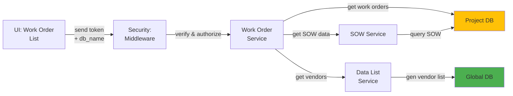

# 5.3.1 Work Order List & Management

## 5.3.1.1 User Interface

When a user navigates to the Work Order List page (route: `/project/:db_name/work_order`), the Vue.js UI sends a JWT token and project database name to the backend. The interface displays a comprehensive data table of work orders with columns for work order number, SOW reference, item description, vendor name, quantity ordered, quantity produced, status, start date, target completion date, and progress percentage. Users can filter by vendor, item type, status, and date range, with advanced search across multiple fields.

## 5.3.1.2 Security

The middleware verifies token validity through Laravel Passport's `auth:api` middleware, validates project access via `project.session:api`, and checks privileges:
- `project.wo:R` for read access (view work order list)
- `project.wo:W` for write access (create, edit work orders)

## 5.3.1.3 Application Services

### 5.3.1.3.1 Work Order Service

Manages work order operations including listing, filtering, searching, and status tracking.

**Key Methods:**
- `datatables()` - Returns work order list with DataTables pagination, sorting, and filtering
- `index()` - Retrieves work orders with custom filters (vendor, status, date range)
- `getVendorList()` - Returns distinct vendor list from work orders for filter dropdown
- `checkWOAvailability()` - Validates work order number uniqueness
- `searchWorkOrders()` - Multi-column search across work order fields

### 5.3.1.3.2 SOW Service

Provides SOW data for work order display and linking work orders back to parent SOW items.

### 5.3.1.3.3 Data List Service

Returns cached vendor and item reference data for work order display.

## 5.3.1.4 Database

**Project Database:**
- `work_order` - Work order records with id_sow reference, vendor assignment, quantities, status, dates
- `work_order_sow` - Junction table linking work orders to SOW items for many-to-many relationships

**Global Database:**
- `manufacturer` - Vendor details for work order assignment

*Figure: Work Order List & Management Component Design*
