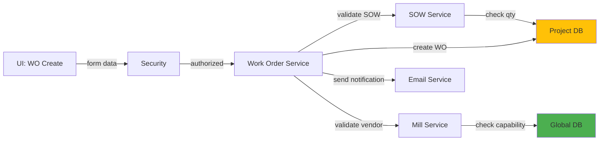

# 5.3.2 Work Order Creation & Assignment

## 5.3.2.1 User Interface
Work order creation form with SOW selection, vendor assignment, quantity allocation, schedule dates, and manufacturing specifications. Users select parent SOW, allocate quantity (cannot exceed SOW remaining quantity), assign vendor from approved manufacturer list, set target completion date, and configure work order-specific requirements.

## 5.3.2.2 Security
Requires `project.wo:W` privilege for creating/editing work orders. Validates user has project access and SOW modification permissions.

## 5.3.2.3 Application Services
- **Work Order Service**: Creates work orders from SOW with quantity validation, vendor assignment, schedule calculation
- **SOW Service**: Validates parent SOW exists, calculates remaining quantity, updates SOW status
- **Mill Service**: Validates vendor capabilities for assigned item type and specifications
- **Email Service**: Sends work order notifications to vendors and project team

## 5.3.2.4 Database
- `work_order` - New work order record with id_sow, id_manufacturer, quantities, dates, status
- `work_order_sow` - Links work order to parent SOW
- `sow` - Updates remaining quantity after work order creation

