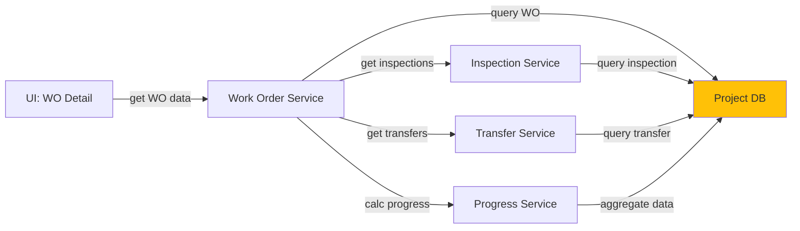

# 5.3.3 Work Order Tracking & Status

## 5.3.3.1 User Interface
Work order detail page with tabs for basic info, manufacturing progress, inspection results, and delivery tracking. Displays work order status timeline, quantity produced vs ordered, quality metrics, and vendor performance data.

## 5.3.3.2 Security
Requires `project.wo:R` for viewing work order details. Write privileges (`project.wo:W`) needed for status updates.

## 5.3.3.3 Application Services
- **Work Order Service**: Retrieves work order details, calculates progress, updates status
- **Inspection Service**: Returns inspection results for work order items
- **Transfer Service**: Provides delivery/shipment data for completed work orders
- **Progress Service**: Calculates work order completion percentage based on production, inspection, delivery

## 5.3.3.4 Database
- `work_order` - Work order master record with status, progress, dates
- `inspection` - Inspection records linked to work order via id_work_order
- `transfer_cargo` - Shipment records for delivered work order items
- `work_order_history` - Status change history with timestamps and user actions

