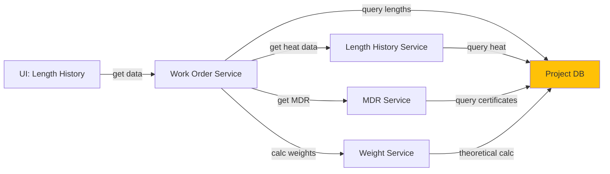

# 5.3.4 Length History & Heat Management

## 5.3.4.1 User Interface
Length history management page showing detailed pipe length records with heat numbers, manufacturing batch data, and material traceability. Users can view length distribution, heat number assignments, and material certification status.

## 5.3.4.2 Security
Requires `project.wo:R` for viewing length history. `project.wo:W` needed for recording new length entries.

## 5.3.4.3 Application Services
- **Work Order Service**: Manages length history records and heat number tracking
- **Length History Service**: Records individual pipe lengths with heat numbers, weights, and manufacturing data
- **MDR Service**: Links length records to Material Data Reports for certification tracking
- **Weight Service**: Calculates theoretical vs actual weights for length records

## 5.3.4.4 Database
- `length_history` - Individual pipe length records with work_order_id, heat_number, length, weight, status
- `heat` - Heat number master records with manufacturing batch information
- `work_order` - Parent work order reference
- `mdr` - Material Data Reports linked to heat numbers

