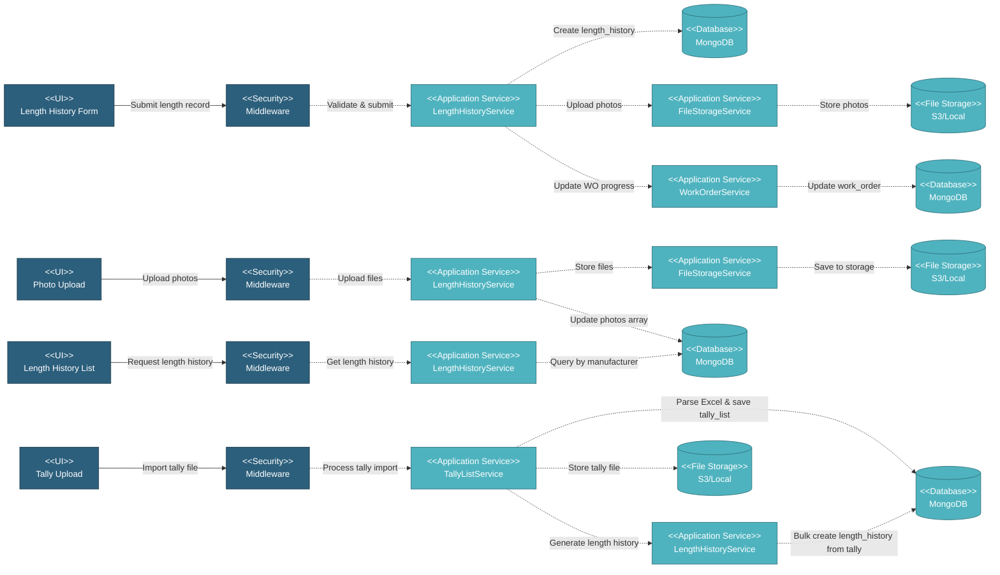

# 5.3.2 Length History Tracking

This component provides detailed production tracking by recording individual pipe lengths, heat numbers, pipe numbers, and photo attachments for quality documentation. It enables real-time progress calculation and complete material traceability for quality assurance.

---

## Component Design Diagram

*Figure: Length History Tracking Component Design*

---

## 5.3.2.1 User Interface

### 5.3.2.1.1 Length History Form

This is the entry point for submitting coating production length records. Users enter heat number, pipe number, and length. The form provides dropdown options for item/spec combinations, heat numbers, pipe numbers, and length values. Upon submission, it sends authentication token and length data.

### 5.3.2.1.2 Length History List

This UI displays all length history records for a specific manufacturer. Users can view heat numbers, pipe numbers, lengths, and associated photos. Users can filter by manufacturer and view report files.

### 5.3.2.1.3 View Reports Modal (DataTables)

This UI is a modal that provides a paginated view of all length history records with server-side DataTables processing. Users can view Date Submitted, Item, Heat No., Pipe No., Length, and Report File Name. Users can download report files and delete individual length history records. The modal is accessed via the "View Length Reports" button in the Length History component.

---

## 5.3.2.2 Security

Middleware validates the authentication token sent from Length History UIs. Only authenticated and authorized users can proceed to submit or view length history records.

**Security Checks:**
- `auth:api` - Validates JWT token via Laravel Passport
- `project.session:api` - Validates user has access to the project database
- `work_order:RW` - Required to submit and manage length history records
- `work_order:R` - Required to view length history records

---

## 5.3.2.3 Application Services

### 5.3.2.3.1 Initial Data Retrieval

- **Item Service**: Fetches item options for length history form.
- **Specification Service**: Provides specification options.
- **Length History Service**: Retrieves heat number, pipe number, and length options based on selected item/spec.

### 5.3.2.3.2 Length History Submission

Handles length history record creation and saves it to MongoDB. This includes heat number, pipe number, length, and optional photo attachments.

### 5.3.2.3.3 Auto-Generation from Tally Import

When a production tally file is imported through the Tally Upload UI:

1. **TallyListService** processes the Excel file and saves tally records to `tally_list` collection
2. **TallyListService** calls `LengthHistoryService.genLengthHistory()` to automatically generate length history records
3. **LengthHistoryService** iterates through all tally records and creates corresponding `length_history` records with:
   - Manufacturer, item, and spec from work order
   - Pipe number and heat number from tally
   - Length from tally
   - Initial status as "unresolved"
   - Reference to tally file ID

This auto-generation ensures that all production tally data is immediately available in length history for tracking and reporting.

### 5.3.2.3.4 Length History Operations

Each of the following services handles a specific operation in the length history flow. All of them update length history data in MongoDB through the Length History Service:

- **Add Report**: Creates new length history record with heat number, pipe number, and length.
- **View Length History**: Retrieves length history records filtered by manufacturer.
- **Report DataTables**: Handles server-side DataTables processing for length history list.
- **Delete Report**: Removes length history records.
- **Delete Item from Report**: Removes specific items from report.
- **Download History Photos**: Downloads attached photos from storage.
- **Resolve Length History**: Resolves and processes length history data.
- **Generate Length History**: Bulk creates length history records from tally list data.

---

## 5.3.2.4 Database

MongoDB serves as the central data store for Length History Tracking. The component interacts with the following collections:

**Project Database (`{mongodb_project}_{project_code}`):**

- **`length_history`** - Individual pipe length records. Key fields: _id, id_wo, id_manufacturer, id_item, id_spec_manufacturing, qty_unit, heat_no, pipe_no, length, photos (array), report_file_name, created_at, created_by.

- **`work_order`** - Work order records referenced by length history.

- **`tally_list`** - Tally list records used for generating length history.

**Global Database (`mongodb_global`):**

- **`item`** - Item master data referenced by length history.

- **`specification`** - Specification master data referenced by length history.

- **`mill`** - Manufacturer/coater data for filtering length history by vendor.

**File Storage (`S3 / Local`):**

- **Length History Photos**: Stored with file paths saved in length_history.photos array.

All create, update, and fetch operations on length history are handled through the Length History Service, ensuring consistent data access patterns and proper multi-tenant database routing.
