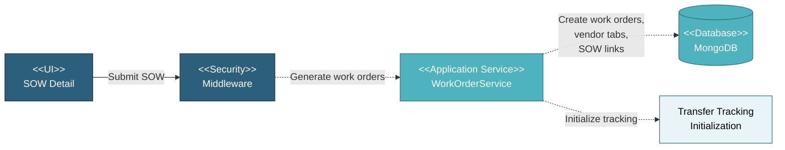

# 5.4.1 Work Order & Vendor Tab Generation

This component handles the automatic generation of work orders and vendor tabs when a SOW (Scope of Work) is submitted. Work orders are created for manufacturing and coating processes, while vendor tabs are automatically generated to organize work orders by manufacturer and coater for vendor-specific views.

---

## Component Design Diagram

*Figure: Work Order & Vendor Tab Generation Component Design*

---

## 5.4.1.1 User Interface

### 5.4.1.1.1 SOW Detail

Triggers automatic work order generation when SOW status changes from "Draft" to "Submitted". This is a background process that uses SOW configuration (item, specification, manufacturer, coater, quantities) to create work orders. When submitted SOWs are edited, work orders are automatically regenerated to reflect changes.

### 5.4.1.1.2 Work Order List

Displays work orders organized by vendor tabs. Each tab represents a manufacturer or coater, showing only their specific work orders. Users can filter and view work orders by vendor, making it easier for vendors to see only their assigned work.

### 5.4.1.1.3 Vendor Tab Reordering

Allows authorized users to drag-and-drop vendor tabs to customize display order by priority or preference. Tab order is saved per project and persists across sessions.

---

## 5.4.1.2 Security

Middleware validates the authentication token sent from the SOW Form and Work Order List UIs. Only authenticated and authorized users can proceed to submit SOWs or view work orders.

**Security Checks:**
- `auth:api` - Validates JWT token via Laravel Passport
- `project.session:api` - Validates user has access to the project database
- `scope_of_work:RW` - Required to submit SOWs and trigger work order generation
- `work_order:R/RW` - Required to view work orders

---

## 5.4.1.3 Application Services

### 5.4.1.3.1 Work Order Generation

Triggered automatically when SOW status changes to "Submitted". The system reads SOW configuration and creates work orders for manufacturing and coating processes:

**Manufacturing Work Orders:**
- Creates work orders for all required pipe types based on item configuration
- Includes processes: production, document submission, pipe receiving
- Assigns to manufacturer specified in SOW

**Coating Work Orders:**
- Created only if coater is specified in SOW
- Includes processes: pipe receiving, material test, coating application, document submission
- Assigns to coater specified in SOW

**Work Order Links:**
- Links work orders to source SOW for traceability
- Enables tracking from SOW through production to delivery
- Supports regeneration when SOW is edited

**Transfer Tracking Initialization:**
- Initializes transfer tracking records for shipment coordination
- Prepares work orders for future transfer and cargo management

### 5.4.1.3.2 Vendor Tab Management

Organizes work orders by vendor for easier management:

**Tab Creation:**
- Automatically creates tabs for each manufacturer and coater
- Groups work orders by vendor for vendor-specific views
- Default order: manufacturing vendors first (alphabetically), then coating vendors

**Tab Reordering:**
- Supports drag-and-drop reordering for custom prioritization
- Saves tab order per project
- Updates display order immediately

**Work Order Filtering:**
- Filters work orders by selected vendor tab
- Shows only relevant work orders for each vendor
- Enables vendors to focus on their assigned work

---

## 5.4.1.4 Database

MongoDB serves as the central data store for Work Order and Vendor Tab generation. The component interacts with the following collections:

**Project Database (`{mongodb_project}_{project_code}`):**

- **`sow`** - Source SOW records that trigger work order generation. Key fields: _id, status (triggers WO generation when "Submitted"), id_item, id_spec, id_manufacturer, id_coater, quantity conversions (object with pcs/mt/m factors), delivery_tolerance.

- **`work_order`** - Generated work order records. Key fields: _id, id_item, id_spec_manufacturing, id_spec_coating (for coating WOs), id_manufacturer, type ("manufacturing" or "coating"), process (production/pipe_receiving/loadout/document_submission/material_test/coating type), stage ("production"), item_type, qty, qty_unit, conversion (object).

- **`vendor_tab`** - Vendor tab configuration for organizing work orders by vendor. Key fields: _id, id_vendor (concatenation of mill._id + "_" + type, e.g., "507f1f77bcf86cd799439011_manufacturing"), name (mill short_name), type ("manufacturing" or "coating"), id_manufacturer (mill._id from global DB), seq (integer for drag-drop ordering).

- **`work_order_sow`** - Junction table linking work orders to SOWs (many-to-many relationship). Key fields: _id, id_work_order, id_sow.

- **`transfer_track`**, **`transfer_track_sow`**, **`transfer_track_work_order`**, **`transfer_move`** - Transfer tracking records initialized during WO generation (see 5.4.4 for details).

- **`item`** - Item master data referenced by work orders. Key fields: _id, type, desc.

- **`specification`** - Specification master data referenced by work orders. Key fields: _id, name.

**Global Database (`mongodb_global`):**

- **`mill`** - Manufacturer/coater master data for vendor tabs and work order assignment. Key fields: _id, short_name (displayed in vendor tabs), full_name, type ("Mill", "Bender" or "Coater").

All create, update, and fetch operations on work orders and vendor tabs are handled through the Work Order Service and Vendor Tab Service, ensuring consistent data access patterns and proper multi-tenant database routing.
