# 5.4.3 Work Order Progress Tracking

This component handles the calculation and monitoring of work order progress based on manual progress input for manufacturing production, or automatic calculation from tally data for coating processes. It provides progress percentage tracking, schedule management, and integration with the overall project progress tracking system.

---

## Component Design Diagram

```mermaid
graph LR
    UI_PROGRESS["&lt;&lt;UI&gt;&gt;<br/>Progress Input Form"]
    UI_REVERSE["&lt;&lt;UI&gt;&gt;<br/>Reverse Progress Modal"]
    UI_TALLY["&lt;&lt;UI&gt;&gt;<br/>Tally Upload"]

    SEC1["&lt;&lt;Security&gt;&gt;<br/>Middleware"]
    SEC2["&lt;&lt;Security&gt;&gt;<br/>Middleware"]
    SEC3["&lt;&lt;Security&gt;&gt;<br/>Middleware"]

    OVERALL_SVC1["&lt;&lt;Application Service&gt;&gt;<br/>OverallWorkOrderService"]
    OVERALL_SVC2["&lt;&lt;Application Service&gt;&gt;<br/>OverallWorkOrderService"]
    OVERALL_SVC3["&lt;&lt;Application Service&gt;&gt;<br/>OverallWorkOrderService"]
    WO_SVC["&lt;&lt;Application Service&gt;&gt;<br/>WorkOrderService"]
    TALLY_SVC["&lt;&lt;Application Service&gt;&gt;<br/>TallyListService"]

    CMD_ADJUST1["&lt;&lt;Artisan Command&gt;&gt;<br/>adjust:overalls"]
    CMD_ADJUST2["&lt;&lt;Artisan Command&gt;&gt;<br/>adjust:overalls"]
    CMD_CHART["&lt;&lt;Artisan Command&gt;&gt;<br/>progress:chart"]

    DB1[("&lt;&lt;Database&gt;&gt;<br/>MongoDB Project")]
    DB2[("&lt;&lt;Database&gt;&gt;<br/>MongoDB Project")]
    DB3[("&lt;&lt;Database&gt;&gt;<br/>MongoDB Project")]

    %% Manual Progress Flow
    UI_PROGRESS -->|Submit progress| SEC1
    SEC1 -.->|Call submitProgress| OVERALL_SVC1
    OVERALL_SVC1 -.->|Save to work_order_progress,<br/>work_order_actual,<br/>work_order_schedule| DB1
    OVERALL_SVC1 -.->|Trigger regeneration| CMD_ADJUST1
    CMD_ADJUST1 -.->|Recalculate & update<br/>overall_work_order| DB1
    CMD_ADJUST1 -.->|Trigger SOW charts| CMD_CHART
    CMD_CHART -.->|Update progress charts| DB1

    %% Reverse Progress Flow
    UI_REVERSE -->|Select date & edit progress| SEC2
    SEC2 -.->|Call submitReverseOveralls| OVERALL_SVC2
    OVERALL_SVC2 -.->|Update work_order_progress,<br/>work_order_actual,<br/>work_order_schedule| DB2
    OVERALL_SVC2 -.->|Trigger regeneration| CMD_ADJUST2
    CMD_ADJUST2 -.->|Recalculate & update<br/>overall_work_order| DB2

    %% Tally Upload Flow
    UI_TALLY -->|Upload tally| SEC3
    SEC3 -.->|Save tally data| TALLY_SVC
    TALLY_SVC -.->|Store to tally_list| DB3
    TALLY_SVC -.->|Calculate progress| OVERALL_SVC3
    OVERALL_SVC3 -.->|Distribute to lots| WO_SVC
    WO_SVC -.->|Update work_order_schedule| DB3

    style UI_PROGRESS fill:#2C5F7C,stroke:#1a3a4a,color:#fff
    style UI_REVERSE fill:#2C5F7C,stroke:#1a3a4a,color:#fff
    style UI_TALLY fill:#2C5F7C,stroke:#1a3a4a,color:#fff
    style SEC1 fill:#2C5F7C,stroke:#1a3a4a,color:#fff
    style SEC2 fill:#2C5F7C,stroke:#1a3a4a,color:#fff
    style SEC3 fill:#2C5F7C,stroke:#1a3a4a,color:#fff
    style OVERALL_SVC1 fill:#4FB3BF,stroke:#2a6d76,color:#fff
    style OVERALL_SVC2 fill:#4FB3BF,stroke:#2a6d76,color:#fff
    style OVERALL_SVC3 fill:#4FB3BF,stroke:#2a6d76,color:#fff
    style WO_SVC fill:#4FB3BF,stroke:#2a6d76,color:#fff
    style TALLY_SVC fill:#4FB3BF,stroke:#2a6d76,color:#fff
    style CMD_ADJUST1 fill:#FFA726,stroke:#f57c00,color:#fff
    style CMD_ADJUST2 fill:#FFA726,stroke:#f57c00,color:#fff
    style CMD_CHART fill:#FFA726,stroke:#f57c00,color:#fff
    style DB1 fill:#4FB3BF,stroke:#2a6d76,color:#fff
    style DB2 fill:#4FB3BF,stroke:#2a6d76,color:#fff
    style DB3 fill:#4FB3BF,stroke:#2a6d76,color:#fff
```

*Figure: Work Order Progress Tracking Component Design*

---

## 5.4.3.1 User Interface

### 5.4.3.1.1 Progress Input Form

**Manufacturing Production**: Manual progress input via form with date picker and percentage or quantity fields per schedule (steel making, plate making, pipe forming, inspection, etc.). Shows base schedule, forecast schedule dates, lot-based tracking, quantity (if applicable), and actual progress.

**Coating Processes**: Progress automatically calculated from tally uploads.

### 5.4.3.1.2 Reverse Progress Modal

Allows editing historical progress records. User selects a previous input date from dropdown, modifies progress values, and system regenerates all subsequent progress records to maintain consistency.

### 5.4.3.1.3 Work Order List with Progress

Displays progress percentage, status, and visual progress bars for each work order. Color coding based on schedule adherence.

---

## 5.4.3.2 Security

**Progress Input (Write Operations)**:
- `project.wo:W` - Submit progress, reverse progress, update forecast dates, update document submission
- Applies to: `submitProgress()`, `submitReverseProgress()`, `updateDocSub()`

**Progress Viewing (Read Operations)**:
- `project.wo:R` - View work order progress, progress stats, charts, lot progress
- Applies to: `index()`, `getReverseProgress()`, `genOverallProgressStats()`, `genOverallChartStats()`, etc.

---

## 5.4.3.3 Application Services

### 5.4.3.3.1 Manual Progress Submission (Manufacturing Production)

`OverallWorkOrderService::submitProgress()` - Triggered by progress input form submission.

**Process**:
1. Save progress input date to `work_order_progress` (id_wo, input_date)
2. For each lot and schedule: extract input_progress, generate actual records, calculate total_qty_real and total_percent_real
3. Handle inspection child schedules: generate separate actuals, calculate weighted average
4. Update `work_order_schedule`: base/forecast dates, qty_real, percent_real
5. Save to `work_order_actual` for historical tracking
6. Trigger Artisan commands: `adjust:overalls` (recalculate overalls), `progress:chart` (regenerate SOW S-Curve chart)

### 5.4.3.3.2 Automatic Progress Calculation (Coating Processes)

`BaseService::distributeTallyProgress()` and `OverallWorkOrderService::genWorkOrderTallyProgress()` - Triggered by tally upload.

**Process**:
1. Query `tally_list` for accepted tally records
2. Extract total length (M/FT) or piece count (PCS) based on qty_unit
3. Distribute progress across lots sequentially: fill lot to 100% or partial, remaining flows to next lot
4. Calculate: `percent_real = round((qty_real / lot.qty) × 100, 1)`
5. Update `work_order_schedule` with qty_real and percent_real per lot

### 5.4.3.3.3 Pipe Receiving Progress Calculation

`OverallWorkOrderService::genWorkOrderPipeReceivingProgress()` - Calculates progress from load-in tally.

**Process**:
1. Query `tally_list`: filter by `tally_type = 'load_in'`, `missing != true`
2. Sum length or count based on qty_unit
3. Calculate: `percent_real = (progress / work_order.qty) × 100` (capped at 100%)
4. Return qty_real, percent_real, percent_real_raw

### 5.4.3.3.4 Reverse Progress (Edit Historical Progress)

`OverallWorkOrderService::submitReverseOveralls()` - Triggered by user selecting historical progress date.

**Process**:
1. User selects `work_order_progress` record from last_update dropdown
2. Load progress data via `setReverseOveralls()`
3. User modifies progress percentages in reverse progress modal
4. Save updated values to selected `work_order_progress` record
5. Regenerate all future progress records to maintain consistency
6. Update `work_order_actual` for selected date and regenerate future actuals
7. Trigger `adjust:overalls` to recalculate charts

**Use Case**: Correct data entry errors without re-entering all subsequent records.

### 5.4.3.3.5 Document Submission Progress

`OverallWorkOrderService::updateDocSub()` - Updates progress for document submission work orders.

**Process**:
1. Update work_order fields: percent_real, qty_real, status
2. Save directly to `work_order` collection (no lot-based tracking)

---

## 5.4.3.4 Database

**Project Database** (`mongodb_project_{project_code}`):

- **`work_order`** - Progress tracking fields: qty, qty_unit, qty_real, percent_real, base/forecast_schedule dates
- **`work_order_progress`** - Progress input records: id_wo, input_date
- **`work_order_actual`** - Actual progress per schedule: id_wo_progress, id_wo_lot, schedule, type, total_qty_real, total_percent_real
- **`work_order_schedule`** - Lot schedules: id_wo_lot, schedule, qty, qty_real, percent_real, base/forecast/actual dates
- **`work_order_lot`** - Lot records: id_wo, qty, qty_unit, schedule dates
- **`tally_list`** - Tally for coating: id_wo, id_route, tally_type, length, damage, missing
- **`overall_work_order`** - Aggregated progress for dashboards (populated by Artisan commands)

---
