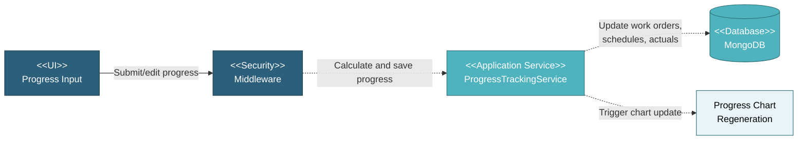

# 5.4.3 Work Order Progress Tracking

This component handles the calculation and monitoring of work order progress based on manual progress input for manufacturing production, or automatic calculation from tally data for coating processes. It provides progress percentage tracking, schedule management, and integration with the overall project progress tracking system.

---

## Component Design Diagram

```mermaid
graph LR
    UI_PROGRESS["&lt;&lt;UI&gt;&gt;<br/>Progress Input"]
    SEC["&lt;&lt;Security&gt;&gt;<br/>Middleware"]
    PROGRESS_SVC["&lt;&lt;Application Service&gt;&gt;<br/>ProgressTrackingService"]
    DB[("&lt;&lt;Database&gt;&gt;<br/>MongoDB")]
    CHART_REGEN["Progress Chart<br/>Regeneration"]

    UI_PROGRESS -->|Submit/edit progress| SEC
    SEC -.->|Calculate and save progress| PROGRESS_SVC
    PROGRESS_SVC -.->|Update work orders,<br/>schedules, actuals| DB
    PROGRESS_SVC -.->|Trigger chart update| CHART_REGEN

    style UI_PROGRESS fill:#2C5F7C,stroke:#1a3a4a,color:#fff
    style SEC fill:#2C5F7C,stroke:#1a3a4a,color:#fff
    style PROGRESS_SVC fill:#4FB3BF,stroke:#2a6d76,color:#fff
    style DB fill:#4FB3BF,stroke:#2a6d76,color:#fff
    style CHART_REGEN fill:#E8F4F8,stroke:#2a6d76,color:#000
```

*Figure: Work Order Progress Tracking Component Design*

---

## 5.4.3.1 User Interface

### 5.4.3.1.1 Progress Input Form

**Manufacturing Production**: Manual progress input via form with date picker and percentage or quantity fields per schedule (steel making, plate making, pipe forming, inspection, etc.). Shows base schedule, forecast schedule dates, lot-based tracking, quantity (if applicable), and actual progress.

**Coating Processes**: Progress automatically calculated from tally uploads.

### 5.4.3.1.2 Reverse Progress Modal

Allows editing historical progress records. User selects a previous input date from dropdown, modifies progress values, and system regenerates all subsequent progress records to maintain consistency.

### 5.4.3.1.3 Work Order List with Progress

Displays progress percentage, status, and visual progress bars for each work order. Color coding based on schedule adherence.

---

## 5.4.3.2 Security

Middleware validates the authentication token sent from the Progress Tracking UI. Only authenticated and authorized users can proceed to submit or view progress data.

**Security Checks:**
- `auth:api` - Validates JWT token via Laravel Passport
- `project.session:api` - Validates user has access to the project database
- `user.privileges` - Checks for `project.wo:W` privilege to submit/edit progress, or `project.wo:R` to view progress

---

## 5.4.3.3 Application Services

### 5.4.3.3.1 Manual Progress Input

Handles manual progress submission for manufacturing production work orders. Users input progress percentages or quantities for each production schedule stage (steel making, plate making, pipe forming, inspection, etc.). The system records the progress input date, calculates actual quantities and percentages per lot and schedule, updates work order schedules with actual progress, stores historical progress records for tracking, and triggers progress chart regeneration to update project dashboards.

### 5.4.3.3.2 Automatic Progress Calculation

Calculates progress automatically for coating work orders based on tally data. When tally sheets are uploaded, the system retrieves accepted tally records, extracts total quantities (length or piece count), distributes progress across delivery lots sequentially (filling each lot to 100% before moving to the next), calculates progress percentage for each lot, and updates work order schedules with calculated progress. This eliminates manual data entry for coating processes.

### 5.4.3.3.3 Historical Progress Editing

Allows users to correct past progress entries without re-entering all subsequent records. Users select a previous progress input date from the dropdown, modify progress values in the reverse progress modal, and the system saves the updated values, regenerates all future progress records to maintain consistency, updates historical tracking records, and triggers progress chart recalculation. This feature is essential for correcting data entry errors while preserving data integrity.

### 5.4.3.3.4 Document Submission Progress

Handles progress tracking for document submission work orders (different from manufacturing/coating). Updates progress percentage based on document submission status.

---

## 5.4.3.4 Database

**Project Database** (`mongodb_project_{project_code}`):

- **`work_order`** - Progress tracking fields: qty, qty_unit, qty_real, percent_real, base/forecast_schedule dates
- **`work_order_progress`** - Progress input records: id_wo, input_date
- **`work_order_actual`** - Actual progress per schedule: id_wo_progress, id_wo_lot, schedule, type, total_qty_real, total_percent_real
- **`work_order_schedule`** - Lot schedules: id_wo_lot, schedule, qty, qty_real, percent_real, base/forecast/actual dates
- **`work_order_lot`** - Lot records: id_wo, qty, qty_unit, schedule dates
- **`tally_list`** - Tally for coating: id_wo, id_route, tally_type, length, damage, missing
- **`overall_work_order`** - Aggregated progress for dashboards (populated by Artisan commands)

---
