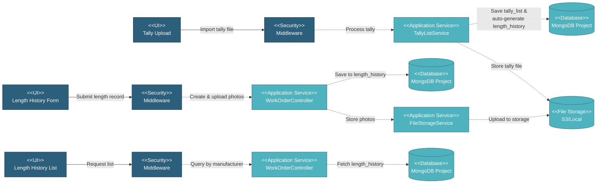

# 5.4.4 Length History Tracking

This component tracks individual pipe production records for coating processes, including heat numbers, pipe numbers, lengths, and photo attachments for quality documentation and traceability.

---

## Component Design Diagram

*Figure: Length History Tracking Component Design*

---

## 5.4.4.1 User Interface

### 5.4.4.1.1 Length History Form

Form for submitting coating production records. Provides dropdown options for item/spec, heat number, pipe number, and length. Supports photo attachments for quality documentation.

### 5.4.4.1.2 Length History List

Displays length history records filtered by manufacturer. Shows heat numbers, pipe numbers, lengths, photos, and unresolved pipe alerts. Includes "View Length Reports" button to open modal with all records.

### 5.4.4.1.3 View Reports Modal

DataTables modal showing all length history records with server-side pagination. Displays date submitted, item, heat no., pipe no., length, and report file name. Supports download and delete operations.

---

## 5.4.4.2 Security

**Write Operations** (`project.wo:W`):
- Submit length report: `submitLengthReport()`
- Delete report: `deleteReport()`
- Delete item from report: `deleteItemFromReport()`
- Resolve length history: `resolveLengthHistory()`

**Read Operations** (`project.wo:R`):
- View length history list: `lengthHistoryListData()`
- View reports DataTables: `lengthReportDataTables()`
- Download photos: `downloadHistoryPhotos()`
- Get dropdown options: `lengthHistoryItemSpecOptions()`, `lengthHistoryHeatOptions()`, `lengthHistoryPipeOptions()`, `lengthHistoryLengthOptions()`

---

## 5.4.4.3 Application Services

### 5.4.4.3.1 Submit Length Report

`WorkOrderController::submitLengthReport()` - Creates length history record with photos.

**Process**:
1. Validate input: heat number, pipe number, length, manufacturer, item, spec
2. Upload photos to S3/local storage via FileStorageService
3. Save to `length_history` collection with photo URLs
4. Return success response

### 5.4.4.3.2 View Length History

`WorkOrderController::lengthHistoryListData()` and `lengthReportDataTables()` - Retrieve length history records.

**Process**:
1. Query `length_history` filtered by manufacturer
2. For DataTables: apply server-side pagination, sorting, search
3. Include unresolved pipe alerts
4. Return formatted data with photo URLs

### 5.4.4.3.3 Auto-Generation from Tally Import

`TallyListService::genLengthHistory()` - Automatically creates length history from tally uploads.

**Process**:
1. Parse Excel tally file and save to `tally_list` collection
2. For each tally record: create `length_history` with manufacturer, item, spec, pipe number, heat number, length
3. Set initial status as "unresolved"
4. Store reference to tally file ID
5. Store tally file to S3/local storage

**Use Case**: Ensures all production tally data is immediately available in length history for tracking.

### 5.4.4.3.4 Dropdown Options

`WorkOrderController` methods provide cascading dropdown data:
- `lengthHistoryItemSpecOptions()` - Get item/spec combinations by manufacturer
- `lengthHistoryHeatOptions()` - Get heat numbers filtered by item/spec
- `lengthHistoryPipeOptions()` - Get pipe numbers filtered by heat number
- `lengthHistoryLengthOptions()` - Get length values filtered by pipe number

### 5.4.4.3.5 Delete and Resolve Operations

- `deleteReport()` - Remove entire length history record
- `deleteItemFromReport()` - Remove specific item from report
- `resolveLengthHistory()` - Mark unresolved pipes as resolved
- `downloadHistoryPhotos()` - Download attached photos from storage

---

## 5.4.4.4 Database

**Project Database** (`mongodb_project_{project_code}`):

- **`length_history`** - Pipe length records: id_wo, id_manufacturer, id_item, id_spec_manufacturing, heat_no, pipe_no, length, qty_unit, photos (array), report_file_name, status (resolved/unresolved), id_tally_file
- **`work_order`** - Referenced by length history
- **`tally_list`** - Source for auto-generated length history
- **`item`** - Item data collection
- **`specification`** - Spec data collection

**Global Database** (`mongodb_global`):

- **`mill`** - Manufacturer/coater data for filtering

**File Storage** (S3/Local):

- Length history photos and tally files with paths stored in database

---
