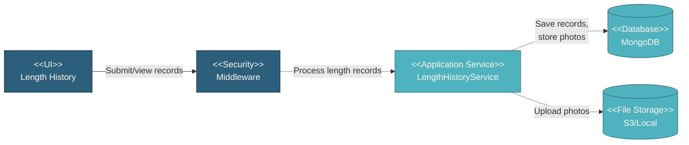

# 5.4.4 Length History Tracking

This component tracks individual pipe production records for coating processes, including heat numbers, pipe numbers, lengths, and photo attachments for quality documentation and traceability.

---

## Component Design Diagram

```mermaid
graph LR
    UI_FORM["&lt;&lt;UI&gt;&gt;<br/>Length History"]
    SEC["&lt;&lt;Security&gt;&gt;<br/>Middleware"]
    LENGTH_SVC["&lt;&lt;Application Service&gt;&gt;<br/>LengthHistoryService"]
    DB[("&lt;&lt;Database&gt;&gt;<br/>MongoDB")]
    STORAGE[("&lt;&lt;File Storage&gt;&gt;<br/>S3/Local")]

    UI_FORM -->|Submit/view records| SEC
    SEC -.->|Process length records| LENGTH_SVC
    LENGTH_SVC -.->|Save records,<br/>store photos| DB
    LENGTH_SVC -.->|Upload photos| STORAGE

    style UI_FORM fill:#2C5F7C,stroke:#1a3a4a,color:#fff
    style SEC fill:#2C5F7C,stroke:#1a3a4a,color:#fff
    style LENGTH_SVC fill:#4FB3BF,stroke:#2a6d76,color:#fff
    style DB fill:#4FB3BF,stroke:#2a6d76,color:#fff
    style STORAGE fill:#4FB3BF,stroke:#2a6d76,color:#fff
```

*Figure: Length History Tracking Component Design*

---

## 5.4.4.1 User Interface

### 5.4.4.1.1 Length History Form

Form for submitting coating production records. Provides dropdown options for item/spec, heat number, pipe number, and length. Supports photo attachments for quality documentation.

### 5.4.4.1.2 Length History List

Displays length history records filtered by manufacturer. Shows heat numbers, pipe numbers, lengths, photos, and unresolved pipe alerts. Includes "View Length Reports" button to open modal with all records.

### 5.4.4.1.3 View Reports Modal

DataTables modal showing all length history records with server-side pagination. Displays date submitted, item, heat no., pipe no., length, and report file name. Supports download and delete operations.

---

## 5.4.4.2 Security

Middleware validates the authentication token sent from the Length History UI. Only authenticated and authorized users can proceed to submit or view length history records.

**Security Checks:**
- `auth:api` - Validates JWT token via Laravel Passport
- `project.session:api` - Validates user has access to the project database
- `user.privileges` - Checks for `project.wo:W` privilege to submit/edit records, or `project.wo:R` to view records

---

## 5.4.4.3 Application Services

### 5.4.4.3.1 Manual Length Record Submission

Allows users to manually submit individual pipe production records for coating processes. Users enter heat number, pipe number, and length, and can attach photos for quality documentation. The system validates the input data, uploads photos to file storage, saves the length history record with photo references, and makes the record immediately available for tracking and reporting. This provides detailed traceability for each pipe through the coating process.

### 5.4.4.3.2 Automatic Generation from Tally

When tally files are uploaded, the system automatically generates length history records from the tally data. This eliminates manual data entry by extracting pipe information (heat number, pipe number, length) from the tally file, creating length history records for each pipe, marking records as "unresolved" for verification, and linking records to the source tally file. This ensures all production tally data is immediately available in length history for tracking.

### 5.4.4.3.3 Length History Viewing

Displays length history records filtered by manufacturer for vendor-specific views. Supports searching, sorting, and pagination for large datasets. Shows unresolved pipe alerts for items requiring verification. Provides download capability for attached photos and reports. Enables project teams to review production records and verify pipe documentation.

### 5.4.4.3.4 Record Management

Supports editing and deletion of length history records for data correction. Allows resolving unresolved pipes after verification. Enables removal of specific items from reports or entire reports. Maintains data integrity by tracking changes and preserving audit trails.

---

## 5.4.4.4 Database

**Project Database** (`mongodb_project_{project_code}`):

- **`length_history`** - Pipe length records: id_wo, id_manufacturer, id_item, id_spec_manufacturing, heat_no, pipe_no, length, qty_unit, photos (array), report_file_name, status (resolved/unresolved), id_tally_file
- **`work_order`** - Referenced by length history
- **`tally_list`** - Source for auto-generated length history
- **`item`** - Item data collection
- **`specification`** - Spec data collection

**Global Database** (`mongodb_global`):

- **`mill`** - Manufacturer/coater data for filtering

**File Storage** (S3/Local):

- Length history photos and tally files with paths stored in database

---
